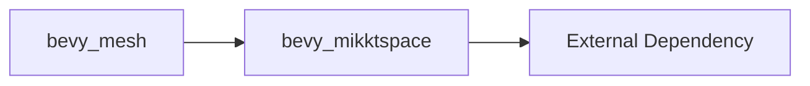

+++
title = "#19798 Move bevy_mikktspace out of tree"
date = "2025-08-04T00:00:00"
draft = false
template = "pull_request_page.html"
in_search_index = true

[taxonomies]
list_display = ["show"]

[extra]
current_language = "en"
available_languages = {"en" = { name = "English", url = "/pull_request/bevy/2025-08/pr-19798-en-20250804" }, "zh-cn" = { name = "中文", url = "/pull_request/bevy/2025-08/pr-19798-zh-cn-20250804" }}
labels = ["A-Rendering", "C-Dependencies", "C-Code-Quality", "A-Math", "P-Unsound", "X-Blessed", "D-Unsafe"]
+++

# Analysis of PR #19798: Move bevy_mikktspace out of tree

## Basic Information
- **Title**: Move bevy_mikktspace out of tree
- **PR Link**: https://github.com/bevyengine/bevy/pull/19798
- **Author**: atlv24
- **Status**: MERGED
- **Labels**: A-Rendering, C-Dependencies, C-Code-Quality, S-Ready-For-Final-Review, A-Math, P-Unsound, X-Blessed, D-Unsafe
- **Created**: 2025-06-24T08:01:41Z
- **Merged**: 2025-08-04T17:35:58Z
- **Merged By**: alice-i-cecile

## Description Translation
```
# Objective

- Have safe bevy_mikktspace by landing #9050
- Don't have C in-tree

Related issues and PRs:

- Closes #9050
- Closes #8429 
- Fixes #7372

## Solution

- Rebase to main
- Remove glam dependency so lock-step update is not necessary anymore
- Make it standalone: https://github.com/atlv24/bevy_mikktspace
- Transfer to bevy org

## Testing

- Test suite made by Layl
```

## The Story of This Pull Request

This PR addresses two main issues: improving code safety by landing a safe Rust implementation of the Mikkelsen tangent space algorithm (#9050), and removing C code from Bevy's main repository. The tangent space generation is essential for normal mapping in rendering, but the original implementation contained unsafe C code that was challenging to maintain and update.

The solution involved extracting the `bevy_mikktspace` crate from Bevy's main repository and making it a standalone library. This extraction allowed the removal of the `glam` dependency, eliminating the need for lock-step version updates between the math library and Bevy. The crate was moved to a new repository under the Bevy organization (https://github.com/atlv24/bevy_mikktspace) where it can be maintained independently.

During the implementation, several key changes were made to integrate the standalone crate:
1. The `bevy_mesh` crate was updated to depend on the external `bevy_mikktspace` crate instead of the in-tree version
2. The tangent generation API in `bevy_mesh` was modified to match the updated interface from the standalone crate
3. The entire `bevy_mikktspace` directory and its contents were removed from Bevy's repository

The API change in `bevy_mesh` is particularly important. The `set_tangent_encoded` method was replaced with a more flexible `set_tangent` method that better handles tangent space calculations:

```rust
// Before:
fn set_tangent_encoded(&mut self, tangent: [f32; 4], face: usize, vert: usize)

// After:
fn set_tangent(
    &mut self,
    tangent_space: Option<bevy_mikktspace::TangentSpace>,
    face: usize,
    vert: usize,
)
```

This change provides more explicit control over tangent space generation and improves error handling by converting the previous boolean return value to a proper `Result` type. The error handling was also enhanced in the tangent generation process:

```rust
// Before:
let success = bevy_mikktspace::generate_tangents(&mut mikktspace_mesh);
if !success {
    return Err(GenerateTangentsError::MikktspaceError);
}

// After:
bevy_mikktspace::generate_tangents(&mut mikktspace_mesh)?;
```

The extraction of `bevy_mikktspace` significantly cleans up Bevy's dependency tree and codebase. By removing over 3,000 lines of code (mostly generated C-to-Rust bindings), the PR reduces maintenance overhead and potential security risks from unsafe code. The standalone crate can now evolve independently with its own release cycle, versioning, and documentation.

Testing was ensured through the existing test suite created by Layl, which verifies the correctness of the tangent generation algorithm. The changes maintain backward compatibility in the generated tangents while improving the safety and maintainability of the code.

## Visual Representation



## Key Files Changed

1. `crates/bevy_mesh/Cargo.toml`
   - Updated dependency to external crate
   ```toml
   # Before:
   bevy_mikktspace = { path = "../bevy_mikktspace", version = "0.17.0-dev" }
   
   # After:
   bevy_mikktspace = { version = "0.17.0-dev" }
   ```

2. `crates/bevy_mesh/src/mikktspace.rs`
   - Updated API usage to match new crate interface
   ```rust
   // Before:
   fn set_tangent_encoded(&mut self, tangent: [f32; 4], face: usize, vert: usize) {
       self.tangents[idx] = tangent;
   }
   
   // After:
   fn set_tangent(&mut self, tangent_space: Option<bevy_mikktspace::TangentSpace>, face: usize, vert: usize) {
       self.tangents[idx] = tangent_space.unwrap_or_default().tangent_encoded();
   }
   ```
   ```rust
   // Error handling simplified
   // Before:
   if !success {
       return Err(GenerateTangentsError::MikktspaceError);
   }
   
   // After:
   bevy_mikktspace::generate_tangents(&mut mikktspace_mesh)?;
   ```

3. `crates/bevy_mikktspace/**` (removed)
   - Entire crate removed from repository including:
     - Generated Rust bindings (`src/generated.rs`)
     - Regression tests (`tests/regression_test.rs`)
     - Example code (`examples/generate.rs`)
     - License files
     - Asset files (`examples/cube.obj`)

## Further Reading

1. [Mikkelsen Tangent Space Algorithm](http://www.mikktspace.com/) - Original algorithm specification
2. [Bevy's Mesh Documentation](https://docs.rs/bevy_mesh/latest/bevy_mesh/) - Details on Bevy's mesh system
3. [Tangent Space Normal Maps](https://learnopengl.com/Advanced-Lighting/Normal-Mapping) - Practical explanation of normal mapping techniques
4. [Rust Safety Guidelines](https://doc.rust-lang.org/nomicon/) - Understanding unsafe code practices in Rust

The extraction of `bevy_mikktspace` demonstrates a healthy approach to dependency management in large projects. By isolating specialized functionality into separate crates, Bevy maintains a cleaner codebase while allowing domain-specific components to evolve at their own pace. This pattern could be applied to other specialized subsystems in the engine.