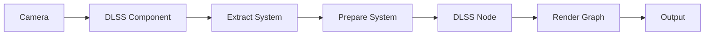

+++
title = "#19864 Initial DLSS implementation"
date = "2025-08-15T00:00:00"
draft = false
template = "pull_request_page.html"
in_search_index = true

[taxonomies]
list_display = ["show"]

[extra]
current_language = "en"
available_languages = {"en" = { name = "English", url = "/pull_request/bevy/2025-08/pr-19864-en-20250815" }, "zh-cn" = { name = "中文", url = "/pull_request/bevy/2025-08/pr-19864-zh-cn-20250815" }}
labels = ["C-Feature", "A-Rendering", "D-Complex", "X-Contentious", "M-Deliberate-Rendering-Change"]
+++

## Initial DLSS implementation

### Basic Information
- **Title**: Initial DLSS implementation
- **PR Link**: https://github.com/bevyengine/bevy/pull/19864
- **Author**: JMS55
- **Status**: MERGED
- **Labels**: C-Feature, A-Rendering, D-Complex, M-Needs-Release-Note, X-Contentious, S-Needs-Review, M-Deliberate-Rendering-Change
- **Created**: 2025-06-29T18:43:47Z
- **Merged**: 2025-08-15T21:28:01Z
- **Merged By**: cart

### Description
# Objective
- Closes https://github.com/bevyengine/bevy/issues/8420

## Solution
- Initial implementation of DLSS upscaling, via https://github.com/bevyengine/dlss_wgpu. 
- Future PRs will work more on transparency, exposure, working with custom viewports, fixing inevitable resolution override bugs, etc.
- DLSS framegen is not planned, but ray-reconstruction is for solari.
- FSR3/4, XeSS2, and MetalFX temporal upscaling should be easy to add now if a future contributor wants to. In the future we could have an auto-temporal AA component that handles DLSS/FSR/XeSS/MetalFX/TAA fallbacks automatically.

## Testing
- Did you test these changes? If so, how?
  - Run the anti_aliasing example
- Are there any parts that need more testing?
  - Different types of scene content and rendering effects to make sure they work with DLSS/upscaling
  - Reviewing dlss_wgpu code

---

## Showcase


### The Story of This Pull Request

#### The Problem and Context
Bevy lacked support for NVIDIA's Deep Learning Super Sampling (DLSS), a temporal anti-aliasing and upscaling technique that uses AI to improve image quality while boosting performance. This was problematic for users with NVIDIA RTX GPUs who wanted to leverage hardware-accelerated upscaling for better performance in graphically intensive scenes. The implementation needed to integrate with Bevy's existing rendering architecture while handling platform-specific requirements like Vulkan extensions and NVIDIA SDK dependencies.

#### The Solution Approach
The implementation uses the `dlss_wgpu` crate to interface with NVIDIA's DLSS SDK. Key engineering decisions included:
1. Creating a modular architecture supporting both DLSS Super Resolution and Ray Reconstruction
2. Integrating with Bevy's render graph and prepass systems
3. Implementing runtime detection of DLSS support
4. Providing camera components to control DLSS behavior
5. Adding resolution override handling for custom rendering pipelines

The solution avoids implementing frame generation but leaves room for future Ray Reconstruction support. It also provides extension points for other upscalers like FSR and XeSS.

#### The Implementation
The implementation adds a new `dlss` module in `bevy_anti_aliasing` with several key components:

1. **Initialization**: `DlssInitPlugin` registers Vulkan extensions during renderer initialization
```rust
unsafe {
    raw_vulkan_settings.add_create_instance_callback(
        move |mut args, additional_vulkan_features| {
            let mut feature_support = FeatureSupport::default();
            match dlss_wgpu::register_instance_extensions(
                dlss_project_id,
                &mut args,
                &mut feature_support,
            ) {
                Ok(_) => {
                    if feature_support.super_resolution_supported {
                        additional_vulkan_features.insert::<DlssSuperResolutionSupported>();
                    }
                    // ...
                }
                Err(_) => {}
            }
        },
    );
}
```

2. **Camera Component**: The `Dlss` component enables DLSS on cameras
```rust
#[derive(Component, Reflect, Clone)]
#[require(TemporalJitter, MipBias, DepthPrepass, MotionVectorPrepass, Hdr)]
pub struct Dlss<F: DlssFeature = DlssSuperResolutionFeature> {
    pub perf_quality_mode: DlssPerfQualityMode,
    pub reset: bool,
    // ...
}
```

3. **Render Graph Integration**: DLSS nodes are inserted into the 3D render graph
```rust
.add_render_graph_edges(
    Core3d,
    (
        Node3d::EndMainPass,
        Node3d::MotionBlur,
        Node3d::DlssSuperResolution,
        Node3d::DlssRayReconstruction,
        Node3d::Bloom,
        Node3d::Tonemapping,
    ),
);
```

4. **Quality Control**: Users can select DLSS quality modes at runtime
```rust
pub enum DlssPerfQualityModeRemoteReflect {
    Auto,
    Dlaa,
    Quality,
    Balanced,
    Performance,
    UltraPerformance,
}
```

#### Technical Insights
Key technical considerations included:
- **Platform Limitations**: DLSS only works on Windows/Linux with Vulkan and NVIDIA RTX GPUs
- **Dependency Management**: The `dlss_wgpu` crate handles SDK interactions
- **Resource Management**: The `DlssRenderContext` manages DLSS state and resources
- **Resolution Handling**: `MainPassResolutionOverride` allows custom renderers to adapt to DLSS upscaling
- **Prepass Requirements**: Depth and motion vector prepasses are mandatory for temporal reconstruction

Performance implications were significant - DLSS can render at lower resolutions then upscale, reducing GPU workload while maintaining image quality.

#### The Impact
This implementation:
1. Adds DLSS Super Resolution support to Bevy
2. Provides foundation for future Ray Reconstruction
3. Enables significant performance improvements for RTX users
4. Introduces resolution override handling that benefits other upscalers
5. Updates the anti-aliasing example to showcase DLSS

The changes affect multiple rendering systems but maintain backwards compatibility through feature gating and optional components. Custom renderers need to account for `MainPassResolutionOverride` when working with DLSS-enabled cameras.

### Visual Representation


### Key Files Changed

1. `crates/bevy_anti_aliasing/src/dlss/mod.rs` (+404/-0)
   - Adds core DLSS implementation and plugin
   - Defines components, resources, and feature traits
```rust
pub struct DlssPlugin;
impl Plugin for DlssPlugin {
    fn build(&self, app: &mut App) {
        app.register_type::<Dlss<DlssSuperResolutionFeature>>()
            .register_type::<Dlss<DlssRayReconstructionFeature>>();
    }
    // ...
}
```

2. `crates/bevy_anti_aliasing/src/dlss/node.rs` (+165/-0)
   - Implements render nodes for DLSS
   - Handles different DLSS feature types
```rust
impl ViewNode for DlssNode<DlssSuperResolutionFeature> {
    type ViewQuery = (/*...*/);
    fn run(&self, /*...*/) {
        // DLSS rendering logic
    }
}
```

3. `examples/3d/anti_aliasing.rs` (+138/-11)
   - Updates anti-aliasing example to support DLSS
   - Adds quality mode controls
```rust
#[cfg(all(feature = "dlss", not(feature = "force_disable_dlss"))]
if keys.just_pressed(KeyCode::Digit6) && dlss.is_none() && dlss_supported.is_some() {
    *msaa = Msaa::Off;
    camera
        .remove::<Fxaa>()
        .remove::<Smaa>()
        .remove::<TaaComponents>()
        .insert(Dlss::default());
}
```

4. `crates/bevy_anti_aliasing/src/dlss/prepare.rs` (+116/-0)
   - Prepares DLSS rendering context
   - Calculates resolution and jitter
```rust
pub fn prepare_dlss<F: DlssFeature>(
    mut query: Query</*...*/>,
    dlss_sdk: Res<DlssSdk>,
    // ...
) {
    // DLSS context preparation
}
```

5. `release-content/release-notes/dlss.md` (+36/-0)
   - Adds release documentation
```markdown
---
title: Deep Learning Super Sampling (DLSS)
authors: ["@JMS55", "@cart"]
---
For users with NVIDIA RTX GPUs, Bevy now offers yet another form of anti-aliasing: DLSS.
```

### Further Reading
- [NVIDIA DLSS SDK Documentation](https://developer.nvidia.com/dlss)
- [Bevy dlss_wgpu Repository](https://github.com/bevyengine/dlss_wgpu)
- [Temporal Anti-Aliasing Techniques](https://en.wikipedia.org/wiki/Temporal_anti-aliasing)
- [Vulkan Extensions for DLSS](https://github.com/NVIDIA/DLSS/blob/main/docs/Vulkan.md)