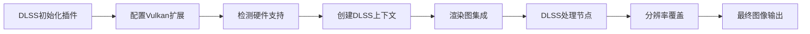

+++
title = "#19864 Initial DLSS implementation"
date = "2025-08-15T00:00:00"
draft = false
template = "pull_request_page.html"
in_search_index = false

[extra]
current_language = "zh-cn"
available_languages = {"en" = { name = "English", url = "/pull_request/bevy/2025-08/pr-19864-en-20250815" }, "zh-cn" = { name = "中文", url = "/pull_request/bevy/2025-08/pr-19864-zh-cn-20250815" }}
+++

# Initial DLSS implementation

## 基本信息
- **标题**: Initial DLSS implementation
- **PR链接**: https://github.com/bevyengine/bevy/pull/19864
- **作者**: JMS55
- **状态**: MERGED
- **标签**: C-Feature, A-Rendering, D-Complex, M-Needs-Release-Note, X-Contentious, S-Needs-Review, M-Deliberate-Rendering-Change
- **创建时间**: 2025-06-29T18:43:47Z
- **合并时间**: 2025-08-15T21:28:01Z
- **合并者**: cart

## 描述翻译
### Objective
- 关闭 https://github.com/bevyengine/bevy/issues/8420

### Solution
- 通过 https://github.com/bevyengine/dlss_wgpu 实现了DLSS上采样的初始版本
- 未来的PR将处理透明度、曝光、自定义视口、修复分辨率覆盖bug等问题
- DLSS帧生成不在计划中，但计划为Solari实现光线重建
- FSR3/4、XeSS2和MetalFX时间上采样现在可以轻松添加
- 未来可以实现一个自动时间抗锯齿组件，自动处理DLSS/FSR/XeSS/MetalFX/TAA的回退

### Testing
- 你测试过这些变更吗？如果是，如何测试的？
  - 运行anti_aliasing示例
- 哪些部分需要更多测试？
  - 不同类型的场景内容和渲染效果，确保它们与DLSS/上采样兼容
  - 审查dlss_wgpu代码

---

### Showcase


## 这个Pull Request的故事

### 问题和背景
在实时渲染中，抗锯齿（AA）是消除图形锯齿状边缘的关键技术。传统方法如MSAA、FXAA、TAA等各有优缺点。NVIDIA的DLSS技术利用深度学习进行上采样和抗锯齿，能在提升性能的同时保持高画质，但需要特定硬件（NVIDIA RTX GPU）和平台（Windows/Linux的Vulkan后端）支持。

Bevy引擎之前已支持多种抗锯齿方法，但缺乏DLSS支持。这个PR的目标是填补这一空白，为使用兼容硬件的用户提供高质量的图像上采样和抗锯齿选项。

### 解决方案方法
作者选择了通过外部库`dlss_wgpu`（由Bevy引擎团队维护）来实现DLSS集成。这种方法避免了从头实现的复杂性，同时确保与Bevy的渲染架构兼容。

主要技术决策包括：
1. **模块化设计**：将DLSS实现为Bevy抗锯齿模块的一个可选特性
2. **条件编译**：通过Cargo特性标志`dlss`控制DLSS的编译
3. **运行时检测**：在渲染初始化时检测DLSS支持
4. **组件化**：添加`Dlss`组件，用户可以将其附加到相机实体来启用DLSS

### 实现细节
实现主要集中在以下几个关键方面：

**1. 初始化流程**：
- 添加了`DlssInitPlugin`，在渲染初始化阶段配置Vulkan实例和设备扩展
- 使用`RawVulkanInitSettings`注册DLSS所需的Vulkan扩展
- 运行时检测DLSS支持并设置`DlssSuperResolutionSupported`资源

```rust
// 在DlssInitPlugin中注册Vulkan扩展
unsafe {
    raw_vulkan_settings.add_create_instance_callback(
        move |mut args, additional_vulkan_features| {
            let mut feature_support = FeatureSupport::default();
            match dlss_wgpu::register_instance_extensions(
                dlss_project_id,
                &mut args,
                &mut feature_support,
            ) {
                Ok(_) => {
                    if feature_support.super_resolution_supported {
                        additional_vulkan_features.insert::<DlssSuperResolutionSupported>();
                    }
                    // ...
                }
                Err(_) => {}
            }
        },
    );
}
```

**2. 核心组件**：
- 创建了`Dlss<F: DlssFeature>`组件，可附加到相机实体
- 支持配置质量模式（`DlssPerfQualityMode`）和重置历史帧（`reset`标志）
- 为不同的DLSS特性（超分辨率、光线重建）提供了泛型实现

```rust
#[derive(Component, Reflect, Clone)]
pub struct Dlss<F: DlssFeature = DlssSuperResolutionFeature> {
    pub perf_quality_mode: DlssPerfQualityMode,
    pub reset: bool,
    pub _phantom_data: PhantomData<F>,
}
```

**3. 渲染图集成**：
- 在Bevy的3D渲染图中添加了新的DLSS节点
- 根据DLSS类型（超分辨率或光线重建）处理不同的输入纹理
- 在渲染流程中合理定位DLSS节点（在运动模糊之后，Bloom之前）

```rust
// 在渲染图中添加DLSS节点
.add_render_graph_node::<ViewNodeRunner<node::DlssNode<DlssSuperResolutionFeature>>>(
    Core3d,
    Node3d::DlssSuperResolution,
)
.add_render_graph_edges(
    Core3d,
    (
        Node3d::EndMainPass,
        Node3d::MotionBlur,
        Node3d::DlssSuperResolution,
        Node3d::DlssRayReconstruction,
        Node3d::Bloom,
        // ...
    ),
);
```

**4. 分辨率管理**：
- DLSS需要根据质量模式调整渲染分辨率
- 添加了`MainPassResolutionOverride`组件来管理分辨率覆盖
- 自动计算建议的Mipmap偏移（`MipBias`）和时间抖动（`TemporalJitter`）

```rust
// 在prepare_dlss系统中计算分辨率覆盖
commands.entity(entity).insert((
    DlssRenderContext::<F> { ... },
    MainPassResolutionOverride(render_resolution),
));
```

**5. 示例集成**：
- 扩展了`anti_aliasing`示例，支持DLSS
- 添加了DLSS质量模式切换逻辑
- 在UI中显示DLSS选项（仅当支持时）

```rust
// 在anti_aliasing示例中添加DLSS支持
#[cfg(all(feature = "dlss", not(feature = "force_disable_dlss"))]
app.insert_resource(DlssProjectId(uuid!(
    "5417916c-0291-4e3f-8f65-326c1858ab96"
)));
```

### 技术洞察
1. **条件编译**：通过`cfg`属性确保DLSS仅在支持的环境编译：
   ```rust
   #[cfg(all(feature = "dlss", not(feature = "force_disable_dlss"))]
   ```
   这避免了在不兼容平台（如WebGL）上编译DLSS代码。

2. **线程安全**：使用`Arc<Mutex<...>>`包装DLSS上下文，确保线程安全访问：
   ```rust
   pub struct DlssRenderContext<F: DlssFeature> {
       pub context: Mutex<F::Context>,
       ...
   }
   ```

3. **渲染资源管理**：
   - 修改了`CameraMainTextureUsages`以包含存储绑定用途
   - 扩展了深度纹理用途以支持纹理绑定
   ```rust
   camera_main_texture_usages.0 |= TextureUsages::STORAGE_BINDING;
   depth_texture_usages |= TextureUsages::TEXTURE_BINDING;
   ```

4. **错误处理**：在DLSS初始化失败时提供明确的日志信息：
   ```rust
   if dlss_sdk.is_err() {
       info!("DLSS is not supported on this system");
       return;
   }
   ```

### 影响
1. **性能提升**：DLSS允许以较低分辨率渲染，然后通过AI上采样，显著提升帧率
2. **画质改进**：相比TAA等传统方法，DLSS提供更高质量的图像抗锯齿
3. **扩展性**：
   - 为后续集成FSR、XeSS等其他上采样技术奠定了基础
   - 添加了`DlssFeature` trait，支持不同的DLSS变体
4. **开发者体验**：
   - 提供了清晰的API和示例
   - 添加了详细的文档和发布说明

## 视觉表示



## 关键变更文件

1. **`crates/bevy_anti_aliasing/src/dlss/mod.rs` (+404/-0)**
   - 新增文件，实现DLSS核心功能
   - 定义插件、组件和资源
   - 关键代码：
     ```rust
     pub struct DlssPlugin;
     impl Plugin for DlssPlugin { ... }
     ```

2. **`crates/bevy_anti_aliasing/src/dlss/node.rs` (+165/-0)**
   - 实现渲染节点
   - 根据DLSS模式处理不同的输入纹理
   - 关键代码：
     ```rust
     impl ViewNode for DlssNode<DlssSuperResolutionFeature> { ... }
     ```

3. **`examples/3d/anti_aliasing.rs` (+138/-11)**
   - 扩展示例支持DLSS
   - 添加DLSS切换和质量模式选择
   - 关键修改：
     ```rust
     if keys.just_pressed(KeyCode::Digit6) { ... } // 启用DLSS
     ```

4. **`crates/bevy_anti_aliasing/src/dlss/prepare.rs` (+116/-0)**
   - 准备DLSS渲染上下文
   - 关键函数`prepare_dlss`
   - 代码：
     ```rust
     pub fn prepare_dlss<F: DlssFeature>( ... ) { ... }
     ```

5. **`release-content/release-notes/dlss.md` (+36/-0)**
   - 新增发布说明
   - 包含使用指南和限制

## 扩展阅读
- [DLSS SDK文档](https://developer.nvidia.com/dlss)
- [Bevy dlss_wgpu库](https://github.com/bevyengine/dlss_wgpu)
- [Vulkan渲染指南](https://www.khronos.org/vulkan/)