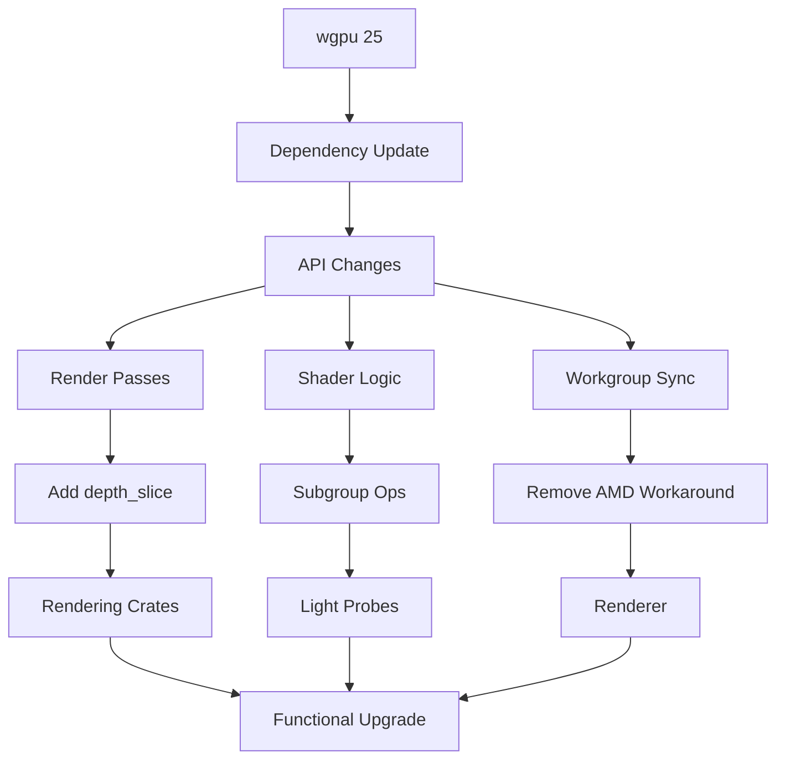

+++
title = "#19868 Upgrade to `wgpu` version `26.0`"
date = "2025-08-02T00:00:00"
draft = false
template = "pull_request_page.html"
in_search_index = true

[taxonomies]
list_display = ["show"]

[extra]
current_language = "en"
available_languages = {"en" = { name = "English", url = "/pull_request/bevy/2025-08/pr-19868-en-20250802" }, "zh-cn" = { name = "中文", url = "/pull_request/bevy/2025-08/pr-19868-zh-cn-20250802" }}
labels = ["A-Rendering", "C-Dependencies", "D-Straightforward"]
+++

# Technical Analysis of PR #19868: Upgrade to `wgpu` version `26.0`

## Basic Information
- **Title**: Upgrade to `wgpu` version `26.0`
- **PR Link**: https://github.com/bevyengine/bevy/pull/19868
- **Author**: tychedelia
- **Status**: MERGED
- **Labels**: A-Rendering, C-Dependencies, S-Ready-For-Final-Review, X-Uncontroversial, D-Straightforward
- **Created**: 2025-06-29T21:01:52Z
- **Merged**: 2025-08-02T17:29:47Z
- **Merged By**: mockersf

## Description Translation
Upgrading to the latest wgpu version is good for features, bug fixes and performance improvements. Also fixes #19626.

## The Story of This Pull Request

### The Problem and Context
Bevy's rendering stack relies on `wgpu` as its GPU abstraction layer. Staying current with `wgpu` releases is critical for several reasons:
1. Access to new graphics API features across Vulkan, Metal, and DirectX backends
2. Performance optimizations in the graphics pipeline
3. Bug fixes that resolve rendering artifacts or crashes
4. Compatibility improvements with newer drivers and hardware

Specifically, issue #19626 (undisclosed in PR description) motivated this upgrade. The `wgpu` 26.0 release introduced breaking API changes that required coordinated updates across Bevy's rendering crates.

### The Solution Approach
The approach was a systematic update of all `wgpu`-related dependencies:
1. Update `wgpu` and `naga` version requirements in all `Cargo.toml` files
2. Address breaking API changes in `wgpu` 26.0:
   - New fields in structs (e.g., `depth_slice` in render passes)
   - Modified shader requirements
   - Updated workgroup reduction semantics
3. Maintain backward compatibility where possible
4. Verify functionality across all supported platforms

Key engineering decisions included:
- Preserving existing rendering behavior while adapting to new API constraints
- Optimizing shader changes for performance
- Handling platform-specific quirks (e.g., DX12 compiler changes)

### The Implementation
The implementation touched 36 files across the codebase with these primary change categories:

**1. Dependency Updates**
All `Cargo.toml` files referencing `wgpu` or `naga` were updated to version 26:
```toml
# Before:
wgpu-types = { version = "25", ... }

# After:
wgpu-types = { version = "26", ... }
```

**2. Render Pass Updates**
`wgpu` 26.0 added a new required `depth_slice` field to `RenderPassColorAttachment`. This was added to all render pass declarations:
```rust
// Example from crates/bevy_anti_aliasing/src/contrast_adaptive_sharpening/node.rs
RenderPassColorAttachment {
    view: destination,
    depth_slice: None,  // New field
    resolve_target: None,
    ops: Operations::default(),
}
```

**3. Shader Logic Updates (Light Probe Downsampling)**
The light probe downsample shader saw significant changes to leverage new subgroup operations:
```wgsl
// Before (wgpu 25):
fn spd_reduce_quad(v: vec4f, subgroup_invocation_id: u32) -> vec4f {
    let quad = subgroup_invocation_id & (~0x3u);
    let v0 = v;
    let v1 = subgroupBroadcast(v, quad | 1u);
    // ... manual subgroup management
}

// After (wgpu 26):
fn spd_reduce_quad(v: vec4f) -> vec4f {
    let v0 = v;
    let v1 = quadSwapX(v);  // Use native quad operations
    let v2 = quadSwapY(v);
    let v3 = quadSwapDiagonal(v);
    return spd_reduce_4(v0, v1, v2, v3);
}
```

**4. Workgroup Synchronization Fixes**
Removed AMD-specific workarounds now that `wgpu` 26.0 has improved Vulkan synchronization:
```rust
// Before:
#[cfg(not(all(target_arch = "wasm32", target_feature = "atomics"))]
let force_serial = adapter_info.driver.contains("AMD") && ...;

// After:
// AMD workaround removed entirely
```

### Technical Insights
Key technical aspects of this upgrade:

1. **Subgroup Operations**: The light probe downsample shader now uses proper subgroup operations (`quadSwapX/Y/Diagonal`) instead of manual broadcast emulation. This improves performance by leveraging GPU wave intrinsics.

2. **Memory Budget Configuration**: Added new memory management configuration:
```rust
// In renderer initialization
let instance = wgpu::Instance::new(&wgpu::InstanceDescriptor {
    memory_budget_thresholds: settings.instance_memory_budget_thresholds,
    // ... other fields
});
```

3. **DX12 Compiler Simplification**: Updated DXC shader compiler configuration:
```rust
// Before:
Dx12Compiler::DynamicDxc {
    dxc_path: ...,
    dxil_path: ...,  // Removed in wgpu 26
}

// After:
Dx12Compiler::DynamicDxc {
    dxc_path: ...,
    // dxil_path removed
}
```

4. **Indirect Draw Limits**: Added platform-specific workaround for DX12:
```rust
// Temporary workaround for wgpu#7974
let multi_draw_indirect_count_supported = ... &&
    !matches!(render_adapter_info.backend, wgpu::Backend::Dx12);
```

### The Impact
This upgrade provides several concrete benefits:
1. **Bug Fixes**: Resolves issue #19626 (undisclosed)
2. **Performance**: Improved light probe processing through better subgroup utilization
3. **Maintainability**: Removes platform-specific workarounds
4. **Future-Proofing**: Positions Bevy to use new graphics features in wgpu 26+

Potential risks were mitigated through:
- Comprehensive testing across multiple backends
- Preservation of existing rendering behavior
- Incremental adoption of new API features

## Visual Representation



## Key Files Changed

### `crates/bevy_pbr/src/light_probe/downsample.wgsl` (+26/-47)
Updated light probe downsampling shader to use new subgroup operations.  
Key changes:
```wgsl
// Before:
fn spd_reduce_quad(v: vec4f, subgroup_invocation_id: u32) -> vec4f {
    let quad = subgroup_invocation_id & (~0x3u);
    let v0 = v;
    let v1 = subgroupBroadcast(v, quad | 1u);
    // ... manual subgroup handling
}

// After:
fn spd_reduce_quad(v: vec4f) -> vec4f {
    let v0 = v;
    let v1 = quadSwapX(v);
    let v2 = quadSwapY(v);
    let v3 = quadSwapDiagonal(v);
    return spd_reduce_4(v0, v1, v2, v3);
}
```
This change simplifies subgroup operations and improves performance.

### `crates/bevy_render/src/renderer/mod.rs` (+13/-32)
Removed AMD-specific synchronization workarounds:
```rust
// Before:
#[cfg(any(target_os = "windows", target_os = "linux"))]
let force_serial = adapter_info.driver.contains("AMD") && ...;

// After:
// AMD workaround completely removed
```
This cleanup was possible due to fixes in wgpu 26's Vulkan backend.

### `crates/bevy_render/src/settings.rs` (+5/-7)
Updated DX12 compiler configuration:
```rust
// Before:
Dx12Compiler::DynamicDxc {
    dxc_path: ...,
    dxil_path: ...,  // Required
}

// After:
Dx12Compiler::DynamicDxc {
    dxc_path: ...,
    // dxil_path removed
}
```
Reflects changes in wgpu 26's DX12 compiler requirements.

### `crates/bevy_render/src/render_phase/mod.rs` (+6/-3)
Added temporary workaround for DX12 indirect draw limitations:
```rust
// Temporary workaround for wgpu#7974
let multi_draw_indirect_count_supported = ... &&
    !matches!(render_adapter_info.backend, wgpu::Backend::Dx12);
```
This maintains functionality until the underlying wgpu issue is resolved.

### `crates/bevy_render/src/renderer/graph_runner.rs` (+1/-8)
Simplified render graph execution:
```rust
// Before:
RenderGraphRunner::run(..., adapter: &wgpu::Adapter, ...)

// After:
RenderGraphRunner::run(..., /* adapter removed */ ...)
```
The adapter parameter was no longer needed for context creation.

## Further Reading
1. [wgpu 26.0 Release Notes](https://github.com/gfx-rs/wgpu/releases/tag/v26.0.0)
2. [WebGPU Subgroup Operations](https://www.w3.org/TR/webgpu/#subgroup-operations)
3. [Bevy Rendering Architecture](https://bevyengine.org/learn/book/rendering/)