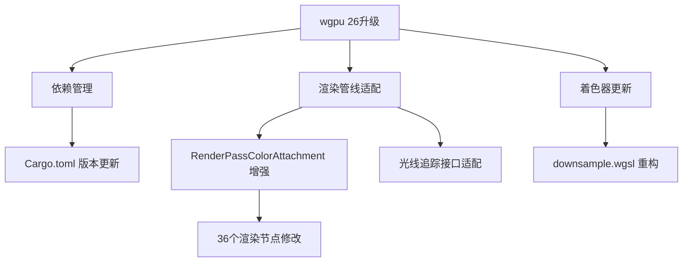

+++
title = "#19868 Upgrade to `wgpu` version `26.0"
date = "2025-08-02T00:00:00"
draft = false
template = "pull_request_page.html"
in_search_index = false

[extra]
current_language = "zh-cn"
available_languages = {"en" = { name = "English", url = "/pull_request/bevy/2025-08/pr-19868-en-20250802" }, "zh-cn" = { name = "中文", url = "/pull_request/bevy/2025-08/pr-19868-zh-cn-20250802" }}
+++

# 升级至 `wgpu` 版本 `26.0`

## 基础信息
- **标题**: Upgrade to `wgpu` version `26.0`
- **PR链接**: https://github.com/bevyengine/bevy/pull/19868
- **作者**: tychedelia
- **状态**: 已合并 (MERGED)
- **标签**: A-Rendering, C-Dependencies, S-Ready-For-Final-Review, X-Uncontroversial, D-Straightforward
- **创建时间**: 2025-06-29T21:01:52Z
- **合并时间**: 2025-08-02T17:29:47Z
- **合并人**: mockersf

## 描述翻译
### 目标
- 升级到最新 wgpu 版本可获得新特性、错误修复和性能改进
- 同时修复 #19626

### 解决方案
- 升级依赖版本

## PR 技术分析

### 问题背景
Bevy 引擎依赖图形 API 抽象层 `wgpu` 进行跨平台渲染。`wgpu` 26.0 版本引入了 API 变更和功能改进，主要变化包括：
1. `RenderPassColorAttachment` 新增必需字段 `depth_slice`
2. 工作组(wave)操作接口变更
3. 光线追踪 API 调整
4. DX12 编译器检测逻辑简化
5. 新增内存预算阈值配置

这些变更导致 Bevy 现有代码与新版本不兼容，需要同步升级适配。未升级会导致编译错误和运行时故障（如 #19626）。

### 解决方案
通过系统性的依赖版本升级和代码适配解决兼容性问题：
1. 将所有 `wgpu` 相关依赖从 `25` 升级到 `26`
2. 适配 `wgpu` 26 的 API 变更
3. 修复因 API 变更导致的着色器编译错误
4. 启用新版本引入的功能特性

### 关键技术实现
#### 1. 渲染附件适配
`wgpu` 26 要求在 `RenderPassColorAttachment` 中显式指定 `depth_slice` 字段。在 36 个文件中添加了该字段并设置为 `None`（表示默认深度切片）：

```rust
// 变更前:
RenderPassColorAttachment {
    view: destination,
    resolve_target: None,
    ops: Operations::default(),
}

// 变更后:
RenderPassColorAttachment {
    view: destination,
    depth_slice: None,  // 新增字段
    resolve_target: None,
    ops: Operations::default(),
}
```

此变更加在以下核心流程：
- 抗锯齿处理（FXAA, SMAA, TAA）
- 后处理（泛光、景深、色调映射）
- 光线追踪节点
- 屏幕截图处理

#### 2. 光照探针下采样着色器重构
`crates/bevy_pbr/src/light_probe/downsample.wgsl` 重构了工作组操作逻辑：
- 移除 `subgroup_invocation_id` 参数
- 使用 `quadSwap` 指令替代手动的 subgroup 广播
- 简化工作组间数据交换逻辑

关键变更对比：
```wgsl
// 变更前:
fn spd_reduce_quad(v: vec4f, subgroup_invocation_id: u32) -> vec4f {
    let quad = subgroup_invocation_id & (~0x3u);
    let v0 = v;
    let v1 = subgroupBroadcast(v, quad | 1u);
    let v2 = subgroupBroadcast(v, quad | 2u);
    let v3 = subgroupBroadcast(v, quad | 3u);
    return spd_reduce_4(v0, v1, v2, v3);
}

// 变更后:
fn spd_reduce_quad(v: vec4f) -> vec4f {
    let v0 = v;
    let v1 = quadSwapX(v);
    let v2 = quadSwapY(v);
    let v3 = quadSwapDiagonal(v);
    return spd_reduce_4(v0, v1, v2, v3);
}
```
此变更优化了工作组内数据交换效率，符合 `wgpu` 26 的 WGSL 规范更新。

#### 3. 渲染器初始化增强
在 `crates/bevy_render/src/lib.rs` 中新增内存预算阈值配置：
```rust
let instance = wgpu::Instance::new(&wgpu::InstanceDescriptor {
    memory_budget_thresholds: settings.instance_memory_budget_thresholds, // 新增
    ..default()
});
```
此配置允许精细控制 GPU 内存分配策略。

#### 4. DX12 编译器检测优化
简化了 DXC 编译器检测逻辑（`crates/bevy_render/src/settings.rs`）：
```rust
// 变更前:
if std::fs::metadata(dxc).is_ok() && std::fs::metadata(dxil).is_ok()

// 变更后:
if std::fs::metadata(dxc).is_ok()  // 只需检测 dxcompiler.dll
```

#### 5. 光线追踪 API 适配
`bevy_solari` 光线追踪模块适配 TLAS 创建接口变更：
```rust
// 变更前:
let mut tlas = TlasPackage::new(device.create_tlas(...));

// 变更后:
let mut tlas = device.create_tlas(...);  // 直接创建加速结构
```
反映 `wgpu` 26 中光线追踪 API 的简化。

### 技术影响
1. **兼容性**：确保 Bevy 与 `wgpu` 26+ 的兼容性
2. **性能**：着色器优化可能提升光照探针处理效率
3. **内存管理**：新增内存预算阈值提升资源控制精度
4. **维护性**：DX12 工具链检测逻辑更健壮

### 经验总结
1. **跨版本升级**：大版本依赖升级需全面测试渲染管线各阶段
2. **WGSL 规范**：工作组操作接口易随规范版本变更，需关注 WGSL 更新日志
3. **扩展字段处理**：新增必需字段时可用 `..default()` 语法保持兼容
4. **平台适配**：Windows 图形工具链检测应优先考虑常见部署场景

## 组件关系图


## 关键文件变更

### 1. 光照探针下采样着色器
`crates/bevy_pbr/src/light_probe/downsample.wgsl` (+26/-47)
```wgsl
// 关键变更：工作组操作简化
fn spd_reduce_quad(v: vec4f) -> vec4f {
    let v0 = v;
    let v1 = quadSwapX(v);
    let v2 = quadSwapY(v);
    let v3 = quadSwapDiagonal(v);
    return spd_reduce_4(v0, v1, v2, v3);
}
```

### 2. 渲染器初始化
`crates/bevy_render/src/renderer/mod.rs` (+13/-32)
```rust
// 新增内存预算阈值
let instance = wgpu::Instance::new(&wgpu::InstanceDescriptor {
    memory_budget_thresholds: settings.instance_memory_budget_thresholds,
    ..default()
});
```

### 3. 渲染设置更新
`crates/bevy_render/src/settings.rs` (+5/-7)
```rust
// 简化DX12编译器检测
Dx12Compiler::DynamicDxc {
    dxc_path: String::from(dxc),
    max_shader_model: DxcShaderModel::V6_7,
}
```

### 4. 渲染阶段优化
`crates/bevy_render/src/render_phase/mod.rs` (+6/-3)
```rust
// 添加DX12间接绘制限制
let multi_draw_indirect_count_supported = ... &&
    !matches!(render_adapter_info.backend, wgpu::Backend::Dx12);
```

### 5. 渲染图执行器优化
`crates/bevy_render/src/renderer/graph_runner.rs` (+1/-8)
```rust
// 移除不必要的适配器参数
RenderContext::new(render_device, diagnostics_recorder)
```

## 扩展阅读
1. [wgpu 26.0 发布说明](https://github.com/gfx-rs/wgpu/releases/tag/v26.0.0)
2. [WGSL 工作组操作规范](https://www.w3.org/TR/WGSL/#subgroup-operations)
3. [光线追踪加速结构最佳实践](https://github.com/gfx-rs/wgpu/wiki/Acceleration-Structures)