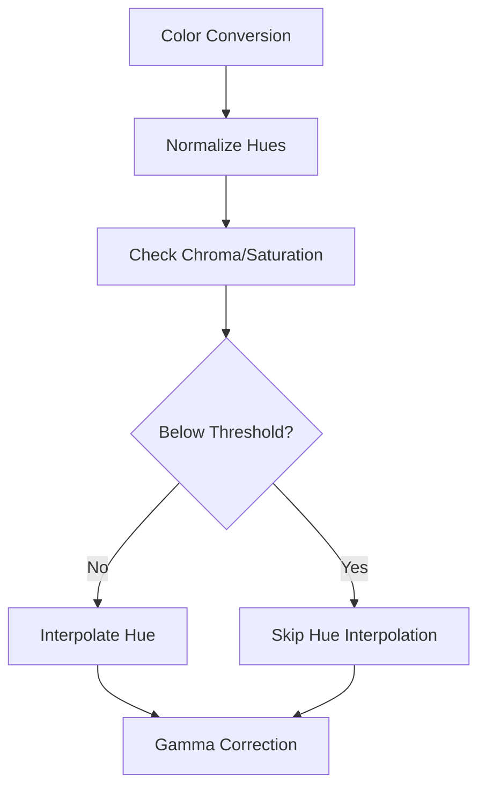

+++
title = "#20035"
date = "2025-08-04T00:00:00"
draft = false
template = "pull_request_page.html"
in_search_index = true

[taxonomies]
list_display = ["show"]

[extra]
current_language = "en"
available_languages = {"en" = { name = "English", url = "/pull_request/bevy/2025-08/pr-20035-en-20250804" }, "zh-cn" = { name = "中文", url = "/pull_request/bevy/2025-08/pr-20035-zh-cn-20250804" }}
+++

### More UI Gradients Fixes: Technical Analysis

#### The Problem and Context
Bevy's gradient rendering had three core issues affecting UI visuals:
1. Gamma correction used an approximation (pow 2.2) that didn't match sRGB standards
2. HSL/HSV conversion functions produced inaccurate results
3. Hue interpolation artifacts occurred near grayscale colors (chroma ≈ 0)

These were visible in gradients transitioning to/from black/white, causing unexpected hue shifts. The existing implementation also lacked comprehensive test coverage for edge cases.

#### The Solution Approach
The fix required coordinated changes across color spaces:
1. Implemented precise sRGB gamma correction from #12939
2. Fixed HSL/HSV conversion math
3. Added chroma/saturation thresholds to skip hue interpolation near grayscale
4. Expanded test coverage with new gradient scenarios

Key engineering decisions:
- Maintained backward compatibility with existing color space definitions
- Separated RGB and alpha interpolation
- Used normalized hue representations (0-1 range) consistently
- Established 0.0001 threshold (`HUE_GUARD`) for chroma/saturation checks

#### The Implementation
The solution modified three key areas:

1. **Gamma Correction (gradient.wgsl)**
Replaced power approximation with standard sRGB piecewise function:
```wgsl
// Before
vec4(pow(color.rgb, vec3(2.2)), color.a)

// After
fn gamma(value: f32) -> f32 {
    if value <= 0.0 { return value; }
    if value <= 0.04045 {
        return value / 12.92;
    } else {
        return pow((value + 0.055) / 1.055, 2.4);
    }
}
```

2. **Hue Handling (gradient.wgsl + gradient.rs)**
Normalized hues to 0-1 range before shader processing:
```rust
// gradient.rs
// Before
[hsla.hue / 360.0, hsla.saturation, ...]

// After
[hsla.hue / 360., hsla.saturation, ...] // Consistent normalization
```

Added chroma/saturation guards to skip hue interpolation:
```wgsl
// gradient.wgsl
if a.y < HUE_GUARD { // Chroma check for Oklch
    h = g; // Use target's hue
} else if b.y < HUE_GUARD {
    g = h; // Use source's hue
}
```

3. **Test Coverage (ui.rs)**
Added 5 new gradient test cases covering:
- Grayscale transitions
- Constant hue with varying saturation/lightness
- Full hue spectrum
- Multi-color gradients

```rust
// examples/testbed/ui.rs
vec![
    Color::hsl(180.71191, 0.0, 0.3137255).into(), // Grayscale
    Color::hsl(0.0 + 0.0001, 1.0, 0.5).into(),    // Hue boundary
    Color::WHITE.into(),                           // Multi-color
    RED.into(),
    LIME.into(),
    BLUE.into(),
    Color::BLACK.into(),
]
```

#### Technical Insights
Key improvements:
1. **Color Accuracy**: Proper gamma correction matches standard sRGB displays
2. **Visual Consistency**: HSL/HSV conversions now match CSS specifications
3. **Edge Case Handling**: Hue interpolation skips when:
   - Chroma < 0.0001 (Oklch)
   - Saturation < 0.0001 (HSL/HSV)
4. **Performance**: Minimal overhead from threshold checks (branching on constant)

Alpha handling was optimized by:
```wgsl
vec4(mix_colors(start_color.xyz, end_color.xyz, t), 
     mix(start_color.a, end_color.a, t))
```

#### The Impact
- Fixed hue shifts in grayscale gradients
- Corrected color output across all supported spaces
- Added validation for 9 color spaces × 6 gradient types
- Enabled smoother UI transitions (visible in before/after comparison)

Before:  
  

After:  


### Visual Representation


### Key Files Changed

1. **crates/bevy_ui_render/src/gradient.wgsl**  
   Rewrote color conversion and interpolation logic:
```wgsl
// Before
fn oklaba_to_linear_rgba(c: vec4<f32>) -> vec4<f32> {
    // ... pow 2.2 approximation
}

// After
fn oklch_to_linear_rgb(c: vec3<f32>) -> vec3<f32> {
    let hue = c.z * TAU;
    return oklab_to_linear_rgb(vec3(c.x, c.y * cos(hue), c.y * sin(hue)));
}

// Added chroma guard
if a.y < HUE_GUARD {
    h = g; // Use target's hue
}
```

2. **examples/testbed/ui.rs**  
   Expanded test coverage with grid layout:
```rust
// Before
commands.spawn((Node { ... }, ...));

// After
commands.spawn(Node {
    display: bevy::ui::Display::Grid, // Grid layout
    row_gap: Val::Px(4.),
    column_gap: Val::Px(4.),
    ... 
})
```

3. **crates/bevy_ui_render/src/gradient.rs**  
   Standardized hue normalization:
```rust
// Before
[hsla.hue / 360.0, ...]  // Inconsistent normalization

// After
[hsla.hue / 360., ...] // Consistent 0-1 range
```

### Further Reading
1. [sRGB Gamma Correction](https://en.wikipedia.org/wiki/SRGB)
2. [OKLab Color Space](https://bottosson.github.io/posts/oklab/)
3. [CSS Gradient Specification](https://www.w3.org/TR/css-images-4/#color-stop-syntax)