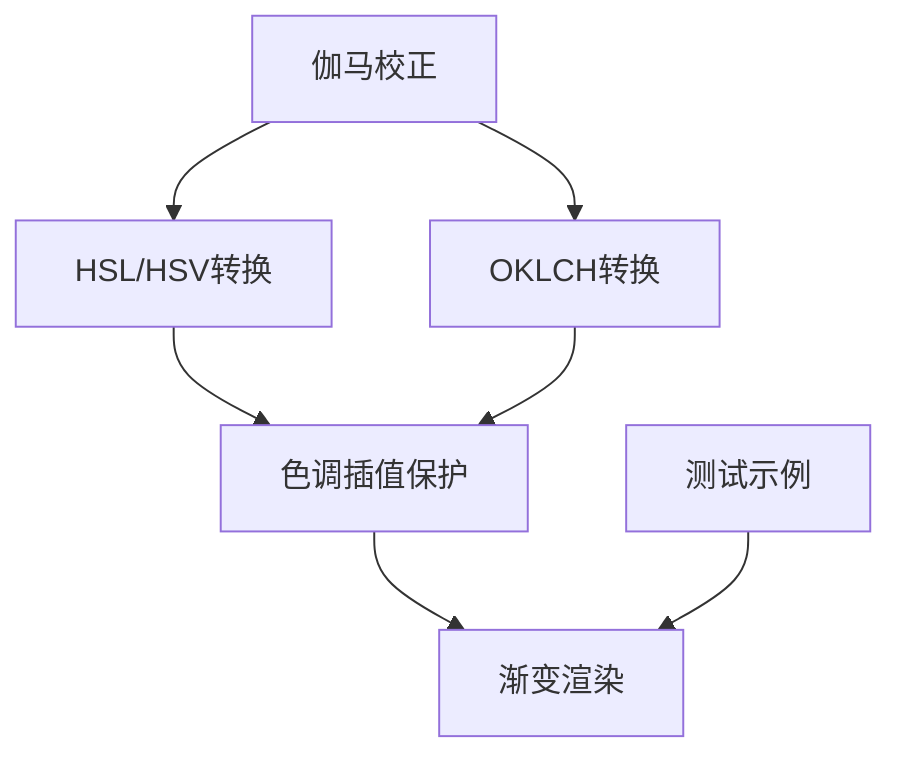

+++
title = "#20035 More UI gradients fixes"
date = "2025-08-04T00:00:00"
draft = false
template = "pull_request_page.html"
in_search_index = false

[extra]
current_language = "zh-cn"
available_languages = {"en" = { name = "English", url = "/pull_request/bevy/2025-08/pr-20035-en-20250804" }, "zh-cn" = { name = "中文", url = "/pull_request/bevy/2025-08/pr-20035-zh-cn-20250804" }}
labels = ["C-Bug", "A-Rendering", "A-UI", "M-Deliberate-Rendering-Change"]
+++

# PR分析报告：More UI gradients fixes

## Basic Information
- **Title**: More UI gradients fixes
- **PR Link**: https://github.com/bevyengine/bevy/pull/20035
- **Author**: ickshonpe
- **Status**: MERGED
- **Labels**: C-Bug, A-Rendering, A-UI, S-Ready-For-Final-Review, M-Deliberate-Rendering-Change
- **Created**: 2025-07-08T16:56:33Z
- **Merged**: 2025-08-04T16:30:19Z
- **Merged By**: alice-i-cecile

## Description Translation
# 目标

进一步改进渐变实现。

## 解决方案
更多UI渐变改进：
* 使用来自#12939的更精确的伽马校正函数
* 修复了hsl和hsv转换函数
* 当色度或饱和度接近零时忽略色调且不进行插值

之前：


之后：


## 测试

可以使用`testbed_ui`和`gradients`示例进行测试。

## The Story of This Pull Request

### 问题背景
UI渐变渲染在特定场景下存在视觉问题，主要表现在：
1. 颜色空间转换不准确，特别是HSL和HSV空间
2. 在低饱和度/色度情况下出现不自然的色调插值
3. 缺乏正确的伽马校正处理

这些问题导致渐变在黑白过渡或低饱和度颜色时产生不期望的色调偏移（如描述中的"before"截图所示）。这些问题属于渲染缺陷（C-Bug），影响UI组件的视觉一致性。

### 解决方案方法
PR采取了系统性修复方案：
1. **引入精确伽马校正**：移植#12939的伽马校正实现，确保sRGB/线性空间转换正确
2. **重构颜色空间处理**：解耦RGB转换和alpha处理
3. **添加色度/饱和度保护**：引入`HUE_GUARD`阈值避免无效色调插值
4. **增强测试覆盖**：扩展测试示例验证各种边界情况

工程决策聚焦于：
- 保持向后兼容的API
- 最小化性能影响
- 提供全面的视觉测试用例

### 技术实现细节
核心修改集中在着色器逻辑(`gradient.wgsl`)：
1. **伽马校正函数**：添加`sRGB_to_linear_rgb()`和`linear_rgb_to_sRGB()`函数
2. **颜色空间转换重构**：
   - 分离RGB和alpha处理
   - 修正HSL/HSV转换公式
3. **色调插值保护**：
   ```wgsl
   const HUE_GUARD: f32 = 0.0001;
   
   if a.y < HUE_GUARD {
       h = g; // 使用目标色调
   }
   ```
4. **混合函数优化**：所有`mix_*`函数增加色度/饱和度检查

Rust端配合修改：
- 确保色调值正确归一化(0-1范围)
- 扩展测试场景覆盖更多边界情况

### 技术洞察
关键实现要点：
1. **色度保护机制**：当色度(chroma)或饱和度(saturation)低于阈值时，跳过色调插值，直接使用有效色调值。这解决了黑白渐变中出现意外色调的问题。
   
2. **伽马校正精确性**：新伽马函数严格遵循sRGB标准：
   ```wgsl
   fn gamma(value: f32) -> f32 {
       if value <= 0.04045 {
           return value / 12.92;
       } else {
           return pow((value + 0.055) / 1.055, 2.4);
       }
   }
   ```

3. **色调归一化处理**：所有色调值统一为0-1范围，确保跨颜色空间一致性

### 影响与改进
这些修改带来：
1. **视觉准确性提升**：修复低饱和度渐变中的色调偏移问题
2. **颜色一致性**：不同颜色空间的渐变结果更可预测
3. **健壮性增强**：处理边界情况更可靠
4. **测试覆盖完善**：新增6种测试场景验证各种极端情况

从工程角度看，这个PR展示了：
- 颜色空间插值的正确处理模式
- 着色器中边界条件的安全处理
- 通过可视化测试验证渲染变更的有效方法

## Visual Representation



## Key Files Changed

### 1. `crates/bevy_ui_render/src/gradient.wgsl` (+165/-77)
**修改原因**：重构颜色转换逻辑，增加伽马校正和色调保护机制

关键变更：
```wgsl
// 新增伽马校正函数
fn srgb_to_linear_rgb(color: vec3<f32>) -> vec3<f32> {
    return vec3(
        gamma(color.x),
        gamma(color.y),
        gamma(color.z)
    );
}

// 修改后的HSL转换（去alpha处理）
fn hsl_to_linear_rgb(hsl: vec3<f32>) -> vec3<f32> {
    // ...计算逻辑...
    return srgb_to_linear_rgb(vec3(r + m, g + m, b + m));
}

// 增加色调保护的条件检查
fn mix_oklch(a: vec3<f32>, b: vec3<f32>, t: f32) -> vec3<f32> {
    var h = a.z;
    var g = b.z;
    if a.y < HUE_GUARD {
        h = g;
    } else if b.y < HUE_GUARD {
        g = h;
    }
    // ...插值逻辑...
}
```

### 2. `examples/testbed/ui.rs` (+88/-44)
**修改原因**：扩展测试场景覆盖更多边界情况

关键变更：
```rust
// 新增测试场景
vec![
    Color::hsl(180.71191, 0.0, 0.3137255).into(),
    Color::hsl(180.71191, 0.5, 0.3137255).into(),
    Color::hsl(180.71191, 1.0, 0.3137255).into(),
],
vec![
    Color::WHITE.into(),
    RED.into(),
    LIME.into(),
    BLUE.into(),
    Color::BLACK.into(),
]

// 使用网格布局组织测试
commands.spawn(Node {
    display: bevy::ui::Display::Grid,
    row_gap: Val::Px(4.),
    column_gap: Val::Px(4.),
    ..Default::default()
})
```

### 3. `crates/bevy_ui_render/src/gradient.rs` (+6/-10)
**修改原因**：确保色调值正确归一化

关键变更：
```rust
// 统一色调归一化处理
match space {
    InterpolationColorSpace::Oklcha | InterpolationColorSpace::OklchaLong => {
        let oklcha: Oklcha = color.into();
        [
            oklcha.lightness,
            oklcha.chroma,
            oklcha.hue / 360., // 显式归一化
            oklcha.alpha,
        ]
    }
    // 其他空间类似处理...
}
```

## Further Reading
1. [sRGB颜色空间标准](https://en.wikipedia.org/wiki/SRGB)
2. [OKLab颜色模型解释](https://bottosson.github.io/posts/oklab/)
3. [颜色插值最佳实践](https://www.vis4.net/blog/posts/mastering-multi-hued-color-scales/)
4. [WebGPU着色器编程指南](https://webgpufundamentals.org)