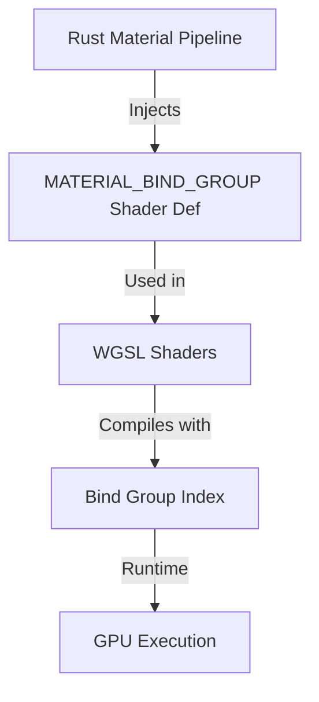

+++
title = "#20069 Material bind group shader def"
date = "2025-08-06T00:00:00"
draft = false
template = "pull_request_page.html"
in_search_index = true

[taxonomies]
list_display = ["show"]

[extra]
current_language = "en"
available_languages = {"en" = { name = "English", url = "/pull_request/bevy/2025-08/pr-20069-en-20250806" }, "zh-cn" = { name = "中文", url = "/pull_request/bevy/2025-08/pr-20069-zh-cn-20250806" }}
labels = ["C-Feature", "A-Rendering"]
+++

## Material Bind Group Shader Def

### Basic Information
- **Title**: Material bind group shader def
- **PR Link**: https://github.com/bevyengine/bevy/pull/20069
- **Author**: tychedelia
- **Status**: MERGED
- **Labels**: C-Feature, A-Rendering, S-Ready-For-Final-Review
- **Created**: 2025-07-09T21:08:01Z
- **Merged**: 2025-08-06T05:27:37Z
- **Merged By**: alice-i-cecile

### Description Translation
Use a shader def for the material bind group index to make it easier for when we want to switch back to group 2 in the future without breaking everyone again.

### The Story of This Pull Request

#### The Problem and Context
Bevy's rendering system relies on WGSL shaders that reference bind groups by index. When the engine upgraded to wgpu 0.25, the material bind group index changed from 2 to 3. This hard-coded value in shaders caused breaking changes requiring manual updates across the codebase and user projects. The rigid coupling between shader code and bind group layout made future index changes difficult and error-prone.

#### The Solution Approach
The solution introduces a shader definition (`MATERIAL_BIND_GROUP`) to abstract the bind group index. This allows changing the index through a single constant in Rust code rather than requiring manual updates to every shader file. The approach maintains backward compatibility while enabling future flexibility. Key decisions included:
1. Using a shader def instead of a constant buffer for minimal overhead
2. Implementing consistent naming (`MATERIAL_BIND_GROUP`) across 2D/3D pipelines
3. Preserving existing bind group indices (3 for 3D, 2 for 2D) during migration

#### The Implementation
The implementation involved two primary changes:

1. **Rust Code Updates**  
   Added compile-time constants for bind group indices and injected them into shaders via `ShaderDefVal` during pipeline specialization:
   
   ```rust
   // In bevy_pbr/src/material.rs
   pub const MATERIAL_BIND_GROUP_INDEX: usize = 3;
   
   descriptor.vertex.shader_defs.push(ShaderDefVal::UInt(
       "MATERIAL_BIND_GROUP".into(),
       MATERIAL_BIND_GROUP_INDEX as u32,
   ));
   ```

2. **WGSL Shader Migration**  
   Replaced all hard-coded `@group(N)` references with the shader def:
   
   ```wgsl
   // Before
   @group(3) @binding(0) var texture: texture_2d<f32>;
   
   // After
   @group(#{MATERIAL_BIND_GROUP}) @binding(0) var texture: texture_2d<f32>;
   ```

The changes affected 27 files across core rendering crates and example shaders. The migration guide was updated to reflect best practices for future compatibility.

#### Technical Insights
The shader def system allows value substitution at pipeline compilation time. Using `#{MATERIAL_BIND_GROUP}` syntax provides:
- **Compile-time evaluation**: No runtime performance cost
- **Strong typing**: UInt ensures valid group indices
- **Cross-pipeline consistency**: Works in both forward/prepass pipelines
- **Backward compatibility**: Existing shaders continue working

#### The Impact
This change decouples shader code from bind group layout specifics. Future index changes will only require updating the Rust constants rather than modifying individual shaders. The solution:
1. Reduces breakage risk during rendering backend upgrades
2. Simplifies maintenance of material systems
3. Provides clear migration path via the updated wgpu 0.25 guide

### Visual Representation


### Key Files Changed

1. `crates/bevy_pbr/src/render/pbr_bindings.wgsl`  
   Updated all material resource bindings to use shader def:
   ```wgsl
   // Before:
   @group(3) @binding(0) var<storage> material_indices: array<StandardMaterialBindings>;
   
   // After:
   @group(#{MATERIAL_BIND_GROUP}) @binding(0) var<storage> material_indices: array<StandardMaterialBindings>;
   ```

2. `assets/shaders/fallback_image_test.wgsl`  
   Migrated texture bindings to shader def:
   ```wgsl
   // Before:
   @group(3) @binding(0) var test_texture_1d: texture_1d<f32>;
   
   // After:
   @group(#{MATERIAL_BIND_GROUP}) @binding(0) var test_texture_1d: texture_1d<f32>;
   ```

3. `crates/bevy_render/src/bindless.wgsl`  
   Updated bindless resource declarations:
   ```wgsl
   // Before:
   @group(3) @binding(1) var bindless_samplers_filtering: binding_array<sampler>;
   
   // After:
   @group(#{MATERIAL_BIND_GROUP}) @binding(1) var bindless_samplers_filtering: binding_array<sampler>;
   ```

4. `crates/bevy_sprite/src/mesh2d/material.rs`  
   Added 2D material bind group constant and shader def:
   ```rust
   pub const MATERIAL_2D_BIND_GROUP_INDEX: usize = 2;
   
   descriptor.vertex.shader_defs.push(ShaderDefVal::UInt(
       "MATERIAL_BIND_GROUP".into(),
       MATERIAL_2D_BIND_GROUP_INDEX as u32,
   ));
   ```

5. `crates/bevy_pbr/src/material.rs`  
   Implemented core 3D material bind group logic:
   ```rust
   pub const MATERIAL_BIND_GROUP_INDEX: usize = 3;
   
   if let Some(ref mut fragment) = descriptor.fragment {
       fragment.shader_defs.push(ShaderDefVal::UInt(
           "MATERIAL_BIND_GROUP".into(),
           MATERIAL_BIND_GROUP_INDEX as u32,
       ));
   };
   ```

### Further Reading
1. [WGSL Shader Def Specification](https://github.com/bevyengine/bevy/blob/main/crates/bevy_render/src/render_resource/pipeline_specializer.rs)
2. [Bevy Render Pipeline Documentation](https://bevyengine.org/learn/book/getting-started/pipeline/)
3. [WGSL Bind Group Layouts](https://www.w3.org/TR/WGSL/#binding-points)