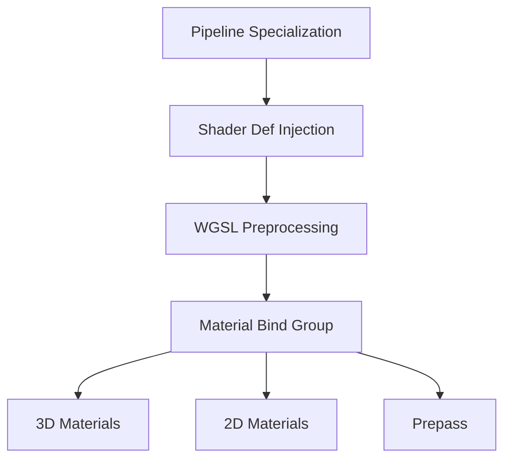

+++
title = "#20069 Material bind group shader def"
date = "2025-08-06T00:00:00"
draft = false
template = "pull_request_page.html"
in_search_index = false

[extra]
current_language = "zh-cn"
available_languages = {"en" = { name = "English", url = "/pull_request/bevy/2025-08/pr-20069-en-20250806" }, "zh-cn" = { name = "中文", url = "/pull_request/bevy/2025-08/pr-20069-zh-cn-20250806" }}
labels = ["C-Feature", "A-Rendering"]
+++

# Material bind group shader def

## Basic Information
- **Title**: Material bind group shader def
- **PR Link**: https://github.com/bevyengine/bevy/pull/20069
- **Author**: tychedelia
- **Status**: MERGED
- **Labels**: C-Feature, A-Rendering, S-Ready-For-Final-Review
- **Created**: 2025-07-09T21:08:01Z
- **Merged**: 2025-08-06T05:27:37Z
- **Merged By**: alice-i-cecile

## Description Translation
使用 shader def 定义材质绑定组索引，方便未来切换回 group 2 时避免再次破坏兼容性。

## The Story of This Pull Request

### 问题背景
Bevy 引擎在升级到 wgpu 0.25 时，材质绑定组索引从 group 2 改为 group 3。这种硬编码方式存在两个主要问题：
1. **兼容性风险**：未来如果需要再次更改绑定组索引（例如优化资源布局），需要全局修改所有着色器文件
2. **维护困难**：超过 30 个着色器文件直接硬编码了 group 3，任何索引变更都需要全面更新

这种硬编码方式使得绑定组索引变更成为破坏性变更，每次都需要开发者手动更新所有相关着色器。

### 解决方案
核心思路是用 shader def 动态定义绑定组索引：
1. 在 Rust 代码中定义常量 `MATERIAL_BIND_GROUP_INDEX`
2. 通过渲染管线特化将索引值注入为 shader def
3. 在 WGSL 着色器中用 `#{MATERIAL_BIND_GROUP}` 宏替代硬编码数字

具体实施时针对不同渲染管线做了适配：
- **3D 管线**：在 `bevy_pbr/src/material.rs` 定义 `MATERIAL_BIND_GROUP_INDEX = 3`
- **2D 管线**：在 `bevy_sprite/src/mesh2d/material.rs` 定义 `MATERIAL_2D_BIND_GROUP_INDEX = 2`
- **Prepass 管线**：额外注入 `MATERIAL_BIND_GROUP` shader def

```rust
// 注入 shader def 的代码片段
descriptor.vertex.shader_defs.push(ShaderDefVal::UInt(
    "MATERIAL_BIND_GROUP".into(),
    MATERIAL_BIND_GROUP_INDEX as u32,
));
```

### 技术实现
实现过程需要协调多个系统组件：
1. **渲染管线特化**：在管线编译时注入 `MATERIAL_BIND_GROUP` shader def
2. **WGSL 预处理**：用 `#{...}` 语法在着色器中进行宏替换
3. **绑定组声明更新**：所有材质绑定组声明改用宏形式

```wgsl
// 改造后的绑定组声明
@group(#{MATERIAL_BIND_GROUP}) @binding(0) var texture: texture_2d<f32>;
```

这种方案保持了与现有硬编码相同的运行时性能，因为宏替换发生在着色器编译前阶段，不影响运行时效率。

### 影响与改进
主要技术收益包括：
1. **变更弹性**：未来绑定组索引变更只需修改 Rust 常量定义
2. **向后兼容**：保留当前 group 3 的默认值，不影响现有功能
3. **统一管理**：所有材质绑定组索引通过单一常量控制

对于开发者，迁移指南已更新说明使用 `#{MATERIAL_BIND_GROUP}` 替代硬编码数字的实践。

## Visual Representation



## Key Files Changed

### `crates/bevy_pbr/src/material.rs`
**修改原因**：实现 3D 材质绑定组索引的动态定义  
**核心改动**：
```rust
// 新增常量定义
pub const MATERIAL_BIND_GROUP_INDEX: usize = 3;

// 在管线特化中注入 shader def
descriptor.vertex.shader_defs.push(ShaderDefVal::UInt(
    "MATERIAL_BIND_GROUP".into(),
    MATERIAL_BIND_GROUP_INDEX as u32,
));
if let Some(ref mut fragment) = descriptor.fragment {
    fragment.shader_defs.push(ShaderDefVal::UInt(
        "MATERIAL_BIND_GROUP".into(),
        MATERIAL_BIND_GROUP_INDEX as u32,
    ));
};
```
**关联性**：为 3D 材质系统建立绑定组索引的动态控制机制

### `crates/bevy_pbr/src/render/pbr_bindings.wgsl`
**修改原因**：替换硬编码绑定组索引为 shader def 宏  
**核心改动**：
```wgsl
// 修改前
@group(3) @binding(0) var<uniform> material: StandardMaterial;

// 修改后
@group(#{MATERIAL_BIND_GROUP}) @binding(0) var<uniform> material: StandardMaterial;
```
**关联性**：所有 PBR 绑定组声明改用动态索引

### `assets/shaders/fallback_image_test.wgsl`
**修改原因**：示例着色器适配新绑定组定义方式  
**核心改动**：
```wgsl
// 修改前
@group(3) @binding(0) var test_texture_1d: texture_1d<f32>;

// 修改后
@group(#{MATERIAL_BIND_GROUP}) @binding(0) var test_texture_1d: texture_1d<f32>;
```
**关联性**：演示资产目录中着色器如何迁移到新方案

### `crates/bevy_render/src/bindless.wgsl`
**修改原因**：无绑定模式适配新索引方案  
**核心改动**：
```wgsl
// 修改前
@group(3) @binding(1) var bindless_samplers_filtering: binding_array<sampler>;

// 修改后
@group(#{MATERIAL_BIND_GROUP}) @binding(1) var bindless_samplers_filtering: binding_array<sampler>;
```
**关联性**：确保无绑定渲染路径与新索引机制兼容

### `crates/bevy_sprite/src/mesh2d/material.rs`
**修改原因**：为 2D 材质实现绑定组索引动态控制  
**核心改动**：
```rust
// 新增 2D 专用常量
pub const MATERIAL_2D_BIND_GROUP_INDEX: usize = 2;

// 注入 2D 管线的 shader def
descriptor.vertex.shader_defs.push(ShaderDefVal::UInt(
    "MATERIAL_BIND_GROUP".into(),
    MATERIAL_2D_BIND_GROUP_INDEX as u32,
));
```
**关联性**：扩展方案支持 2D 渲染管线

## Further Reading
1. [Bevy Shader Defs 文档](https://bevyengine.org/learn/book/getting-started/shader-defs/)
2. [WGSL 绑定组规范](https://gpuweb.github.io/gpuweb/wgsl/#attribute-group)
3. [Bevy 渲染管线架构](https://bevyengine.org/learn/book/getting-started/pipeline/)