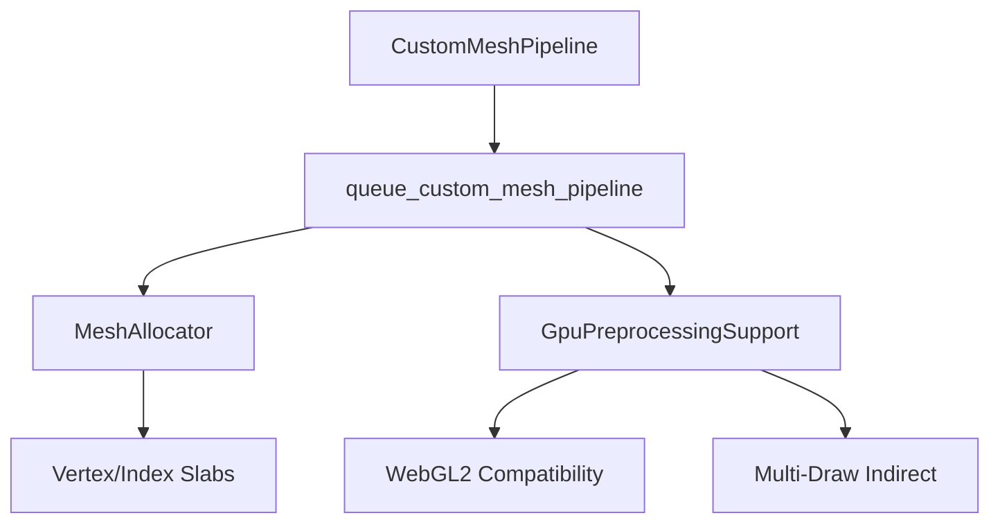

+++
title = "#20107"
date = "2025-08-05T00:00:00"
draft = false
template = "pull_request_page.html"
in_search_index = true

[taxonomies]
list_display = ["show"]

[extra]
current_language = "en"
available_languages = {"en" = { name = "English", url = "/pull_request/bevy/2025-08/pr-20107-en-20250805" }, "zh-cn" = { name = "中文", url = "/pull_request/bevy/2025-08/pr-20107-zh-cn-20250805" }}
+++

## The Story of This Pull Request

This pull request addresses three interconnected issues in Bevy's `specialized_mesh_pipeline` example. First, the example didn't work on WebGL2 due to custom batching implementation that bypassed Bevy's rendering abstractions. Second, it contained redundant batching logic that duplicated existing engine functionality. Third, it only implemented basic batching without leveraging Bevy's multi-draw indirect capabilities.

The core problem stemmed from the example manually implementing GPU instance buffering and indirect parameter management instead of using Bevy's built-in batching system. This custom approach broke WebGL2 compatibility since it didn't account for platform-specific rendering constraints. The original implementation also created unnecessary maintenance overhead by duplicating existing engine functionality.

To resolve these issues, we refactored the example to use Bevy's standard batching abstractions. The key changes include:

1. Removing the custom batching implementation and replacing it with Bevy's `GpuPreprocessingSupport` and `MeshAllocator`
2. Simplifying the view query by removing unused parameters
3. Replacing manual work item buffer management with standardized batching methods
4. Using the actual mesh asset ID instead of a placeholder invalid ID
5. Switching to `BinnedRenderPhaseType::mesh()` which automatically handles both batching and multi-draw indirect

These changes make the example both simpler and more powerful. By leveraging `GpuPreprocessingSupport`, we automatically gain WebGL2 compatibility since the engine handles platform differences internally. The switch to `BinnedRenderPhaseType::mesh()` also enables multi-draw indirect rendering where supported, potentially improving performance on capable hardware.

The implementation demonstrates proper use of Bevy's rendering abstractions. Instead of manually managing work item buffers and indirect parameters, we now rely on the engine's built-in systems:

```rust
// Before: Manual work buffer management
let work_item_buffer = gpu_preprocessing::get_or_create_work_item_buffer::<Opaque3d>(...);
gpu_preprocessing::init_work_item_buffers(...);

// After: Automatic handling through standard components
BinnedRenderPhaseType::mesh(
    mesh_instance.should_batch(),
    &gpu_preprocessing_support,
)
```

This approach ensures the example remains compatible with current and future Bevy rendering features while reducing maintenance burden. The changes also fix the WebGL2 compatibility issue since all platform-specific handling is now delegated to Bevy's internal systems.

## Visual Representation



## Key Files Changed

### `examples/shader_advanced/specialized_mesh_pipeline.rs`

**Changes:**  
- Removed 127 lines of custom batching implementation  
- Added 28 lines using standard Bevy batching abstractions  
- Simplified view query and batching logic  
- Fixed WebGL2 compatibility  

**Key modifications:**  
```rust
// Before: Complex custom batching setup
let mut phase_batched_instance_buffers: ResMut<
    PhaseBatchedInstanceBuffers<Opaque3d, <MeshPipeline as GetBatchData>::BufferData>,
>;
let mut phase_indirect_parameters_buffers: ResMut<PhaseIndirectParametersBuffers<Opaque3d>>;

// After: Standard batching components
gpu_preprocessing_support: Res<GpuPreprocessingSupport>,
mesh_allocator: Res<MeshAllocator>,
```

```rust
// Before: Manual work item buffer management
let work_item_buffer = gpu_preprocessing::get_or_create_work_item_buffer::<Opaque3d>(...);
gpu_preprocessing::init_work_item_buffers(...);

// After: Automatic batching type selection
BinnedRenderPhaseType::mesh(
    mesh_instance.should_batch(),
    &gpu_preprocessing_support,
)
```

```rust
// Before: Placeholder asset ID
Opaque3dBinKey {
    asset_id: AssetId::<Mesh>::invalid().untyped(),
}

// After: Actual mesh asset ID
Opaque3dBinKey {
    asset_id: mesh_instance.mesh_asset_id.into(),
}
```

## Further Reading

1. [Bevy Rendering Architecture](https://bevyengine.org/learn/book/getting-started/rendering/)  
2. [Bevy Batching System Documentation](https://docs.rs/bevy/latest/bevy/render/batching/index.html)  
3. [WebGL2 Limitations in Bevy](https://github.com/bevyengine/bevy/blob/main/docs/plugins_guidelines.md#webgl2)  
4. [Multi-Draw Indirect Explained](https://www.khronos.org/opengl/wiki/Vertex_Rendering#Multi-Draw_Indirect)