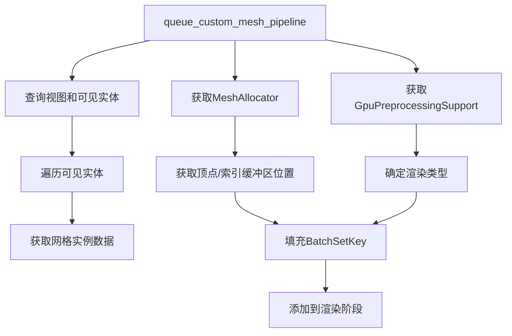

+++
title = "#20107 Clean up specialized_mesh_pipeline"
date = "2025-08-05T00:00:00"
draft = false
template = "pull_request_page.html"
in_search_index = false

[extra]
current_language = "zh-cn"
available_languages = {"en" = { name = "English", url = "/pull_request/bevy/2025-08/pr-20107-en-20250805" }, "zh-cn" = { name = "中文", url = "/pull_request/bevy/2025-08/pr-20107-zh-cn-20250805" }}
+++

# Clean up specialized_mesh_pipeline

## 基本信息
- **标题**: Clean up specialized_mesh_pipeline
- **PR 链接**: https://github.com/bevyengine/bevy/pull/20107
- **作者**: IceSentry
- **状态**: MERGED
- **标签**: C-Bug, A-Rendering, C-Examples, O-Web, S-Ready-For-Final-Review, D-Straightforward
- **创建时间**: 2025-07-13T02:03:53Z
- **合并时间**: 2025-08-05T20:22:10Z
- **合并者**: alice-i-cecile

## 描述翻译
### Objective（目标）

- 该示例在 WebGL2 上无法工作
- 它尝试重新实现批处理逻辑而不是使用现有抽象，这在 WebGL2 上会失败
- 它只使用了批处理

### Solution（解决方案）

- 使用现有抽象并移除与批处理相关的代码
  - 这修复了 WebGL2 问题
  - 它还使其使用多绘制间接（multi draw indirect）而不仅仅是批处理

### Testing（测试）

- 使用 bevy CLI 为 webgl 和 wegpu 测试了该示例，并在本地运行了该示例

## 本次 Pull Request 的技术分析

### 问题背景
`specialized_mesh_pipeline` 示例存在三个主要问题：
1. 在 WebGL2 环境下无法正常运行
2. 重复实现了批处理逻辑而不是复用现有抽象
3. 只支持传统批处理方式，未能利用更高效的 multi draw indirect

根本问题在于该示例手动管理了批处理相关的 GPU 缓冲区和工作项（work items），这违反了 Bevy 的渲染抽象设计。特别是：
- 直接操作 `PhaseBatchedInstanceBuffers` 和 `PhaseIndirectParametersBuffers`
- 手动处理 `PreprocessWorkItem` 和间接参数分配
- 硬编码使用 `BinnedRenderPhaseType::BatchableMesh`

这种实现方式在 WebGL2 上会失败，因为 WebGL2 不支持某些底层 GPU 操作。此外，它限制了示例只能使用传统批处理，无法利用更现代的 multi draw indirect 技术。

### 解决方案
PR 通过以下方式重构了代码：
1. 完全移除自定义的批处理管理逻辑
2. 使用 Bevy 内置的 `MeshAllocator` 和 `GpuPreprocessingSupport`
3. 动态选择渲染路径（multi draw indirect 或传统批处理）

关键修改集中在 `queue_custom_mesh_pipeline` 系统函数中：

#### 1. 删除不必要的资源和参数
```rust
-   param: StaticSystemParam<<MeshPipeline as GetBatchData>::Param>,
-   mut phase_batched_instance_buffers: ResMut<
-       PhaseBatchedInstanceBuffers<Opaque3d, <MeshPipeline as GetBatchData>::BufferData>,
-   >,
-   mut phase_indirect_parameters_buffers: ResMut<PhaseIndirectParametersBuffers<Opaque3d>>,
+   mesh_allocator: Res<MeshAllocator>,
+   gpu_preprocessing_support: Res<GpuPreprocessingSupport>,
```

#### 2. 简化视图查询
```rust
-   views: Query<(
-       &RenderVisibleEntities,
-       &ExtractedView,
-       &Msaa,
-       Has<NoIndirectDrawing>,
-       Has<OcclusionCulling>,
-   )>,
+   views: Query<(&RenderVisibleEntities, &ExtractedView, &Msaa)>,
```

#### 3. 使用网格分配器获取缓冲区
```rust
+   let (vertex_slab, index_slab) = mesh_allocator.mesh_slabs(&mesh_instance.mesh_asset_id);
```

#### 4. 动态选择渲染类型
```rust
-   BinnedRenderPhaseType::BatchableMesh,
+   BinnedRenderPhaseType::mesh(
+       mesh_instance.should_batch(),
+       &gpu_preprocessing_support,
+   ),
```

### 技术实现细节
1. **移除自定义批处理逻辑**：
   - 删除了手动管理的工作项缓冲区（work item buffers）
   - 移除了间接参数缓冲区的直接操作
   - 删除了 `MeshBatchSetInfo` 结构体

2. **使用内置抽象**：
   - `MeshAllocator` 提供顶点/索引缓冲区位置
   - `GpuPreprocessingSupport` 决定可用渲染路径
   - `BinnedRenderPhaseType::mesh()` 自动选择最优策略

3. **动态渲染路径选择**：
   ```rust
   BinnedRenderPhaseType::mesh(should_batch, gpu_support)
   ```
   根据硬件支持自动选择：
   - 支持 GPU 预处理 → Multi draw indirect
   - 不支持但可批处理 → 传统批处理
   - 其他情况 → 单次绘制

### 影响与改进
1. **WebGL2 兼容性**：
   - 移除 WebGL2 不支持的底层操作
   - 使用标准 API 保证跨平台兼容性

2. **性能提升**：
   - 在支持硬件上启用 multi draw indirect
   - 减少不必要的 CPU-GPU 数据传输

3. **代码简化**：
   - 减少 99 行代码（127 → 28）
   - 移除复杂的手动资源管理
   - 遵循 Bevy 标准渲染模式

4. **维护性**：
   - 消除与核心渲染逻辑的重复
   - 作为正确使用渲染抽象的示例

## 关键文件变更

### `examples/shader_advanced/specialized_mesh_pipeline.rs`
**变更描述**：重构 mesh 排队系统，使用标准批处理机制替代自定义实现

#### 主要代码变更：
```rust
// 之前：复杂的手动批处理管理
let system_param_item = param.into_inner();
let UntypedPhaseBatchedInstanceBuffers {
    ref mut data_buffer,
    ref mut work_item_buffers,
    ref mut late_indexed_indirect_parameters_buffer,
    ref mut late_non_indexed_indirect_parameters_buffer,
    ..
} = phase_batched_instance_buffers.buffers;

// ... [约50行手动缓冲区管理代码] ...

// 之后：简洁的标准实现
let (vertex_slab, index_slab) = mesh_allocator.mesh_slabs(&mesh_instance.mesh_asset_id);
opaque_phase.add(
    Opaque3dBatchSetKey {
        draw_function,
        pipeline: pipeline_id,
        material_bind_group_index: None,
        vertex_slab: vertex_slab.unwrap_or_default(),
        index_slab,
        lightmap_slab: None,
    },
    Opaque3dBinKey {
        asset_id: mesh_instance.mesh_asset_id.into(),
    },
    (render_entity, visible_entity),
    mesh_instance.current_uniform_index,
    BinnedRenderPhaseType::mesh(
        mesh_instance.should_batch(),
        &gpu_preprocessing_support,
    ),
    *change_tick,
);
```

## 视觉关系图


## 进一步阅读
1. [Bevy 渲染管线文档](https://bevyengine.org/learn/book/render-pipelines/)
2. [WebGL 在 Bevy 中的支持](https://bevyengine.org/learn/book/platforms/web/)
3. [Multi Draw Indirect 规范](https://registry.khronos.org/OpenGL/extensions/ARB/ARB_multi_draw_indirect.txt)
4. [Bevy 批处理系统源码](https://github.com/bevyengine/bevy/blob/main/crates/bevy_render/src/batching/mod.rs)