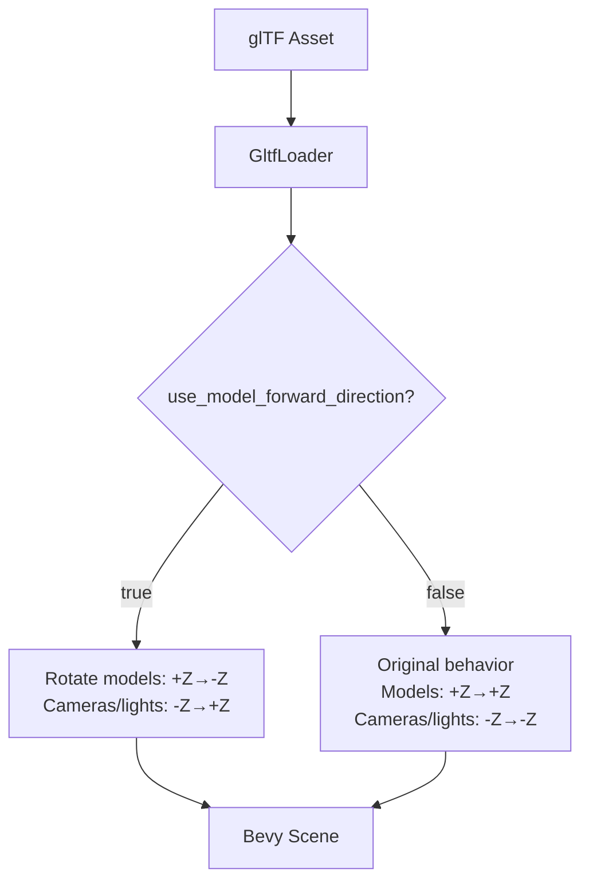

+++
title = "#20131 Rebrand glTF coordinate conversion to an alternative strategy that is biased towards glTF models"
date = "2025-08-16T00:00:00"
draft = false
template = "pull_request_page.html"
in_search_index = true

[taxonomies]
list_display = ["show"]

[extra]
current_language = "en"
available_languages = {"en" = { name = "English", url = "/pull_request/bevy/2025-08/pr-20131-en-20250816" }, "zh-cn" = { name = "中文", url = "/pull_request/bevy/2025-08/pr-20131-zh-cn-20250816" }}
labels = ["A-Rendering", "X-Controversial", "D-Straightforward", "S-Needs-SME", "A-glTF"]
+++

# Analysis of PR #20131: Rebrand glTF Coordinate Conversion Strategy

## Basic Information
- **Title**: Rebrand glTF coordinate conversion to an alternative strategy that is biased towards glTF models
- **PR Link**: https://github.com/bevyengine/bevy/pull/20131
- **Author**: janhohenheim
- **Status**: MERGED
- **Labels**: A-Rendering, X-Controversial, D-Straightforward, S-Needs-SME, A-glTF
- **Created**: 2025-07-14T11:40:55Z
- **Merged**: 2025-08-16T01:16:49Z
- **Merged By**: cart

## Description
# Objective

- Fixes https://github.com/bevyengine/bevy/issues/20121
- Reverts https://github.com/bevyengine/bevy/pull/19816

Per long discussion with @superdump (see https://github.com/bevyengine/bevy/issues/19686#issuecomment-3069180465), the new coordinate loading system is still wrong, just now biased in favor of having correct forward semantics for models instead of cameras. 
Which is still what I need, but it should not be the new default, as we may well change `Transform::forward` instead. 

## Solution

Since changing forward semantics is a bigger change, let's rebrand the coordinate conversion code and keep it opt-in so that users that don't use glTF cameras get correct semantics in the meantime.

## Testing

- Ran 3D examples and Blender test scenes.

## The Story of This Pull Request

### The Problem and Context
The core issue stems from the mismatch between Bevy's coordinate system and glTF's coordinate conventions. Bevy uses:
- Forward: -Z
- Up: Y
- Right: X

However, glTF has different conventions depending on the asset type:
- Models: Forward = +Z
- Cameras/Lights: Forward = -Z

Previous implementation (#19816) attempted to resolve this by automatically converting coordinates to align with Bevy's system. While this fixed model orientation, it introduced new issues:
1. Camera and light orientations became incorrect in Bevy space
2. The change was too disruptive as a default behavior
3. The implementation didn't properly handle the dual-nature of glTF's coordinate systems

This created a situation where we either had:
- Correct models but incorrect cameras/lights, OR
- Correct cameras/lights but incorrect models

The fundamental tension arises because glTF defines different forward directions for different asset types, while Bevy expects a consistent coordinate system.

### The Solution Approach
The PR takes a pragmatic approach:
1. Revert the previous coordinate conversion implementation
2. Introduce an explicit, opt-in strategy for users who need correct model orientation
3. Maintain the original behavior as default to prevent breaking existing projects
4. Rebrand the feature to clarify its purpose

Key engineering decisions:
- Added a new `use_model_forward_direction` flag in both `GltfPlugin` and `GltfLoaderSettings`
- Made the feature opt-in rather than default
- Removed the temporary warning system about future changes
- Clarified documentation about the coordinate system implications

### The Implementation
The implementation centers around replacing the previous `convert_coordinates` boolean with a more descriptive `use_model_forward_direction` flag. When enabled, this option:

1. Rotates models so their forward direction (+Z in glTF) becomes -Z in Bevy
2. Adjusts cameras/lights so their forward direction (-Z in glTF) becomes +Z in Bevy

This is controlled through:
```rust
// Global setting
App::new()
    .add_plugins(DefaultPlugins.set(GltfPlugin {
        use_model_forward_direction: true,  // Opt-in to model-forward behavior
        ..default()
    }))
    .run();

// Per-asset setting
let handle = asset_server.load_with_settings(
    "model.gltf#Scene0",
    |settings: &mut GltfLoaderSettings| {
        settings.use_model_forward_direction = Some(true);
    }
);
```

The documentation was significantly improved to explain the exact behavior:
```rust
// crates/bevy_gltf/src/lib.rs
pub struct GltfPlugin {
    /// How to convert glTF coordinates on import...
    pub use_model_forward_direction: bool,
    // ...
}
```

### Technical Insights
The key insight is that there's no perfect solution that satisfies all use cases simultaneously. The PR acknowledges this by:
1. Making the behavior explicit and configurable
2. Clearly documenting the trade-offs
3. Avoiding breaking changes to existing projects

The coordinate transformation matrix remains the same as in #19816, but its application is now controlled by the explicit opt-in flag rather than being enabled by default. This maintains the technical solution while changing its activation strategy.

### The Impact
This change provides:
- Backward compatibility for existing projects
- An explicit path for users needing correct model orientation
- Clear documentation about coordinate system implications
- Removal of confusing warnings about future breaking changes

Users who require models to have correct forward semantics can now enable this behavior, while others maintain the previous camera-centric behavior. The controversial aspects of the previous implementation are resolved by making the feature opt-in rather than mandatory.

## Visual Representation



## Key Files Changed

### `crates/bevy_gltf/src/lib.rs`
- Replaced `convert_coordinates` with `use_model_forward_direction`
- Improved documentation to clarify coordinate system behavior

Before:
```rust
pub struct GltfPlugin {
    pub convert_coordinates: bool,
    // ...
}
```

After:
```rust
pub struct GltfPlugin {
    pub use_model_forward_direction: bool,
    // ...
}
```

### `crates/bevy_gltf/src/loader/mod.rs`
- Replaced all `convert_coordinates` references
- Removed warning about future behavior changes
- Simplified the coordinate conversion logic

Before:
```rust
pub struct GltfLoader {
    pub default_convert_coordinates: bool,
    // ...
}

pub struct GltfLoaderSettings {
    pub convert_coordinates: Option<bool>,
    // ...
}
```

After:
```rust
pub struct GltfLoader {
    pub default_use_model_forward_direction: bool,
    // ...
}

pub struct GltfLoaderSettings {
    pub use_model_forward_direction: Option<bool>,
    // ...
}
```

### `release-content/release-notes/convert-coordinates.md`
- Added new documentation explaining the opt-in behavior
- Clarified the coordinate system implications

```markdown
---
title: Allow importing glTFs with corrected model forward semantics
...

Bevy uses the following coordinate system...
But glTF is a bit more complicated...
```

### `release-content/migration-guides/convert-coordinates.md`
- Removed outdated migration guide
- The previous migration strategy was abandoned in favor of the opt-in approach

### `Cargo.toml`
- Removed the `gltf_convert_coordinates_default` feature flag
- This feature flag was part of the previous approach and is no longer needed

```toml
# Removed section:
gltf_convert_coordinates_default = [
  "bevy_internal/gltf_convert_coordinates_default",
]
```

## Further Reading
1. [Original issue discussion](https://github.com/bevyengine/bevy/issues/19686#issuecomment-3069180465)
2. [glTF Coordinate System Specification](https://registry.khronos.org/glTF/specs/2.0/glTF-2.0.html#coordinate-system-and-units)
3. [Bevy Transform Documentation](https://docs.rs/bevy_transform/latest/bevy_transform/components/struct.Transform.html)
4. [Coordinate System Conversion Mathematics](https://en.wikipedia.org/wiki/Rotation_matrix)