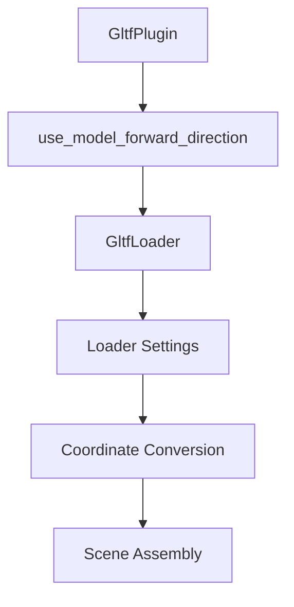

+++
title = "#20131 Rebrand glTF coordinate conversion to an alternative strategy that is biased towards glTF models"
date = "2025-08-16T00:00:00"
draft = false
template = "pull_request_page.html"
in_search_index = false

[extra]
current_language = "zh-cn"
available_languages = {"zh-cn" = { name = "中文", url = "/pull_request/bevy/2025-08/pr-20131-zh-cn-20250816" }}
+++

### 标题：Rebrand glTF coordinate conversion to an alternative strategy that is biased towards glTF models

## 基本信息
- **标题**: Rebrand glTF coordinate conversion to an alternative strategy that is biased towards glTF models
- **PR链接**: https://github.com/bevyengine/bevy/pull/20131
- **作者**: janhohenheim
- **状态**: 已合并
- **标签**: A-Rendering, X-Controversial, D-Straightforward, S-Needs-SME, A-glTF
- **创建时间**: 2025-07-14T11:40:55Z
- **合并时间**: 2025-08-16T01:16:49Z
- **合并人**: cart

## 描述翻译
### 目标
- 修复 https://github.com/bevyengine/bevy/issues/20121
- 撤销 https://github.com/bevyengine/bevy/pull/19816

根据与 @superdump 的长期讨论（见 https://github.com/bevyengine/bevy/issues/19686#issuecomment-3069180465），新的坐标加载系统仍然存在问题，只是现在偏向于让模型有正确的前向语义，而不是相机。虽然这符合我的需求，但它不应该是新的默认行为，因为我们可能会改变 `Transform::forward`。

### 解决方案
由于改变前向语义是更大的变更，我们将重新定位坐标转换代码并使其成为可选项，这样不使用glTF相机的用户在此期间仍能获得正确的语义。

### 测试
- 运行了3D示例和Blender测试场景。

## PR的技术故事

### 问题背景
Bevy引擎的glTF导入存在坐标系统不一致的问题。glTF规范定义：
- 模型(meshes)使用：前向为+Z，上为+Y，右为-X
- 相机(cameras)和光源(lights)使用：前向为-Z，上为+Y，右为+X

而Bevy的世界坐标系统一为：
- 前向：-Z
- 上：+Y
- 右：+X

PR #19816试图通过默认旋转模型180度（绕Y轴）来解决这个问题，使glTF模型的+Z前向对应到Bevy的-Z前向。但这种方法存在争议：
1. 它修正了模型方向，但导致glTF相机和光源的方向错误（从-Z变为+Z）
2. 改变默认行为会破坏现有项目
3. 该方案不能同时满足模型和相机/光源的正确方向需求

### 解决方案
本PR采用更灵活的配置方案：
1. 撤销PR #19816的默认坐标转换行为
2. 引入`use_model_forward_direction`选项，让用户自行选择：
   - `false` (默认)：相机/光源保持-Z前向（与Bevy一致），模型保持+Z前向（与glTF一致）
   - `true`：模型使用-Z前向（与Bevy一致），相机/光源使用+Z前向（与glTF相反）
3. 移除了逐步迁移的警告机制，简化代码逻辑

### 实现细节
核心变更集中在glTF加载器配置：
1. **重命名配置字段**：将`convert_coordinates`改为语义更明确的`use_model_forward_direction`
2. **更改默认值**：从特性开关控制改为硬编码`false`
3. **简化决策逻辑**：移除迁移警告，直接使用配置值

```rust
// crates/bevy_gltf/src/lib.rs
pub struct GltfPlugin {
    // 修改后
    pub use_model_forward_direction: bool,
}

impl Default for GltfPlugin {
    fn default() -> Self {
        GltfPlugin {
            // 默认关闭模型前向修正
            use_model_forward_direction: false,
            // ...其他字段
        }
    }
}
```

```rust
// crates/bevy_gltf/src/loader/mod.rs
let convert_coordinates = match settings.use_model_forward_direction {
    Some(convert) => convert,
    None => loader.default_use_model_forward_direction, // 直接使用全局默认值
};
```

### 技术洞察
1. **配置优先原则**：通过可选配置而非硬编码方案，平衡了不同用户需求：
   - 需要正确模型方向的用户：启用`use_model_forward_direction=true`
   - 需要正确相机方向的用户：保持默认配置
   
2. **语义明确化**：
   - 旧字段名`convert_coordinates`过于笼统
   - 新字段名`use_model_forward_direction`清晰表达了"优先模型方向"的意图

3. **简化迁移路径**：
   - 移除临时特性标志`gltf_convert_coordinates_default`
   - 删除逐步迁移警告，避免控制台噪声污染
   - 更新文档明确说明两种模式的行为差异

### 影响
1. **向后兼容**：默认行为恢复为v0.17之前的模式，减少对现有项目的破坏
2. **灵活性提升**：艺术家可以导出模型后直接在Bevy中使用，无需手动旋转
3. **场景构建**：启用选项后，模型的前向向量(`Transform::forward()`)与Bevy坐标系一致，简化逻辑：
   ```rust
   // 启用use_model_forward_direction=true后
   model.transform.forward() // 返回-Z，与Bevy标准一致
   ```
4. **文档更新**：删除过时的迁移指南，添加新的发布说明解释选项行为

## 关键文件变更

### 1. `crates/bevy_gltf/src/lib.rs`
**变更原因**：修改glTF插件的配置接口  
**关键修改**：
```diff
pub struct GltfPlugin {
-    pub convert_coordinates: bool,
+    pub use_model_forward_direction: bool,
}

impl Default for GltfPlugin {
     fn default() -> Self {
         GltfPlugin {
             default_sampler: ImageSamplerDescriptor::linear(),
             custom_vertex_attributes: HashMap::default(),
-            convert_coordinates: cfg!(feature = "gltf_convert_coordinates_default"),
+            use_model_forward_direction: false,
         }
     }
}
```

### 2. `crates/bevy_gltf/src/loader/mod.rs`
**变更原因**：实现新的配置逻辑并简化加载流程  
**关键修改**：
```diff
pub struct GltfLoader {
-    pub default_convert_coordinates: bool,
+    pub default_use_model_forward_direction: bool,
}

pub struct GltfLoaderSettings {
-    pub convert_coordinates: Option<bool>,
+    pub use_model_forward_direction: Option<bool>,
}

let convert_coordinates = match settings.use_model_forward_direction {
    Some(convert_coordinates) => convert_coordinates,
-    None => {
-        // 移除复杂的警告和特性检测逻辑
-    }
+    None => loader.default_use_model_forward_direction,
};
```

### 3. `release-content/migration-guides/convert-coordinates.md`
**变更原因**：旧迁移指南已过时  
**操作**：删除文件（-90行）

### 4. `release-content/release-notes/convert-coordinates.md`
**变更原因**：添加新特性的使用说明  
**关键内容**：
```markdown
## 解决方案
设置`use_model_forward_direction=true`使模型前向与Bevy一致：

```rust
App::new()
    .add_plugins(DefaultPlugins.set(GltfPlugin {
        use_model_forward_direction: true,
        ..default()
    }))
```

## 行为对比
| 配置 | 模型前向 | 相机/光源前向 |
|------|----------|---------------|
| false (默认) | +Z | -Z |
| true | -Z | +Z |
```

### 5. `Cargo.toml`
**变更原因**：移除废弃的特性标志  
**关键修改**：
```diff
- gltf_convert_coordinates_default = [
-   "bevy_internal/gltf_convert_coordinates_default",
- ]
```

## 组件关系图



## 进一步阅读
1. [glTF坐标系统规范](https://registry.khronos.org/glTF/specs/2.0/glTF-2.0.html#coordinate-system-and-units)
2. [Bevy坐标系统文档](https://bevyengine.org/learn/book/introduction/coordinate-system/)
3. [原始技术讨论](https://github.com/bevyengine/bevy/issues/19686)