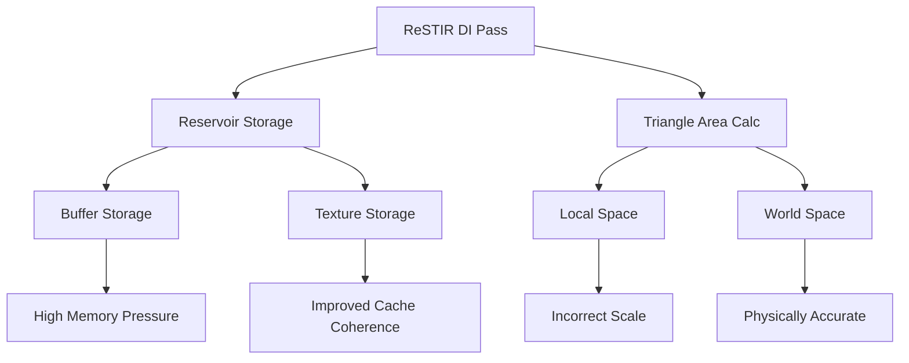

+++
title = "#20156 Optimize solari initial and temporal DI"
date = "2025-08-10T00:00:00"
draft = false
template = "pull_request_page.html"
in_search_index = true

[taxonomies]
list_display = ["show"]

[extra]
current_language = "en"
available_languages = {"en" = { name = "English", url = "/pull_request/bevy/2025-08/pr-20156-en-20250810" }, "zh-cn" = { name = "中文", url = "/pull_request/bevy/2025-08/pr-20156-zh-cn-20250810" }}
labels = ["C-Bug", "A-Rendering", "C-Performance"]
+++

# Technical Analysis: Optimize solari initial and temporal DI

## Basic Information
- **Title**: Optimize solari initial and temporal DI
- **PR Link**: https://github.com/bevyengine/bevy/pull/20156
- **Author**: SparkyPotato
- **Status**: MERGED
- **Labels**: C-Bug, A-Rendering, C-Performance, S-Ready-For-Final-Review, M-Needs-Release-Note
- **Created**: 2025-07-16T00:25:15Z
- **Merged**: 2025-08-10T19:42:23Z
- **Merged By**: alice-i-cecile

## Description Translation
# Objective
Optimizes the initial + temporal ReSTIR DI pass. In the example cornell box scene, it goes from 2.37 ms to 1.97 ms. On a more complex scene, the Lumberyard bistro, with many emissive lights, it goes from 130+ ms to about 80.8 ms at 1440p on a 4070.

I also noticed that triangle area calculation didn't take object scale into account and fixed that.

## Solution
- Switch to textures instead of buffers for reservoir storage.
- There's also a bunch of other micro-optimizations to increase SM occupancy and reduce memory pressure.

## Testing

- This was tested on the cornell box example scene and bistro.
- Everything was tested on Windows 11 with a 4070 running at 1440p. Testing on other platforms and GPUs by running the example.

---

## Showcase


## The Story of This Pull Request

### The Performance Bottleneck
The PR addresses performance issues in Bevy's ReSTIR DI (ReSTIR Direct Illumination) implementation. In complex scenes like the Lumberyard bistro with multiple emissive lights, the initial implementation was taking over 130 ms per frame at 1440p on an RTX 4070, making real-time performance challenging. The cornell box scene also showed room for improvement at 2.37 ms. Performance analysis revealed two main issues: inefficient reservoir storage using buffers rather than textures, and incorrect triangle area calculations that didn't account for object scale.

### Solution Architecture
The solution involves two primary optimizations:
1. **Reservoir storage migration**: Switching from buffer-based to texture-based storage for DI reservoirs
2. **Triangle area correction**: Fixing world-space area calculations by transforming vertices before computation

Additional micro-optimizations were implemented to reduce memory pressure and increase SM occupancy. The texture approach leverages GPU memory architectures better suited for 2D data access patterns, while the triangle area fix ensures physically accurate lighting calculations.

### Implementation Details
The implementation required coordinated changes across multiple subsystems:

**1. Reservoir storage overhaul**  
The core optimization replaces buffer storage with RGBA32UINT storage textures for DI reservoirs. In `prepare.rs`, reservoir creation was refactored:

```rust
// Before: Buffer-based reservoirs
let di_reservoirs_a = render_device.create_buffer(&BufferDescriptor {
    label: Some("solari_lighting_di_reservoirs_a"),
    size: (view_size.x * view_size.y) as u64 * DI_RESERVOIR_STRUCT_SIZE,
    usage: BufferUsages::STORAGE,
    mapped_at_creation: false,
});

// After: Texture-based reservoirs
let di_reservoirs = |name| {
    let tex = render_device.create_texture(&TextureDescriptor {
        label: Some(name),
        size: view_size.to_extents(),
        format: TextureFormat::Rgba32Uint,
        usage: TextureUsages::STORAGE_BINDING,
        // ... other parameters ...
    });
    let view = tex.create_view(&TextureViewDescriptor::default());
    (tex, view)
};
```

**2. Shader adaptation**  
The WGSL shaders were updated to use texture storage and new packing functions:

```wgsl
// Before: Buffer access
@group(1) @binding(3) var<storage, read_write> di_reservoirs_a: array<Reservoir>;

// After: Texture storage
@group(1) @binding(3) var di_reservoirs_a: texture_storage_2d<rgba32uint, read_write>;

// New packing/unpacking functions
fn pack_reservoir(reservoir: Reservoir) -> vec4<u32> {
    let weights = bitcast<vec2<u32>>(vec2<f32>(reservoir.confidence_weight, reservoir.unbiased_contribution_weight));
    return vec4<u32>(reservoir.sample.light_id, reservoir.sample.seed, weights);
}

fn unpack_reservoir(packed: vec4<u32>) -> Reservoir {
    let weights = bitcast<vec2<f32>>(packed.zw);
    return Reservoir(LightSample(packed.x, packed.y), weights.x, weights.y);
}
```

**3. Triangle area correction**  
The triangle area calculation was fixed by transforming vertices to world space before computation:

```wgsl
// Before: Local-space calculation (ignored scale)
let triangle_edge0 = vertices[0].position - vertices[1].position;
let triangle_edge1 = vertices[0].position - vertices[2].position;
let triangle_area = length(cross(triangle_edge0, triangle_edge1)) / 2.0;

// After: World-space calculation
let world_vertices = transform_positions(transform, vertices);
let triangle_edge0 = world_vertices[0] - world_vertices[1];
let triangle_edge1 = world_vertices[0] - world_vertices[2];
let triangle_area = length(cross(triangle_edge0, triangle_edge1)) / 2.0;
```

### Performance Impact
The optimizations yielded significant gains:
- Cornell box: 2.37 ms → 1.97 ms (17% improvement)
- Lumberyard bistro: 130+ ms → 80.8 ms (≥38% improvement)

The texture-based reservoir storage reduces memory bandwidth pressure and improves cache coherence due to better spatial locality. The packing optimization minimizes storage requirements while maintaining necessary precision. The triangle area fix ensures correct light contribution calculations, particularly important for scaled objects.

## Visual Representation



## Key Files Changed

1. **`crates/bevy_solari/src/realtime/prepare.rs` (+29/-32)**  
   Refactored resource creation to use textures for DI reservoirs:
   ```rust
   // DI reservoirs now use texture storage
   let di_reservoirs = |name| {
       render_device.create_texture(/* ... */)
   };
   let di_reservoirs_a = di_reservoirs("solari_lighting_di_reservoirs_a");
   ```

2. **`crates/bevy_solari/src/realtime/restir_di.wgsl` (+35/-12)**  
   Implemented texture-based reservoir storage with packing:
   ```wgsl
   // Packing/unpacking functions
   fn pack_reservoir(reservoir: Reservoir) -> vec4<u32> { /* ... */ }
   fn unpack_reservoir(packed: vec4<u32>) -> Reservoir { /* ... */ }
   
   // Updated reservoir access
   store_reservoir_a(global_id.xy, combined_reservoir);
   ```

3. **`crates/bevy_solari/src/scene/raytracing_scene_bindings.wgsl` (+27/-10)**  
   Fixed triangle area calculation:
   ```wgsl
   // World-space area calculation
   let world_vertices = transform_positions(transform, vertices);
   let triangle_edge0 = world_vertices[0] - world_vertices[1];
   ```

4. **`crates/bevy_solari/src/realtime/node.rs` (+5/-5)**  
   Updated bindings to use texture resources:
   ```rust
   // Bind group layout change
   texture_storage_2d(TextureFormat::Rgba32Uint, StorageTextureAccess::ReadWrite)
   ```

5. **`release-content/release-notes/bevy_solari.md` (+1/-1)**  
   Added PR reference to release notes.

## Further Reading
1. [ReSTIR Paper](https://research.nvidia.com/publication/2020-07_spatiotemporal-reservoir-resampling-real-time-ray-tracing-dynamic-direct) - Original research on reservoir-based spatiotemporal resampling
2. [WGSL Storage Textures](https://www.w3.org/TR/WGSL/#storage-texture) - WebGPU Shading Language specification
3. [GPU Memory Architecture](https://developer.nvidia.com/blog/how-access-global-memory-efficiently-cuda-c-kernels/) - NVIDIA's guide to global memory access patterns