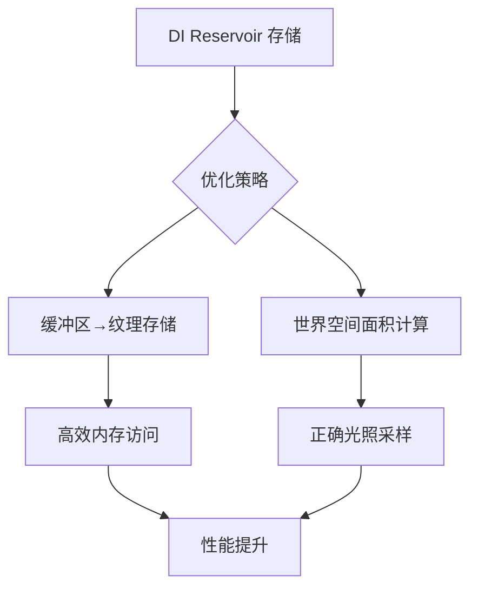

+++
title = "#20156 Optimize solari initial and temporal DI"
date = "2025-08-10T00:00:00"
draft = false
template = "pull_request_page.html"
in_search_index = false

[extra]
current_language = "zh-cn"
available_languages = {"en" = { name = "English", url = "/pull_request/bevy/2025-08/pr-20156-en-20250810" }, "zh-cn" = { name = "中文", url = "/pull_request/bevy/2025-08/pr-20156-zh-cn-20250810" }}
labels = ["C-Bug", "A-Rendering", "C-Performance"]
+++

# PR分析报告：Optimize solari initial and temporal DI

## Basic Information
- **Title**: Optimize solari initial and temporal DI
- **PR Link**: https://github.com/bevyengine/bevy/pull/20156
- **Author**: SparkyPotato
- **Status**: MERGED
- **Labels**: C-Bug, A-Rendering, C-Performance, S-Ready-For-Final-Review, M-Needs-Release-Note
- **Created**: 2025-07-16T00:25:15Z
- **Merged**: 2025-08-10T19:42:23Z
- **Merged By**: alice-i-cecile

## Description Translation
# 目标
优化初始 + 时域 ReSTIR DI 通道。在 Cornell box 示例场景中，处理时间从 2.37 毫秒降低到 1.97 毫秒。在更复杂的 Lumberyard bistro 场景（包含多个自发光光源）中，1440p 分辨率下 RTX 4070 显卡的处理时间从 130+ 毫秒降低到约 80.8 毫秒。

我还注意到三角形面积计算未考虑对象缩放，并修复了此问题。

## 解决方案
- 将蓄水池存储从缓冲区切换到纹理
- 包含其他微优化以提高 SM 占用率并减少内存压力

## 测试
- 在 cornell box 示例场景和 bistro 场景进行测试
- 所有测试在 Windows 11 系统、1440p 分辨率的 RTX 4070 显卡上进行。通过运行示例在其他平台和 GPU 上进行测试

---

## 效果展示


## The Story of This Pull Request

### 问题背景
在实时光线追踪中，ReSTIR DI（ReSTIR 直接光照）是核心算法，但原始实现存在性能瓶颈：
1. 使用存储缓冲区(storage buffer)管理DI蓄水池(reservoir)，访问效率不高
2. 三角形面积计算未考虑对象缩放，导致光照采样权重不准确
3. 在复杂场景（如Lumberyard bistro）中，性能开销过高（130+ ms）

这些限制在1440p分辨率下尤其明显，影响实时渲染的可行性。开发者需要优化DI通道以满足实时帧率要求。

### 解决方案
核心优化策略是：
1. **存储介质切换**：将DI蓄水池从缓冲区迁移到纹理存储
2. **计算精度修正**：在世界空间而非局部空间计算三角形面积
3. **微优化**：减少内存压力，提高GPU占用率

### 实现细节
#### 1. 蓄水池存储优化
原始实现使用存储缓冲区管理DI蓄水池：
```rust
// 变更前：prepare.rs
let di_reservoirs_a = render_device.create_buffer(&BufferDescriptor {
    label: Some("solari_lighting_di_reservoirs_a"),
    size: (view_size.x * view_size.y) as u64 * DI_RESERVOIR_STRUCT_SIZE,
    usage: BufferUsages::STORAGE,
    mapped_at_creation: false,
});
```

优化后改用纹理存储：
```rust
// 变更后：prepare.rs
let di_reservoirs = |name| {
    let tex = render_device.create_texture(&TextureDescriptor {
        label: Some(name),
        size: view_size.to_extents(),
        mip_level_count: 1,
        sample_count: 1,
        dimension: TextureDimension::D2,
        format: TextureFormat::Rgba32Uint,
        usage: TextureUsages::STORAGE_BINDING,
        view_formats: &[],
    });
    let view = tex.create_view(&TextureViewDescriptor::default());
    (tex, view)
};
```

着色器端相应添加pack/unpack函数：
```rust
// restir_di.wgsl
fn pack_reservoir(reservoir: Reservoir) -> vec4<u32> {
    let weights = bitcast<vec2<u32>>(vec2<f32>(reservoir.confidence_weight, reservoir.unbiased_contribution_weight));
    return vec4<u32>(reservoir.sample.light_id, reservoir.sample.seed, weights);
}

fn unpack_reservoir(packed: vec4<u32>) -> Reservoir {
    let weights = bitcast<vec2<f32>>(packed.zw);
    return Reservoir(LightSample(packed.x, packed.y), weights.x, weights.y);
}
```

#### 2. 三角形面积计算修正
原始实现未考虑对象缩放：
```rust
// 变更前：raytracing_scene_bindings.wgsl
let triangle_edge0 = vertices[0].position - vertices[1].position;
let triangle_edge1 = vertices[0].position - vertices[2].position;
let triangle_area = length(cross(triangle_edge0, triangle_edge1)) / 2.0;
```

优化后在世界空间计算：
```rust
// 变更后：raytracing_scene_bindings.wgsl
let world_vertices = transform_positions(transform, vertices);
// ...
let triangle_edge0 = world_vertices[0] - world_vertices[1];
let triangle_edge1 = world_vertices[0] - world_vertices[2];
let triangle_area = length(cross(triangle_edge0, triangle_edge1)) / 2.0;
```

#### 3. 绑定组优化
更新节点绑定以匹配纹理存储：
```rust
// node.rs
BindGroupEntries::sequential(&[
    view_output,
    s.light_tile_samples.as_entire_binding(),
    s.light_tile_resolved_samples.as_entire_binding(),
    &s.di_reservoirs_a.1,  // 使用纹理视图
    &s.di_reservoirs_b.1,  // 使用纹理视图
    s.gi_reservoirs_a.as_entire_binding(),
    // ...
])
```

### 性能提升原理
1. **纹理访问优势**：纹理存储提供更高效的内存访问模式，特别适合逐像素操作
2. **内存压力降低**：纹理格式(Rgba32Uint)更符合GPU内存布局
3. **计算准确性**：世界空间面积计算确保光照采样权重正确
4. **SM占用率提升**：减少内存瓶颈使GPU计算单元更充分利用

### 影响与验证
- **Cornell Box**：2.37ms → 1.97ms (提升17%)
- **Lumberyard Bistro**：130+ms → 80.8ms (提升38%+)
- **功能修正**：三角形面积计算现在正确处理缩放变换
- **兼容性**：在RTX 4070 (1440p)验证，并通过示例测试其他硬件

## Visual Representation



## Key Files Changed

### `crates/bevy_solari/src/realtime/prepare.rs` (+29/-32)
**变更内容**：重构资源创建逻辑，将DI蓄水池从缓冲区迁移到纹理存储  
**关键代码**：
```rust
// 创建纹理存储
let di_reservoirs = |name| {
    let tex = render_device.create_texture(&TextureDescriptor {
        format: TextureFormat::Rgba32Uint,
        usage: TextureUsages::STORAGE_BINDING,
        // ...
    });
    (tex, view)
};
let di_reservoirs_a = di_reservoirs("solari_lighting_di_reservoirs_a");
```

### `crates/bevy_solari/src/realtime/restir_di.wgsl` (+35/-12)
**变更内容**：添加纹理pack/unpack函数，更新蓄水池访问方式  
**关键代码**：
```rust
// 蓄水池读写函数
fn store_reservoir_b(pixel: vec2<u32>, reservoir: Reservoir) {
    textureStore(di_reservoirs_b, pixel, pack_reservoir(reservoir));
}

fn load_reservoir_b(pixel: vec2<u32>) -> Reservoir {
    return unpack_reservoir(textureLoad(di_reservoirs_b, pixel));
}
```

### `crates/bevy_solari/src/scene/raytracing_scene_bindings.wgsl` (+27/-10)
**变更内容**：在世界空间计算三角形面积  
**关键代码**：
```rust
// 世界空间顶点变换
fn transform_positions(transform: mat4x4<f32>, vertices: array<Vertex, 3>) -> array<vec3<f32>, 3> {
    return array<vec3<f32>, 3>(
        (transform * vec4(vertices[0].position, 1.0)).xyz,
        // ...
    );
}

// 世界空间面积计算
let world_vertices = transform_positions(transform, vertices);
let triangle_edge0 = world_vertices[0] - world_vertices[1];
```

### `crates/bevy_solari/src/realtime/node.rs` (+5/-5)
**变更内容**：更新绑定组以使用纹理视图  
**关键代码**：
```rust
// 绑定组更新
BindGroupEntries::sequential(&[
    // ...
    &s.di_reservoirs_a.1,  // 纹理视图
    &s.di_reservoirs_b.1,  // 纹理视图
    // ...
])
```

### `release-content/release-notes/bevy_solari.md` (+1/-1)
**变更内容**：在发布说明中添加本PR引用

## Further Reading
1. **ReSTIR算法**：[Spatiotemporal reservoir resampling for real-time ray tracing](https://research.nvidia.com/publication/2020-07_restir-path-tracing)
2. **GPU纹理优化**：[Optimizing Compute Shaders for L2 Locality](https://developer.nvidia.com/blog/optimizing-compute-shaders-for-l2-locality/)
3. **WGSL纹理**：[WebGPU Texture Documentation](https://gpuweb.github.io/gpuweb/#texture-format-caps)
4. **世界空间变换**：[3D Transformation Matrices](https://learnopengl.com/Getting-started/Transformations)