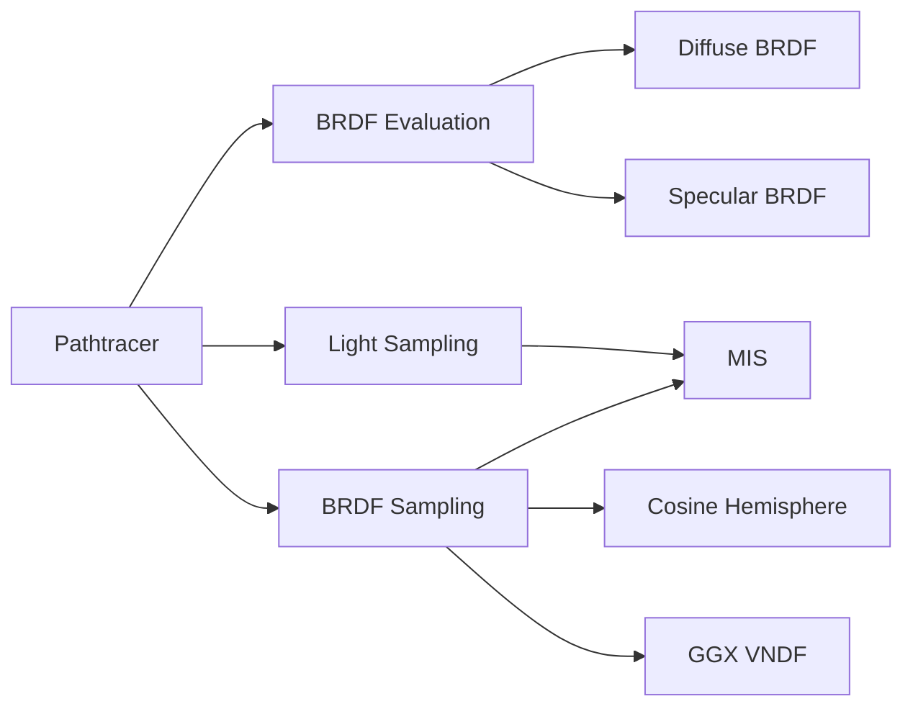

+++
title = "#20242 Solari specular scene/PT support"
date = "2025-08-01T00:00:00"
draft = false
template = "pull_request_page.html"
in_search_index = true

[taxonomies]
list_display = ["show"]

[extra]
current_language = "en"
available_languages = {"en" = { name = "English", url = "/pull_request/bevy/2025-08/pr-20242-en-20250801" }, "zh-cn" = { name = "中文", url = "/pull_request/bevy/2025-08/pr-20242-zh-cn-20250801" }}
labels = ["C-Feature", "A-Rendering"]
+++

# Technical Report: Solari specular scene/PT support

## Basic Information
- **Title**: Solari specular scene/PT support
- **PR Link**: https://github.com/bevyengine/bevy/pull/20242
- **Author**: JMS55
- **Status**: MERGED
- **Labels**: C-Feature, A-Rendering, S-Ready-For-Final-Review, M-Needs-Release-Note
- **Created**: 2025-07-22T04:11:46Z
- **Merged**: 2025-08-01T16:00:52Z
- **Merged By**: alice-i-cecile

## Description Translation
Adds roughness, metallic, and reflectance properties to solari's material system  
Always calculate and expose world_tangent in ResolvedRayHitFull  
Add brdf.wgsl with mixed diffuse/specular BRDF  
Add GGX VNDF importance sampling functions to sampling.wgsl  
Rewrite the pathtracer to use the specular BRDF  
MIS for NEE/BRDF sampling implemented in the pathtracer thanks to @SparkyPotato  

Note that specular support for the realtime lighting plugin will come at a future date. I think I want to focus on getting GI more stable and hooking up a denoiser first. This is _just_ support for the material properties in RaytracingScenePlugin, and specular lighting in the PathtracingPlugin.  

  

## The Story of This Pull Request

The existing Solari pathtracer only supported diffuse materials, limiting its ability to render realistic surfaces. This PR extends the material system with specular properties and implements physically-based rendering in the pathtracer. The core problem was integrating metallic/roughness workflows while maintaining performance and reducing noise through proper importance sampling.

First, the material representation needed expansion. The Rust-side `GpuMaterial` struct was extended to include metallic, roughness, and reflectance properties. This required updating the scene binder to process metallic-roughness textures:

```rust
// Before:
struct GpuMaterial {
    base_color: LinearRgba,
    emissive: LinearRgba,
    base_color_texture_id: u32,
    normal_map_texture_id: u32,
    emissive_texture_id: u32,
    _padding: u32,
}

// After:
struct GpuMaterial {
    normal_map_texture_id: u32,
    base_color_texture_id: u32,
    emissive_texture_id: u32,
    metallic_roughness_texture_id: u32,

    base_color: Vec3,
    perceptual_roughness: f32,
    emissive: Vec3,
    metallic: f32,
    reflectance: Vec3,
    _padding: f32,
}
```

For proper BRDF evaluation, we needed consistent tangent space information. The `ResolvedRayHitFull` struct now always calculates and exposes `world_tangent`:

```wgsl
// Before:
struct ResolvedRayHitFull {
    world_position: vec3<f32>,
    world_normal: vec3<f32>,
    geometric_world_normal: vec3<f32>,
    uv: vec2<f32>,
    triangle_area: f32,
    material: ResolvedMaterial,
}

// After:
struct ResolvedRayHitFull {
    world_position: vec3<f32>,
    world_normal: vec3<f32>,
    geometric_world_normal: vec3<f32>,
    world_tangent: vec4<f32>,
    uv: vec2<f32>,
    triangle_area: f32,
    triangle_count: u32,
    material: ResolvedMaterial,
}
```

The new `brdf.wgsl` module implements a physically-based BRDF combining diffuse and specular components. The key function evaluates both terms:

```wgsl
fn evaluate_brdf(
    world_normal: vec3<f32>,
    wo: vec3<f32>,
    wi: vec3<f32>,
    material: ResolvedMaterial,
) -> vec3<f32> {
    let diffuse_brdf = diffuse_brdf(material.base_color, material.metallic);
    let specular_brdf = specular_brdf(
        world_normal,
        wo,
        wi,
        material.base_color,
        material.metallic,
        material.reflectance,
        material.perceptual_roughness,
        material.roughness,
    );
    return diffuse_brdf + specular_brdf;
}
```

For importance sampling, GGX VNDF functions were added to `sampling.wgsl` based on GPUOpen's reference implementation. These allow proper sampling of specular lobes:

```wgsl
fn sample_ggx_vndf(wi_tangent: vec3<f32>, roughness: f32, rng: ptr<function, u32>) -> vec3<f32> {
    // Implementation based on GPUOpen's bounded VNDF sampling
}

fn ggx_vndf_pdf(wi_tangent: vec3<f32>, wo_tangent: vec3<f32>, roughness: f32) -> f32 {
    // PDF calculation for GGX VNDF sampling
}
```

The pathtracer core was rewritten to leverage these new capabilities. The most significant change is the implementation of Multiple Importance Sampling (MIS) between Next Event Estimation (light sampling) and BRDF sampling:

```wgsl
// Direct lighting with MIS weighting
if !is_perfectly_specular {
    let direct_lighting = sample_random_light(ray_hit.world_position, ray_hit.world_normal, &rng);
    let pdf_of_bounce = brdf_pdf(wo, direct_lighting.wi, ray_hit);
    mis_weight = power_heuristic(1.0 / direct_lighting.inverse_pdf, pdf_of_bounce);
    let direct_lighting_brdf = evaluate_brdf(ray_hit.world_normal, wo, direct_lighting.wi, ray_hit.material);
    radiance += mis_weight * throughput * direct_lighting.radiance * direct_lighting.inverse_pdf * direct_lighting_brdf;
}

// BRDF importance sampling
let next_bounce = importance_sample_next_bounce(wo, ray_hit, &rng);
ray_direction = next_bounce.wi;
throughput *= (evaluate_brdf(...) * cos_theta) / next_bounce.pdf;
```

The `importance_sample_next_bounce` function selects between diffuse and specular sampling based on material properties, using the new GGX VNDF sampling for specular:

```wgsl
if diffuse_selected {
    wi = sample_cosine_hemisphere(ray_hit.world_normal, rng);
} else {
    wi_tangent = sample_ggx_vndf(wo_tangent, ray_hit.material.roughness, rng);
    wi = wi_tangent.x * T + wi_tangent.y * B + wi_tangent.z * N;
}
```

Performance considerations included:
- Russian roulette termination for long paths
- Avoiding specular calculations for perfectly smooth surfaces
- Efficient PDF combination for mixed materials
- Proper MIS weighting using the power heuristic

The changes significantly improve material fidelity while maintaining performance. The pathtracer now handles metallic surfaces, roughness variations, and proper specular reflections. The MIS implementation reduces noise by optimally combining light and BRDF sampling.

## Visual Representation



## Key Files Changed

1. **`crates/bevy_solari/src/pathtracer/pathtracer.wgsl` (+88/-16)**  
   Rewrote pathtracer core to implement specular BRDF and MIS:
   ```wgsl
   // Before (diffuse only):
   let diffuse_brdf = ray_hit.material.base_color / PI;
   radiance += throughput * diffuse_brdf * direct_lighting.radiance * direct_lighting.inverse_pdf;
   ray_direction = sample_cosine_hemisphere(ray_hit.world_normal, &rng);
   
   // After (specular + MIS):
   if !is_perfectly_specular {
       let direct_lighting = sample_random_light(...);
       let pdf_of_bounce = brdf_pdf(...);
       mis_weight = power_heuristic(...);
       radiance += mis_weight * throughput * ...;
   }
   let next_bounce = importance_sample_next_bounce(...);
   ```

2. **`crates/bevy_solari/src/scene/sampling.wgsl` (+57/-2)**  
   Added GGX VNDF sampling functions:
   ```wgsl
   // New functions
   fn sample_ggx_vndf(wi_tangent: vec3<f32>, roughness: f32, rng: ptr<function, u32>) -> vec3<f32> {
       // GPUOpen implementation
   }
   
   fn ggx_vndf_pdf(wi_tangent: vec3<f32>, wo_tangent: vec3<f32>, roughness: f32) -> f32 {
       // PDF calculation
   }
   ```

3. **`crates/bevy_solari/src/scene/brdf.wgsl` (+56/-0)**  
   New BRDF implementation:
   ```wgsl
   fn evaluate_brdf(...) -> vec3<f32> {
       let diffuse_brdf = ...;
       let specular_brdf = ...;
       return diffuse_brdf + specular_brdf;
   }
   ```

4. **`crates/bevy_solari/src/scene/raytracing_scene_bindings.wgsl` (+41/-10)**  
   Extended material and hit data:
   ```wgsl
   // Material additions
   struct Material {
       // ...
       metallic: f32,
       reflectance: vec3<f32>,
       perceptual_roughness: f32,
   }
   
   // Hit data additions
   struct ResolvedRayHitFull {
       world_tangent: vec4<f32>,
       triangle_count: u32,
   }
   ```

5. **`crates/bevy_solari/src/scene/binder.rs` (+25/-8)**  
   Updated Rust-side material representation:
   ```rust
   // Before:
   materials.get_mut().push(GpuMaterial {
       base_color: material.base_color.to_linear(),
       // ...
   });
   
   // After:
   materials.get_mut().push(GpuMaterial {
       metallic: material.metallic,
       reflectance: LinearRgba::from(material.specular_tint).to_vec3() * material.reflectance,
       perceptual_roughness: material.perceptual_roughness,
       // ...
   });
   ```

## Further Reading
1. [Bounded VNDF Sampling for Smith-GGX Reflections](https://gpuopen.com/download/Bounded_VNDF_Sampling_for_Smith-GGX_Reflections.pdf) - Reference for GGX sampling
2. [Physically Based Rendering: From Theory to Implementation](https://pbr-book.org/) - Comprehensive PBR reference
3. [Multiple Importance Sampling](https://graphics.stanford.edu/papers/veach_thesis/chapter9.pdf) - Veach's thesis on MIS
4. [Bevy PBR Shader Code](https://github.com/bevyengine/bevy/blob/main/crates/bevy_pbr/src/render/pbr_types.wgsl) - Reference for PBR implementations