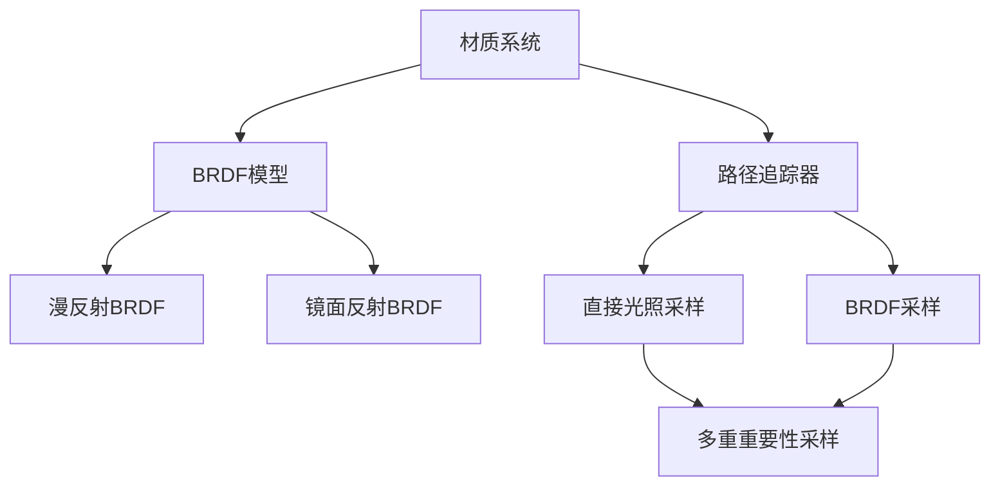

+++
title = "#20242 Solari specular scene/PT support"
date = "2025-08-01T00:00:00"
draft = false
template = "pull_request_page.html"
in_search_index = false

[extra]
current_language = "zh-cn"
available_languages = {"en" = { name = "English", url = "/pull_request/bevy/2025-08/pr-20242-en-20250801" }, "zh-cn" = { name = "中文", url = "/pull_request/bevy/2025-08/pr-20242-zh-cn-20250801" }}
+++

# Solari specular scene/PT support

## 基本信息
- **标题**: Solari specular scene/PT support
- **PR链接**: https://github.com/bevyengine/bevy/pull/20242
- **作者**: JMS55
- **状态**: MERGED
- **标签**: C-Feature, A-Rendering, S-Ready-For-Final-Review, M-Needs-Release-Note
- **创建时间**: 2025-07-22T04:11:46Z
- **合并时间**: 2025-08-01T16:00:52Z
- **合并者**: alice-i-cecile

## 描述翻译
* 为Solari的材质系统添加了粗糙度(roughness)、金属度(metallic)和反射率(reflectance)属性
* 在ResolvedRayHitFull中始终计算并暴露world_tangent
* 添加brdf.wgsl文件，包含混合漫反射/镜面反射BRDF
* 在sampling.wgsl中添加GGX VNDF重要性采样函数
* 重写路径追踪器(pathtracer)以使用镜面反射BRDF
* 由@SparkyPotato实现的路径追踪器中NEE/BRDF采样的多重重要性采样(MIS)

注意：实时光照插件的镜面反射支持将在未来添加。作者计划先让全局光照(GI)更稳定并连接降噪器。本次PR仅为RaytracingScenePlugin中的材质属性支持和PathtracingPlugin中的镜面反射光照。


## PR分析

### 问题与背景
在PR之前，Solari的路径追踪器仅支持漫反射材质，这限制了渲染真实感。现实世界中的材质通常具有镜面反射特性（如金属、光滑表面），因此需要扩展材质系统以支持粗糙度、金属度和反射率属性。同时，路径追踪器需要重写以支持基于物理的渲染(PBR)材质模型，包括正确的BRDF采样和多重重要性采样(MIS)以减少噪声。

技术挑战包括：
1. 需要与Bevy现有的PBR材质系统兼容
2. 路径追踪器需要高效处理镜面反射采样，特别是高光材质
3. 需要正确计算切线空间以支持法线贴图，这对镜面反射至关重要

### 解决方案
PR采用了分阶段方法：
1. 扩展材质系统添加镜面反射属性
2. 在光线命中信息中添加切线数据
3. 实现完整的BRDF模型和采样函数
4. 重写路径追踪器主循环支持镜面反射
5. 集成多重重要性采样(MIS)减少噪声

### 实现细节
#### 1. 材质系统扩展
修改了材质结构以包含镜面反射属性，并确保与Bevy PBR材质兼容：

```rust
// File: crates/bevy_solari/src/scene/binder.rs
// Before:
struct GpuMaterial {
    base_color: LinearRgba,
    emissive: LinearRgba,
    base_color_texture_id: u32,
    normal_map_texture_id: u32,
    emissive_texture_id: u32,
    _padding: u32,
}

// After:
struct GpuMaterial {
    normal_map_texture_id: u32,
    base_color_texture_id: u32,
    emissive_texture_id: u32,
    metallic_roughness_texture_id: u32,

    base_color: Vec3,
    perceptual_roughness: f32,
    emissive: Vec3,
    metallic: f32,
    reflectance: Vec3,
    _padding: f32,
}
```

#### 2. 切线空间计算
在光线命中解析中添加世界切线计算，支持法线贴图：

```rust
// File: crates/bevy_solari/src/scene/raytracing_scene_bindings.wgsl
// Before:
struct ResolvedRayHitFull {
    world_position: vec3<f32>,
    world_normal: vec3<f32>,
    geometric_world_normal: vec3<f32>,
    uv: vec2<f32>,
    triangle_area: f32,
    material: ResolvedMaterial,
}

// After:
struct ResolvedRayHitFull {
    world_position: vec3<f32>,
    world_normal: vec3<f32>,
    geometric_world_normal: vec3<f32>,
    world_tangent: vec4<f32>,  // 新增切线信息
    uv: vec2<f32>,
    triangle_area: f32,
    triangle_count: u32,      // 新增三角形计数
    material: ResolvedMaterial,
}
```

#### 3. BRDF模型实现
新增brdf.wgsl文件，实现完整的PBR BRDF计算：

```rust
// File: crates/bevy_solari/src/scene/brdf.wgsl
fn evaluate_brdf(
    world_normal: vec3<f32>,
    wo: vec3<f32>,
    wi: vec3<f32>,
    material: ResolvedMaterial,
) -> vec3<f32> {
    let diffuse_brdf = diffuse_brdf(material.base_color, material.metallic);
    let specular_brdf = specular_brdf(
        world_normal,
        wo,
        wi,
        material.base_color,
        material.metallic,
        material.reflectance,
        material.perceptual_roughness,
        material.roughness,
    );
    return diffuse_brdf + specular_brdf;
}
```

#### 4. GGX VNDF采样
在sampling.wgsl中添加镜面反射采样函数：

```rust
// File: crates/bevy_solari/src/scene/sampling.wgsl
fn sample_ggx_vndf(wi_tangent: vec3<f32>, roughness: f32, rng: ptr<function, u32>) -> vec3<f32> {
    // GGX VNDF采样实现
    // ...
}

fn ggx_vndf_pdf(wi_tangent: vec3<f32>, wo_tangent: vec3<f32>, roughness: f32) -> f32 {
    // GGX VNDF PDF计算
    // ...
}
```

#### 5. 路径追踪器重写
完全重写路径追踪器主循环，支持镜面反射和MIS：

```rust
// File: crates/bevy_solari/src/pathtracer/pathtracer.wgsl
// Before:
let diffuse_brdf = ray_hit.material.base_color / PI;
// ...

// After:
let next_bounce = importance_sample_next_bounce(wo, ray_hit, &rng);
ray_direction = next_bounce.wi;

// 多重重要性采样
if !bounce_was_perfect_reflection {
    let p_light = random_light_pdf(ray_hit);
    mis_weight = power_heuristic(p_bounce, p_light);
}

// BRDF评估
let brdf = evaluate_brdf(ray_hit.world_normal, wo, next_bounce.wi, ray_hit.material);
```

### 技术洞察
1. **混合BRDF采样**：根据材质属性动态选择漫反射或镜面反射采样路径
2. **多重重要性采样(MIS)**：减少高光材质噪声的关键技术
3. **切线空间转换**：正确支持法线贴图对镜面高光至关重要
4. **完美反射优化**：对完全镜面材质使用简单反射计算避免采样开销
5. **材质属性继承**：重用Bevy PBR的材质计算函数确保一致性

### 影响
1. 显著提升渲染真实感，支持金属、高光等材质
2. 多重重要性采样减少噪声，提高收敛速度
3. 为未来全局光照和降噪器集成奠定基础
4. 保持与Bevy核心PBR系统的兼容性

## 可视化组件关系



## 关键文件变更

1. `crates/bevy_solari/src/pathtracer/pathtracer.wgsl` (+88/-16)
   - 重写路径追踪主循环支持镜面反射和MIS
   - 添加BRDF采样和PDF计算函数
   ```rust
   // 新增镜面反射采样
   fn importance_sample_next_bounce(...) -> NextBounce {
       if is_perfectly_specular {
           return NextBounce(reflect(-wo, ray_hit.world_normal), 1.0, true);
       }
       // 混合采样逻辑
   }
   ```

2. `crates/bevy_solari/src/scene/sampling.wgsl` (+57/-2)
   - 添加GGX VNDF采样和PDF函数
   ```rust
   // GGX VNDF采样
   fn sample_ggx_vndf(...) -> vec3<f32> {
       // 实现基于GPUOpen的Bounded VNDF采样
   }
   ```

3. `crates/bevy_solari/src/scene/brdf.wgsl` (+56/-0)
   - 新增文件实现完整BRDF计算
   ```rust
   fn specular_brdf(...) -> vec3<f32> {
       // 使用GGX分布和Smith可见性函数
       let D = D_GGX(roughness, NdotH);
       let Vs = V_SmithGGXCorrelated(...);
   }
   ```

4. `crates/bevy_solari/src/scene/raytracing_scene_bindings.wgsl` (+41/-10)
   - 扩展材质和光线命中数据结构
   - 完善切线空间计算
   ```rust
   // 切线空间计算
   let TBN = calculate_tbn_mikktspace(world_normal, world_tangent);
   ```

5. `crates/bevy_solari/src/scene/binder.rs` (+25/-8)
   - 修改材质绑定逻辑支持新属性
   ```rust
   materials.get_mut().push(GpuMaterial {
       metallic_roughness_texture_id,
       perceptual_roughness: material.perceptual_roughness,
       // ...
   });
   ```

## 延伸阅读

1. [GGX VNDF采样技术](https://jcgt.org/published/0007/04/01/)
2. [基于物理的渲染理论](https://pbr-book.org/)
3. [多重重要性采样详解](https://graphics.stanford.edu/papers/veach_thesis/)
4. [Bevy PBR实现](https://github.com/bevyengine/bevy/tree/main/crates/bevy_pbr/src)