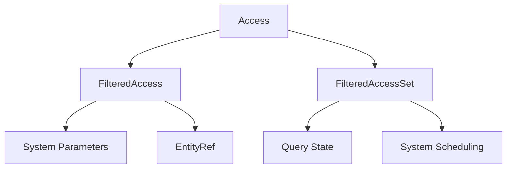

+++
title = "#20288 Remove generic parameter from `Access`, since it's always `ComponentId`"
date = "2025-08-05T00:00:00"
draft = false
template = "pull_request_page.html"
in_search_index = true

[taxonomies]
list_display = ["show"]

[extra]
current_language = "en"
available_languages = {"en" = { name = "English", url = "/pull_request/bevy/2025-08/pr-20288-en-20250805" }, "zh-cn" = { name = "中文", url = "/pull_request/bevy/2025-08/pr-20288-zh-cn-20250805" }}
labels = ["A-ECS", "C-Code-Quality"]
+++

# Analysis of PR #20288: Remove generic parameter from `Access`, since it's always `ComponentId`

## Basic Information
- **Title**: Remove generic parameter from `Access`, since it's always `ComponentId`
- **PR Link**: https://github.com/bevyengine/bevy/pull/20288
- **Author**: chescock
- **Status**: MERGED
- **Labels**: A-ECS, C-Code-Quality, S-Ready-For-Final-Review, M-Needs-Migration-Guide
- **Created**: 2025-07-25T15:41:00Z
- **Merged**: 2025-08-05T20:45:41Z
- **Merged By**: alice-i-cecile

## Description Translation
# Objective

Simplify code that uses `Access`.  Following #19143, we no longer use `Access<ArchetypeComponentId>` anywhere, only `Access<ComponentId>`.  We can simplify the code by removing the generic and having `Access` only use `ComponentId`.  

## Solution

Remove the generic parameter from `Access`, `AccessFilters`, `FilteredAccess`, and `FilteredAccessSet`, replacing it with `ComponentId`.  Also remove the parameter from `FormattedBitSet`, but use plain `usize` to make the output more concise.

## The Story of This Pull Request

### The Problem and Context
After PR #19143 removed the use of `ArchetypeComponentId` in Bevy's ECS access tracking, the generic parameter in `Access<T>` and related types became redundant. The type parameter was always instantiated as `ComponentId`, but still required throughout the codebase. This added unnecessary complexity to method signatures, type annotations, and debug output. The generic implementation also made the code harder to read and maintain.

### The Solution Approach
The solution was straightforward: remove the generic parameter from all access-related types since they only ever use `ComponentId`. This involved:
1. Removing the type parameter from `Access`, `AccessFilters`, `FilteredAccess`, and `FilteredAccessSet`
2. Simplifying the `FormattedBitSet` debug helper to use `usize` instead of a generic type
3. Updating all method signatures to work directly with `ComponentId`
4. Removing now-unnecessary generic type annotations throughout the codebase

### The Implementation
The core changes occurred in `access.rs` where the generic types were replaced with concrete `ComponentId` usage. The `Access` struct was simplified by removing its `PhantomData<T>` marker and all methods now operate directly on `ComponentId`:

```rust
// Before:
pub struct Access<T: SparseSetIndex> { /* ... */ }

// After:
pub struct Access { /* ... */ }
```

Methods were updated to use `ComponentId` directly:
```rust
// Before:
pub fn add_component_read(&mut self, index: T)

// After:
pub fn add_component_read(&mut self, index: ComponentId)
```

The `FormattedBitSet` debug helper was simplified to output raw indices instead of wrapping them:
```rust
// Before output: [ComponentId(5), ComponentId(7)]
// After output: [5, 7]
```

These changes propagated through the entire ECS codebase, affecting:
- Query implementation (fetch.rs, state.rs)
- System parameters (system_param.rs)
- World access methods (entity_ref.rs, filtered_resource.rs)
- Macros and derived implementations (macros/src/*)
- Tests throughout the codebase

### Technical Insights
Key technical points from the implementation:
1. **Direct ComponentId Handling**: All methods now use `ComponentId` directly, calling `index()` to get the underlying usize when needed
2. **Simplified Debug Output**: `FormattedBitSet` now outputs raw indices for cleaner debug displays
3. **Removed Redundant Constraints**: The `SparseSetIndex` trait bound was completely removed from access types
4. **Preserved Semantics**: All access tracking behavior remains unchanged, only the type signatures were simplified

### The Impact
These changes provide several benefits:
1. **Reduced Cognitive Load**: Fewer generic parameters make code easier to understand
2. **Cleaner Signatures**: Method signatures throughout the ECS are shorter and more readable
3. **Simplified Debugging**: Debug output is more concise and readable
4. **Minor Performance Gain**: Removal of indirect generics may improve compile times

The changes are mostly mechanical but touch many parts of the codebase. A migration guide was added to help users update their code.

## Visual Representation



## Key Files Changed

1. `crates/bevy_ecs/src/query/access.rs` (+261/-298)
   - Core changes removing generics from access types
   - Simplified debug formatting
   - Updated all methods to use `ComponentId`

```rust
// Before:
pub struct Access<T: SparseSetIndex> {
    component_read_and_writes: FixedBitSet,
    marker: PhantomData<T>,
}

// After:
pub struct Access {
    component_read_and_writes: FixedBitSet,
}
```

2. `crates/bevy_ecs/src/query/fetch.rs` (+32/-63)
   - Updated WorldQuery implementations to use non-generic access types

```rust
// Before:
fn update_component_access(state: &Self::State, access: &mut FilteredAccess<ComponentId>)

// After:
fn update_component_access(state: &Self::State, access: &mut FilteredAccess)
```

3. `crates/bevy_ecs/src/system/system_param.rs` (+36/-36)
   - Updated system param implementations to use non-generic access

```rust
// Before:
fn init_access(state: &Self::State, access_set: &mut FilteredAccessSet<ComponentId>)

// After:
fn init_access(state: &Self::State, access_set: &mut FilteredAccessSet)
```

4. `crates/bevy_ecs/src/world/entity_ref.rs` (+10/-22)
   - Updated entity reference types to use non-generic access

```rust
// Before:
pub struct FilteredEntityRef<'w, 's> {
    access: &'s Access<ComponentId>,
}

// After:
pub struct FilteredEntityRef<'w, 's> {
    access: &'s Access,
}
```

5. `crates/bevy_ecs/src/world/filtered_resource.rs` (+16/-16)
   - Updated resource access types to be non-generic

```rust
// Before:
pub struct FilteredResources<'w, 's> {
    access: &'s Access<ComponentId>,
}

// After:
pub struct FilteredResources<'w, 's> {
    access: &'s Access,
}
```

## Further Reading
- [PR #19143](https://github.com/bevyengine/bevy/pull/19143) - Original change that removed ArchetypeComponentId
- [ECS Access Control Documentation](https://bevyengine.org/learn/book/ecs-access/)
- [Rust Generics Explanation](https://doc.rust-lang.org/book/ch10-00-generics.html)