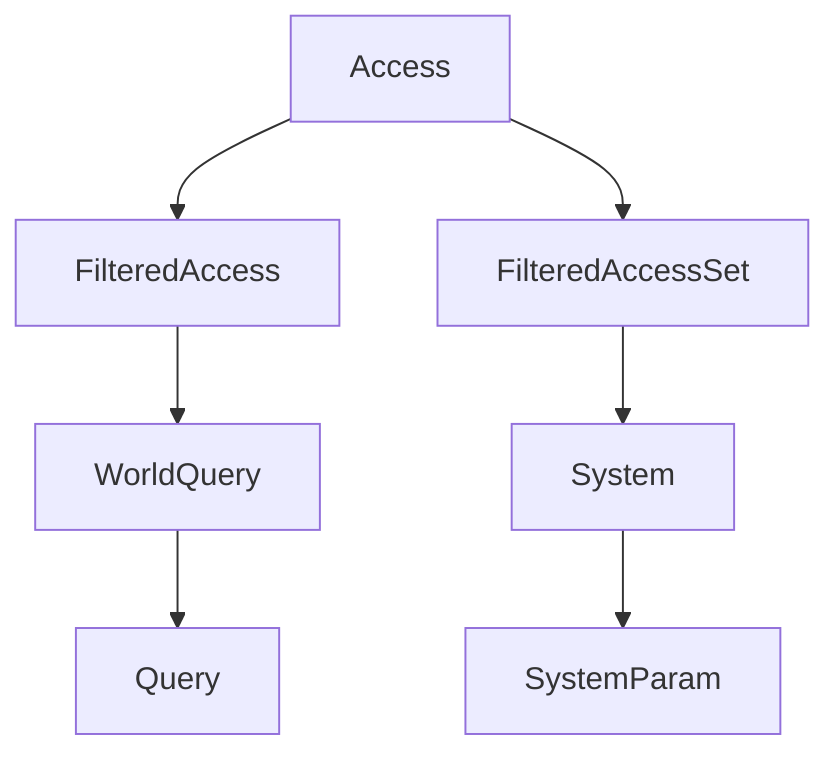

+++
title = "#20288 Remove generic parameter from `Access`, since it's always `ComponentId"
date = "2025-08-05T00:00:00"
draft = false
template = "pull_request_page.html"
in_search_index = false

[extra]
current_language = "zh-cn"
available_languages = {"en" = { name = "English", url = "/pull_request/bevy/2025-08/pr-20288-en-20250805" }, "zh-cn" = { name = "中文", url = "/pull_request/bevy/2025-08/pr-20288-zh-cn-20250805" }}
+++

# 移除 `Access` 的泛型参数

## 基本信息
- **标题**: Remove generic parameter from `Access`, since it's always `ComponentId`
- **PR链接**: https://github.com/bevyengine/bevy/pull/20288
- **作者**: chescock
- **状态**: MERGED
- **标签**: A-ECS, C-Code-Quality, S-Ready-For-Final-Review, M-Needs-Migration-Guide
- **创建时间**: 2025-07-25T15:41:00Z
- **合并时间**: 2025-08-05T20:45:41Z
- **合并者**: alice-i-cecile

## 描述翻译
### 目标
简化使用 `Access` 的代码。继 #19143 之后，我们不再在任何地方使用 `Access<ArchetypeComponentId>`，而只使用 `Access<ComponentId>`。我们可以通过移除泛型参数，使 `Access` 仅使用 `ComponentId` 来简化代码。

### 解决方案
移除 `Access`、`AccessFilters`、`FilteredAccess` 和 `FilteredAccessSet` 的泛型参数，替换为 `ComponentId`。同时移除 `FormattedBitSet` 的参数，但使用普通的 `usize` 以使输出更简洁。

## 这个Pull Request的故事

### 问题和背景
在 Bevy 的 ECS 实现中，`Access` 类型用于跟踪系统对组件和资源的访问权限。该类型最初设计为泛型类型，可以接受 `ComponentId` 或 `ArchetypeComponentId` 作为类型参数。然而，在 PR #19143 中移除了 `ArchetypeComponentId` 的使用后，`Access` 始终只使用 `ComponentId`。这导致泛型参数变得冗余，增加了代码复杂性和维护成本。

主要技术问题包括：
1. 冗余的泛型参数增加了代码阅读和理解的难度
2. 不必要的类型转换和约束降低了代码清晰度
3. 调试输出不够直观，需要额外的格式化处理

### 解决方案方法
开发者决定直接移除 `Access` 及相关类型的泛型参数，将其内部索引类型固定为 `ComponentId`。主要修改包括：
1. 移除 `Access`、`FilteredAccess` 和 `FilteredAccessSet` 的泛型参数
2. 修改相关方法签名，直接使用 `ComponentId` 代替泛型参数
3. 重构 `FormattedBitSet` 辅助结构，使用 `usize` 替代泛型参数
4. 更新所有使用这些类型的地方，移除不必要的泛型参数

### 实现细节
核心修改集中在 `access.rs` 文件中：
1. 移除了 `Access<T>` 的泛型参数：
```rust
// 修改前
pub struct Access<T: SparseSetIndex> {
    component_read_and_writes: FixedBitSet,
    marker: PhantomData<T>,
}

// 修改后
#[derive(Eq, PartialEq, Default)]
pub struct Access {
    component_read_and_writes: FixedBitSet,
}
```

2. 更新了组件访问方法，直接使用 `ComponentId`：
```rust
// 修改前
pub fn add_component_read(&mut self, index: T) {
    let sparse_set_index = index.sparse_set_index();
    // ...
}

// 修改后
pub fn add_component_read(&mut self, index: ComponentId) {
    let sparse_set_index = index.index();
    // ...
}
```

3. 重构了 `FormattedBitSet` 辅助结构：
```rust
// 修改前
struct FormattedBitSet<'a, T: SparseSetIndex> {
    bit_set: &'a FixedBitSet,
    _marker: PhantomData<T>,
}

// 修改后
struct FormattedBitSet<'a> {
    bit_set: &'a FixedBitSet,
}
```

### 技术洞察
1. **类型简化**：移除泛型参数减少了类型系统的复杂性，使代码更易于理解和维护
2. **性能影响**：由于 `ComponentId` 本质上是 `usize` 的包装，此修改不会影响运行时性能
3. **调试改进**：`FormattedBitSet` 现在直接输出索引值，使调试输出更简洁：
```rust
// 修改前输出
read_and_writes: [ComponentId(5), ComponentId(7)]

// 修改后输出
read_and_writes: [5, 7]
```

4. **API 一致性**：所有方法现在直接接受 `ComponentId` 参数，消除了不必要的类型转换

### 影响
1. **代码简化**：移除了 298 行代码，添加了 261 行，净减少 37 行代码
2. **使用影响**：开发者在使用 `Access` 及相关类型时不再需要指定泛型参数
3. **迁移需求**：需要更新所有使用 `Access<ComponentId>` 的地方，移除泛型参数

## 可视化表示


## 关键文件更改

### crates/bevy_ecs/src/query/access.rs (+261/-298)
1. 移除了所有泛型参数，使用 `ComponentId` 作为唯一索引类型
2. 更新了调试输出格式，使用新的 `FormattedBitSet`
3. 简化了类型定义，移除了不必要的 `PhantomData`

关键代码片段：
```rust
// 组件访问方法修改
pub fn add_component_read(&mut self, index: ComponentId) {
    let sparse_set_index = index.index();
    self.add_component_sparse_set_index_read(sparse_set_index);
}
```

### crates/bevy_ecs/src/query/fetch.rs (+32/-63)
1. 更新了 `WorldQuery` trait 的实现
2. 移除了 `FilteredAccess<ComponentId>` 中的泛型参数

关键代码片段：
```rust
// 修改前
fn update_component_access(state: &Self::State, access: &mut FilteredAccess<ComponentId>)

// 修改后
fn update_component_access(state: &Self::State, access: &mut FilteredAccess)
```

### crates/bevy_ecs/src/system/system_param.rs (+36/-36)
1. 更新了系统参数初始化方法
2. 移除了 `FilteredAccessSet<ComponentId>` 中的泛型参数

关键代码片段：
```rust
// 修改前
fn init_access(
    state: &Self::State,
    system_meta: &mut SystemMeta,
    component_access_set: &mut FilteredAccessSet<ComponentId>,
    world: &mut World,
)

// 修改后
fn init_access(
    state: &Self::State,
    system_meta: &mut SystemMeta,
    component_access_set: &mut FilteredAccessSet,
    world: &mut World,
)
```

### crates/bevy_ecs/src/world/entity_ref.rs (+10/-22)
1. 更新了实体引用类型
2. 移除了 `Access<ComponentId>` 中的泛型参数

关键代码片段：
```rust
// 修改前
pub struct FilteredEntityRef<'w, 's> {
    access: &'s Access<ComponentId>,
}

// 修改后
pub struct FilteredEntityRef<'w, 's> {
    access: &'s Access,
}
```

### crates/bevy_ecs/src/world/filtered_resource.rs (+16/-16)
1. 更新了资源访问类型
2. 移除了 `Access<ComponentId>` 中的泛型参数

关键代码片段：
```rust
// 修改前
pub struct FilteredResources<'w, 's> {
    access: &'s Access<ComponentId>,
}

// 修改后
pub struct FilteredResources<'w, 's> {
    access: &'s Access,
}
```

## 进一步阅读
1. [ECS 访问控制文档](https://bevyengine.org/learn/book/ecs-access-control/)
2. [泛型类型简化模式](https://rust-design-patterns.com/patterns/remove-generics.html)
3. [Bevy ECS 架构指南](https://bevyengine.org/learn/ecs-architecture/)