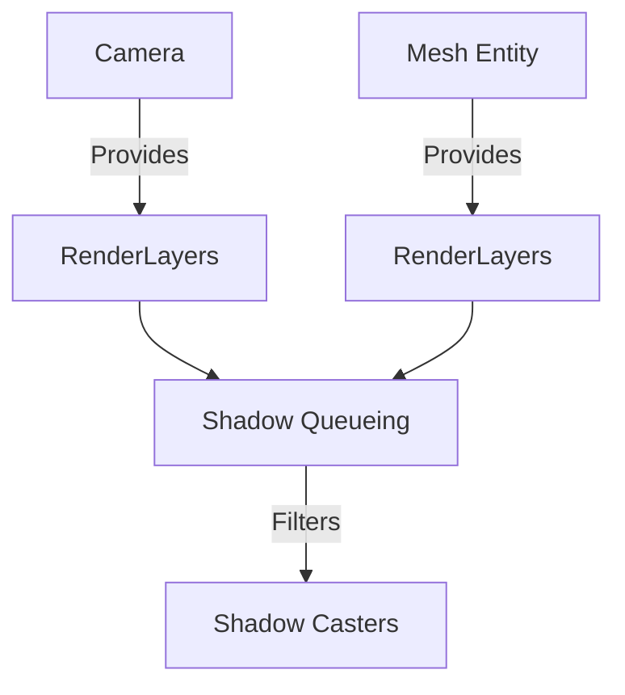

+++
title = "#20327 Make shadows respect render layers"
date = "2025-08-09T00:00:00"
draft = false
template = "pull_request_page.html"
in_search_index = true

[taxonomies]
list_display = ["show"]

[extra]
current_language = "en"
available_languages = {"en" = { name = "English", url = "/pull_request/bevy/2025-08/pr-20327-en-20250809" }, "zh-cn" = { name = "中文", url = "/pull_request/bevy/2025-08/pr-20327-zh-cn-20250809" }}
labels = ["C-Bug", "A-Rendering"]
+++

# Analysis of PR #20327: Make shadows respect render layers

## Basic Information
- **Title**: Make shadows respect render layers
- **PR Link**: https://github.com/bevyengine/bevy/pull/20327
- **Author**: tychedelia
- **Status**: MERGED
- **Labels**: C-Bug, A-Rendering, S-Ready-For-Final-Review
- **Created**: 2025-07-29T22:28:06Z
- **Merged**: 2025-08-09T01:41:09Z
- **Merged By**: james7132

## Description Translation
Adopted from and closes #18747. Original work by @Adriigbs.

Shadows and render layers are a bit complicated. Ideally, this filtering would be done at a higher level, but the camera entity just holds a list of references to the light entities for that view. Those light entities then compute what entities are visible from their perspective. We don't actually get a chance to filter camera and light visible entity until we queue the shadow pass, which is where this PR chooses to filter out entities that aren't visible in a camera from casting shadows.

The alternative would be to store a per camera per light list of entities, which would greatly increase the amount of memory required for visible entities in multi-camera setups.

## The Story of This Pull Request

### The Problem and Context
The core issue addressed in this PR is that shadows were not respecting render layers. In Bevy's rendering system, `RenderLayers` are used to control which entities are visible to specific cameras. However, before this change, entities would still cast shadows in a camera's view even if they weren't on a render layer visible to that camera. This occurred because the shadow queueing system didn't consider the camera's render layers when determining which entities should cast shadows.

The challenge was implementing this filtering efficiently. The camera entity only holds references to light entities, and lights compute visibility from their perspective. The earliest point where we can filter based on both camera and light visibility is during shadow pass queueing.

### The Solution Approach
The solution involves two key changes:
1. Make camera render layers available during shadow queueing
2. Store mesh render layers during mesh extraction for later comparison

This approach was chosen over the alternative of storing per-camera per-light entity lists, which would significantly increase memory usage in multi-camera setups. By performing the filtering during shadow queueing, we avoid that memory overhead while still achieving correct behavior.

### The Implementation
The implementation required modifications in two main areas:

1. **Shadow Queueing (`light.rs`):**
   - Modified the view query to include camera render layers
   - Added a render layer intersection check before processing entities for shadows
   - Moved the cache validation after the render layer check to avoid unnecessary work

```rust
// In queue_shadows system
for (entity, view_lights, camera_layers) in &view_lights {
    // ...
    for main_entity in visible_entities.entities.iter().copied() {
        // ...
        let mesh_layers = mesh_instance
            .shared
            .render_layers
            .as_ref()
            .unwrap_or_default();
        
        let camera_layers = camera_layers.unwrap_or_default();
        
        if !camera_layers.intersects(mesh_layers) {
            continue;
        }
        
        // Skip the entity if it's cached in a bin and up to date
        if shadow_phase.validate_cached_entity(main_entity, *current_change_tick) {
            continue;
        }
        // ... rest of processing
    }
}
```

2. **Mesh Extraction (`mesh.rs`):**
   - Added `render_layers` field to `RenderMeshInstanceShared`
   - Modified mesh extraction queries to include `RenderLayers`
   - Propagated render layers through the extraction process

```rust
// Added to RenderMeshInstanceShared
pub struct RenderMeshInstanceShared {
    // ... existing fields
    pub render_layers: Option<RenderLayers>,
}

// Updated extraction queries
type GpuMeshExtractionQuery = (
    // ... existing components
    Option<Read<RenderLayers>>,
);

// Updated extraction logic
fn extract_mesh_for_gpu_building(
    // ... existing parameters
    render_layers: Option<&RenderLayers>,
) {
    let shared = RenderMeshInstanceShared::for_cpu_building(
        // ... other parameters
        render_layers,
    );
}
```

### Technical Insights
The key technical aspects of this solution include:

1. **Render Layer Propagation:** The solution propagates render layer information from entities to both mesh instances and cameras, making it available at the critical shadow queueing point.

2. **Efficiency Considerations:** By placing the render layer check before cache validation, we avoid unnecessary cache lookups for entities that will be skipped anyway. This ordering minimizes performance impact.

3. **Compatibility Handling:** The implementation properly handles cases where render layers might not be present (using `Option` and `unwrap_or_default`), maintaining backward compatibility.

### The Impact
This change fixes a significant rendering bug where entities would cast shadows in cameras they shouldn't be visible in. The solution:
- Correctly respects render layer configurations
- Maintains performance by avoiding expensive memory allocations
- Preserves existing behavior when render layers aren't used
- Adds minimal overhead (just an additional intersection check per entity)

The changes demonstrate a pattern for propagating component data through Bevy's rendering pipeline to where it's needed for specialized processing.

## Visual Representation



## Key Files Changed

### `crates/bevy_pbr/src/render/light.rs` (+19/-7)
This file contains the shadow queueing logic. The key change adds render layer filtering to skip entities that shouldn't cast shadows in the current camera view.

**Key modifications:**
```rust
// Before:
view_lights: Query<(Entity, &ViewLightEntities), With<ExtractedView>>,

// After:
view_lights: Query<(Entity, &ViewLightEntities, Option<&RenderLayers>), With<ExtractedView>>,

// Added render layer check:
let mesh_layers = mesh_instance
    .shared
    .render_layers
    .as_ref()
    .unwrap_or_default();

let camera_layers = camera_layers.unwrap_or_default();

if !camera_layers.intersects(mesh_layers) {
    continue;
}
```

### `crates/bevy_pbr/src/render/mesh.rs` (+14/-0)
This file handles mesh extraction. The changes propagate render layer information to mesh instances for use during shadow queueing.

**Key modifications:**
```rust
// Added to RenderMeshInstanceShared:
pub struct RenderMeshInstanceShared {
    // ... existing fields
    pub render_layers: Option<RenderLayers>,
}

// Updated extraction queries:
type GpuMeshExtractionQuery = (
    // ... existing components
    Option<Read<RenderLayers>>,
);

// Updated in extraction logic:
shared.render_layers = render_layers.cloned();
```

## Further Reading
1. [Bevy Render Layers Documentation](https://docs.rs/bevy_render/latest/bevy_render/view/struct.RenderLayers.html)
2. [Bevy Rendering Pipeline Overview](https://bevy-cheatbook.github.io/pipeline.html)
3. [Original Issue #18747](https://github.com/bevyengine/bevy/issues/18747)