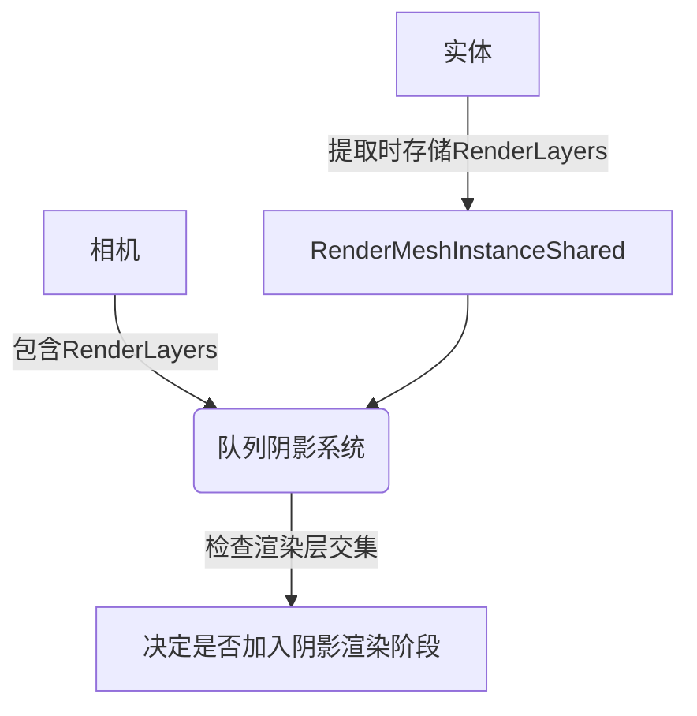

+++
title = "#20327 Make shadows respect render layers"
date = "2025-08-09T00:00:00"
draft = false
template = "pull_request_page.html"
in_search_index = false

[extra]
current_language = "zh-cn"
available_languages = {"en" = { name = "English", url = "/pull_request/bevy/2025-08/pr-20327-en-20250809" }, "zh-cn" = { name = "中文", url = "/pull_request/bevy/2025-08/pr-20327-zh-cn-20250809" }}
labels = ["C-Bug", "A-Rendering"]
+++

# Make shadows respect render layers

## Basic Information
- **Title**: Make shadows respect render layers
- **PR Link**: https://github.com/bevyengine/bevy/pull/20327
- **Author**: tychedelia
- **Status**: MERGED
- **Labels**: C-Bug, A-Rendering, S-Ready-For-Final-Review
- **Created**: 2025-07-29T22:28:06Z
- **Merged**: 2025-08-09T01:41:09Z
- **Merged By**: james7132

## Description Translation
Adopted from and closes #18747. Original work by @Adriigbs.

Shadows and render layers are a bit complicated. Ideally, this filtering would be done at a higher level, but the camera entity just holds a list of references to the light entities for that view. Those light entities then compute what entities are visible from their perspective. We don't actually get a chance to filter camera and light visible entity until we queue the shadow pass, which is where this PR chooses to filter out entities that aren't visible in a camera from casting shadows.

The alternative would be to store a per camera per light list of entities, which would greatly increase the amount of memory required for visible entities in multi-camera setups.

## The Story of This Pull Request

### 问题背景
在Bevy渲染系统中，RenderLayers组件用于控制实体在哪些相机中可见。当前实现存在一个问题：阴影投射未正确考虑渲染层设置。即使实体在相机中不可见（因渲染层不匹配），它仍可能在该相机的场景中投射阴影。这会导致视觉不一致问题，特别是使用多个相机和复杂渲染层设置时。

问题根源在于阴影渲染流程：
1. 相机持有光源实体引用列表
2. 光源独立计算其视角下的可见实体
3. 阴影队列阶段前缺少相机/光源可见性协调

理想解决方案是在更高层级过滤，但相机仅存储光源引用而非完整实体列表。完整实现每相机每光源的实体列表会显著增加内存开销（尤其在多相机配置中）。

### 解决方案
选择在阴影队列阶段(queue_shadows)实现过滤：
1. 提取实体的RenderLayers信息
2. 在阴影队列阶段检查实体渲染层与相机渲染层的交集
3. 无交集的实体跳过阴影投射

这平衡了正确性和性能：
- ✅ 正确实现渲染层对阴影的影响
- ✅ 避免创建每相机每光源的实体列表
- ✅ 最小化内存开销
- ✅ 集中处理过滤逻辑

### 代码实现
核心修改分布在两个文件：

**1. `crates/bevy_pbr/src/render/mesh.rs`**
- 在RenderMeshInstanceShared中添加render_layers字段存储实体的渲染层信息
- 修改网格提取逻辑以捕获实体的RenderLayers组件

```rust
// 修改后
pub struct RenderMeshInstanceShared {
    // ...其他字段
    pub render_layers: Option<RenderLayers>,
}

impl RenderMeshInstanceShared {
    pub fn for_cpu_building(
        // ...
        render_layers: Option<&RenderLayers>,
    ) -> Self {
        // ...
        Self {
            // ...
            render_layers: render_layers.cloned(),
        }
    }
}

// 在提取系统中
fn extract_meshes_for_cpu_building(
    // 查询添加RenderLayers
    Query<(
        // ...
        Option<&RenderLayers>,
    )>,
) {
    // ...
    let shared = RenderMeshInstanceShared::for_cpu_building(
        // ...
        render_layers,
    );
}
```

**2. `crates/bevy_pbr/src/render/light.rs`**
- 修改queue_shadows系统查询以获取相机渲染层
- 在阴影队列前添加渲染层检查逻辑

```rust
// 修改查询获取相机渲染层
view_lights: Query<(Entity, &ViewLightEntities, Option<&RenderLayers>), With<ExtractedView>>,

fn queue_shadows(
    // ...
) {
    for (entity, view_lights, camera_layers) in &view_lights {
        // ...
        // 新增渲染层检查
        let mesh_layers = mesh_instance
            .shared
            .render_layers
            .as_ref()
            .unwrap_or_default();
        
        let camera_layers = camera_layers.unwrap_or_default();
        
        if !camera_layers.intersects(mesh_layers) {
            continue;
        }
        
        // 原有缓存检查...
    }
}
```

### 技术要点
1. **渲染层传播**：
   - 实体渲染层通过RenderMeshInstanceShared传播到渲染管线
   - 保持原有数据流不变，仅添加必要字段

2. **过滤位置选择**：
   - 在queue_shadows阶段过滤避免过早剔除
   - 确保仅当实体在相机中可见时才投射阴影

3. **空值处理**：
   - 使用unwrap_or_default()处理None情况
   - 无渲染层组件视为默认层（与所有层匹配）

4. **性能考量**：
   - 检查发生在每实体阴影队列时
   - 轻量级位运算（RenderLayers使用BitSet实现）
   - 避免创建额外数据结构

### 影响
1. **功能修正**：
   - 阴影现在正确遵循渲染层设置
   - 修复实体在相机中不可见但仍投射阴影的问题

2. **兼容性**：
   - 无渲染层设置的实体保持原有行为
   - 现有项目无需修改即可受益

3. **架构影响**：
   - 保持渲染管线现有结构
   - 最小化侵入性修改

## Visual Representation



## Key Files Changed

### 1. `crates/bevy_pbr/src/render/light.rs` (+19/-7)
**目的**：实现阴影队列阶段的渲染层过滤  
**关键修改**：
```rust
// 修改查询添加相机渲染层
view_lights: Query<(Entity, &ViewLightEntities, Option<&RenderLayers>), With<ExtractedView>>,

// 在阴影队列中添加过滤逻辑
for (entity, view_lights, camera_layers) in &view_lights {
    // ...
    let mesh_layers = mesh_instance
        .shared
        .render_layers
        .as_ref()
        .unwrap_or_default();
    
    let camera_layers = camera_layers.unwrap_or_default();
    
    if !camera_layers.intersects(mesh_layers) {
        continue;
    }
}
```

### 2. `crates/bevy_pbr/src/render/mesh.rs` (+14/-0)
**目的**：存储实体的渲染层信息供阴影系统使用  
**关键修改**：
```rust
// 添加render_layers字段
pub struct RenderMeshInstanceShared {
    // ...
    pub render_layers: Option<RenderLayers>,
}

// 修改构造方法
pub fn for_cpu_building(
    // ...
    render_layers: Option<&RenderLayers>,
) -> Self {
    // ...
    Self {
        // ...
        render_layers: render_layers.cloned(),
    }
}

// 修改提取系统传递render_layers
fn extract_meshes_for_cpu_building(
    // 查询添加RenderLayers
    Query<(
        // ...
        Option<&RenderLayers>,
    )>,
) {
    // ...
    let shared = RenderMeshInstanceShared::for_cpu_building(
        // ...
        render_layers,
    );
}
```

## Further Reading
1. Bevy渲染层文档:  
   https://docs.rs/bevy/latest/bevy/render/view/struct.RenderLayers.html
2. Bevy阴影系统源码分析:  
   https://github.com/bevyengine/bevy/blob/main/crates/bevy_pbr/src/render/light.rs
3. 可见性系统设计模式:  
   https://bevy-cheatbook.github.io/features/visibility.html