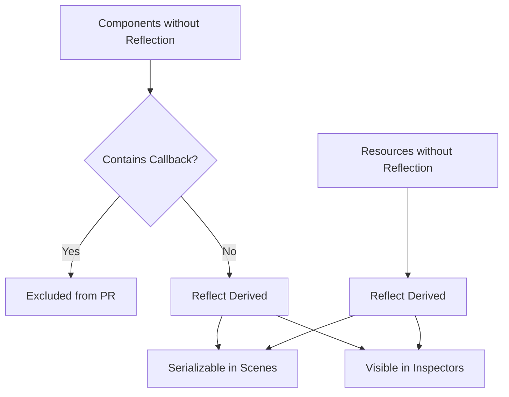

+++
title = "#20339 Reflect non-callback components and resources in bevy_core_widgets and bevy_feathers"
date = "2025-08-03T00:00:00"
draft = false
template = "pull_request_page.html"
in_search_index = true

[taxonomies]
list_display = ["show"]

[extra]
current_language = "en"
available_languages = {"en" = { name = "English", url = "/pull_request/bevy/2025-08/pr-20339-en-20250803" }, "zh-cn" = { name = "中文", url = "/pull_request/bevy/2025-08/pr-20339-zh-cn-20250803" }}
labels = ["A-UI", "D-Straightforward"]
+++

## Reflect non-callback components and resources in bevy_core_widgets and bevy_feathers

### Basic Information
- **Title**: Reflect non-callback components and resources in bevy_core_widgets and bevy_feathers
- **PR Link**: https://github.com/bevyengine/bevy/pull/20339
- **Author**: alice-i-cecile
- **Status**: MERGED
- **Labels**: A-UI, S-Ready-For-Final-Review, X-Uncontroversial, D-Straightforward
- **Created**: 2025-07-30T22:04:01Z
- **Merged**: 2025-08-03T19:58:32Z
- **Merged By**: alice-i-cecile

### Description Translation
# Objective

- Reflecting public components and resources is essential to allow them to be saved to scenes and function properly in inspectors
- Fixes #20040.

## Solution

- Derive reflect for all of the public components and resources that didn't have it
- Various components that store a `Callback`, like `CoreButton`, are a notable exception
   - Because Callbacks are not type-erased, and the reflect derive only works when all generics are reflect, I could not get this to work nicely
   - If you can get this working, please let me know and we can do this in follow-up!
- I also slapped a missing Debug derive on the theme resource because it seems extremely useful and I noticed it

## Notes to reviewers

- this is not feature-gated: see #20337 for the steps needed to meaningfully do so. Fixing that is out of scope for the 0.17 release.
- I've opted to separate the Reflect derive from the other derives wherever rustfmt would let me. While this looks dumb right now, it will reduce the diff noise when fixing #20337.
- I could add reflection to the callback-containing components with an ignore for the callback fields, but I don't think this is particularly useful

### The Story of This Pull Request

This PR addresses a gap in Bevy's UI components where many public components and resources lacked reflection support. Without reflection, these types couldn't be properly serialized to scenes or inspected in tools. The core issue (#20040) prevented UI elements from functioning correctly in common development workflows.

The solution approach was methodical: add `Reflect` derives to all non-callback public components and resources across `bevy_core_widgets` and `bevy_feathers`. Components containing `Callback` fields were excluded due to technical limitations with reflecting generic types. The author deliberately separated `Reflect` derives from other derives to minimize future diff noise when addressing #20337 (feature-gating).

Implementation details:
1. Added `bevy_reflect` dependency to `bevy_core_widgets/Cargo.toml`
2. Derived `Reflect` on enums like `ControlOrientation` and `TrackClick`
3. Added `ReflectComponent` to struct components like `CoreScrollbar` and `ColorSwatch`
4. Implemented `Reflect` for resources including `UiTheme`
5. Added missing `Debug` derive to `UiTheme` for better debuggability

For callback-containing components, the author explicitly chose not to implement reflection by ignoring callback fields, as this wouldn't provide meaningful reflection capabilities. The PR focuses on straightforward cases where reflection could be cleanly implemented.



### Key Files Changed

**crates/bevy_feathers/src/theme.rs (+14/-3)**
Added reflection to theme resources and components. Fixed missing Debug derive.

Before:
```rust
#[derive(Default, Clone)]
pub struct ThemeProps { ... }

#[derive(Resource, Default)]
pub struct UiTheme(pub ThemeProps);
```

After:
```rust
#[derive(Default, Clone, Reflect, Debug)]
#[reflect(Default, Debug)]
pub struct ThemeProps { ... }

#[derive(Resource, Default, Reflect, Debug)]
#[reflect(Resource, Default, Debug)]
pub struct UiTheme(pub ThemeProps);
```

**crates/bevy_core_widgets/src/core_scrollbar.rs (+10/-3)**
Added reflection to scrollbar components and orientation enum.

Before:
```rust
#[derive(Debug, Default, Clone, Copy, PartialEq)]
pub enum ControlOrientation { ... }

#[derive(Component, Debug)]
pub struct CoreScrollbar { ... }
```

After:
```rust
#[derive(Debug, Default, Clone, Copy, PartialEq, Reflect)]
#[reflect(PartialEq, Clone, Default)]
pub enum ControlOrientation { ... }

#[derive(Component, Debug, Reflect)]
#[reflect(Component)]
pub struct CoreScrollbar { ... }
```

**crates/bevy_core_widgets/src/core_slider.rs (+10/-3)**
Added reflection to slider components and enums.

Before:
```rust
#[derive(Debug, Default, PartialEq, Clone, Copy)]
pub enum TrackClick { ... }

#[derive(Component, Debug, PartialEq, Clone)]
pub struct SliderStep(pub f32);
```

After:
```rust
#[derive(Debug, Default, PartialEq, Clone, Copy, Reflect)]
#[reflect(Clone, PartialEq, Default)]
pub enum TrackClick { ... }

#[derive(Component, Debug, PartialEq, Clone, Reflect)]
#[reflect(Component)]
pub struct SliderStep(pub f32);
```

**crates/bevy_feathers/src/controls/checkbox.rs (+8/-3)**
Added reflection to checkbox internal components.

After:
```rust
#[derive(Component, Default, Clone, Reflect)]
#[reflect(Component, Clone, Default)]
struct CheckboxFrame;
```

**crates/bevy_feathers/src/controls/color_swatch.rs (+8/-3)**
Added reflection to color swatch components.

After:
```rust
#[derive(Component, Default, Clone, Reflect)]
#[reflect(Component, Clone, Default)]
pub struct ColorSwatch;
```

### Further Reading
- [Bevy Reflection Documentation](https://docs.rs/bevy_reflect/latest/bevy_reflect/)
- [Scene Serialization Guide](https://bevyengine.org/learn/book/getting-started/scenes/)
- [Related Issue: #20040](https://github.com/bevyengine/bevy/issues/20040)
- [Follow-up Task: #20337](https://github.com/bevyengine/bevy/pull/20337)