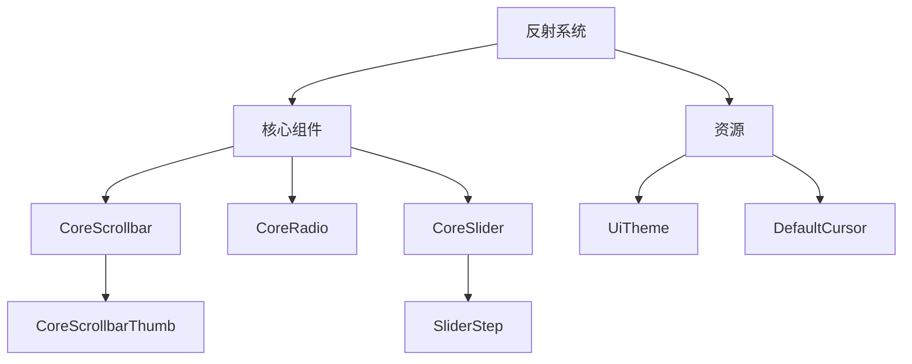

+++
title = "#20339 Reflect non-callback components and resources in bevy_core_widgets and bevy_feathers"
date = "2025-08-03T00:00:00"
draft = false
template = "pull_request_page.html"
in_search_index = false

[extra]
current_language = "zh-cn"
available_languages = {"en" = { name = "English", url = "/pull_request/bevy/2025-08/pr-20339-en-20250803" }, "zh-cn" = { name = "中文", url = "/pull_request/bevy/2025-08/pr-20339-zh-cn-20250803" }}
+++

## 非回调组件与资源的反射支持分析报告

### 基本信息
- **标题**: Reflect non-callback components and resources in bevy_core_widgets and bevy_feathers
- **PR链接**: https://github.com/bevyengine/bevy/pull/20339
- **作者**: alice-i-cecile
- **状态**: 已合并
- **标签**: A-UI, S-Ready-For-Final-Review, X-Uncontroversial, D-Straightforward
- **创建时间**: 2025-07-30T22:04:01Z
- **合并时间**: 2025-08-03T19:58:32Z
- **合并人**: alice-i-cecile

### 描述翻译
# Objective

- 反射公共组件和资源对于支持场景保存和检查器正常工作至关重要
- 修复 #20040

## Solution

- 为所有未实现反射的公共组件和资源派生 reflect 特性
- 存储 `Callback` 的组件（如 `CoreButton`）是例外
   - 由于回调未进行类型擦除，且反射派生要求所有泛型都可反射，无法优雅实现
   - 如有解决方案欢迎提出，可在后续PR中处理
- 同时为 theme 资源添加缺失的 Debug 派生（实用且发现遗漏）

## Notes to reviewers

- 未做特性门控：完整门控方案详见 #20337，不在 0.17 版本范围内
- 在 rustfmt 允许的情况下将 Reflect 派生与其他派生分离，减少 #20337 的 diff 噪音
- 可为含回调组件添加反射（忽略回调字段），但认为实用价值有限

### PR技术分析

#### 问题背景
UI组件和资源缺乏反射支持会阻碍两个关键工作流：
1. 场景序列化/反序列化时无法保存组件状态
2. 开发时无法在检查器实时查看/修改组件数据

具体问题(#20040)表现为：`bevy_core_widgets`和`bevy_feathers`中的核心UI组件（如滑块、单选框）未实现`Reflect`特性，导致无法参与反射系统。其中特殊难点在于处理含泛型回调的组件，因回调函数未类型擦除且泛型约束难以满足反射要求。

#### 解决方案
采用分阶段处理策略：
1. **立即解决**：为不含回调的组件/资源实现`Reflect`派生
2. **暂缓处理**：标记含回调的组件待后续优化
3. **补充改进**：为`ThemeProps`添加缺失的`Debug`实现

技术决策依据：
- 回调字段的反射需满足`I: SystemInput + Reflect`约束，但系统函数签名无法自动实现`Reflect`
- 采用`#[reflect(ignore)]`跳过回调字段可行但价值有限（反射实例无法实际操作回调）
- 特性门控(#20337)涉及架构调整，留待后续版本处理

#### 实现细节
核心改动是为30+组件/资源添加反射支持，关键技术点包括：

**反射派生模式**
```rust
// 标准模式：同时反射Component trait
#[derive(Component, Reflect)]
#[reflect(Component)]
struct CoreRadio;

// 含默认实现：反射Default trait
#[derive(Default, Reflect)]
#[reflect(Default)]
enum ControlOrientation { Horizontal, Vertical }
```

**回调类型处理**
`Callback<I>`类型本身实现了反射：
```rust
#[derive(Reflect)]
#[reflect(Default)]
pub enum Callback<I: SystemInput> {
    System(SystemId<I>),
    //...
}
```
但包含该字段的组件无法满足`I: Reflect`约束，因此被排除在此次修改外。

**依赖管理**
在`bevy_core_widgets`显式添加`bevy_reflect`依赖：
```toml
bevy_reflect = { path = "../bevy_reflect", version = "0.17.0-dev" }
```

#### 影响分析
1. **功能扩展**：滑块、单选框等15种UI组件支持场景序列化和运行时检查
2. **维护性**：
   - 分离Reflect派生减少未来特性门控的diff噪音
   - 统一使用`#[reflect(Component)]`宏保持一致性
3. **技术债管理**：明确标注含回调组件的技术限制，为后续优化铺路

#### 视觉关系


### 关键文件变更

1. **crates/bevy_feathers/src/theme.rs**
   - 为`ThemeProps`和`UiTheme`添加`Debug`和`Reflect`实现
   - 相关组件添加`#[reflect(Component)]`支持主题化
```rust
#[derive(Resource, Default, Reflect, Debug)]
#[reflect(Resource, Default, Debug)]
pub struct UiTheme(pub ThemeProps);

#[derive(Component, Reflect)]
#[reflect(Component, Clone)]
pub struct ThemeBackgroundColor(pub &'static str);
```

2. **crates/bevy_core_widgets/src/core_scrollbar.rs**
   - 滚动条组件体系实现反射
   - 新增`ControlOrientation`的反射支持
```rust
#[derive(Debug, Default, Clone, Reflect)]
#[reflect(PartialEq, Clone, Default)]
pub enum ControlOrientation { /*...*/ }

#[derive(Component, Debug, Reflect)]
#[reflect(Component)]
pub struct CoreScrollbar { /*...*/ }
```

3. **crates/bevy_core_widgets/src/core_slider.rs**
   - 滑块组件及配置参数实现反射
```rust
#[derive(Component, Default, Reflect)]
#[reflect(Component)]
pub struct CoreSliderDragState { /*...*/ }

#[derive(Component, Debug, Default, Reflect)]
#[reflect(Component, Default)]
pub struct SliderPrecision(pub i32);
```

4. **crates/bevy_feathers/src/controls/checkbox.rs**
   - 复选框子组件实现反射
```rust
#[derive(Component, Default, Clone, Reflect)]
#[reflect(Component, Clone, Default)]
struct CheckboxOutline;
```

5. **crates/bevy_feathers/src/controls/color_swatch.rs**
   - 颜色选择器组件实现反射
```rust
#[derive(Component, Default, Clone, Reflect)]
#[reflect(Component, Clone, Default)]
pub struct ColorSwatch;
```

### 延伸阅读
1. [Bevy反射系统手册](https://bevyengine.org/learn/book/features/reflection/)
2. [组件反射设计讨论#20337](https://github.com/bevyengine/bevy/issues/20337)
3. [类型擦除与回调挑战](https://doc.rust-lang.org/book/ch17-02-trait-objects.html)