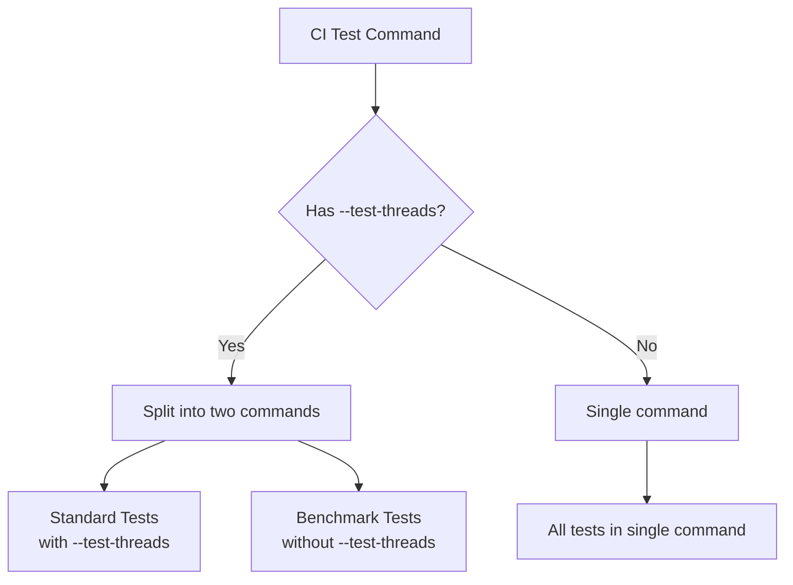

+++
title = "#20346 Side: Fix `ci` tool when running with `--test-threads`"
date = "2025-08-02T00:00:00"
draft = false
template = "pull_request_page.html"
in_search_index = true

[taxonomies]
list_display = ["show"]

[extra]
current_language = "en"
available_languages = {"en" = { name = "English", url = "/pull_request/bevy/2025-08/pr-20346-en-20250802" }, "zh-cn" = { name = "中文", url = "/pull_request/bevy/2025-08/pr-20346-zh-cn-20250802" }}
labels = ["A-Build-System", "C-Testing", "D-Straightforward"]
+++

# Analysis of PR #20346: Side: Fix `ci` tool when running with `--test-threads`

## Basic Information
- **Title**: Side: Fix `ci` tool when running with `--test-threads`
- **PR Link**: https://github.com/bevyengine/bevy/pull/20346
- **Author**: hukasu
- **Status**: MERGED
- **Labels**: A-Build-System, S-Ready-For-Final-Review, C-Testing, D-Straightforward
- **Created**: 2025-07-31T00:53:23Z
- **Merged**: 2025-08-02T18:13:17Z
- **Merged By**: mockersf

## Description Translation
The original description is in English and is preserved exactly as-is:

# Objective

`ci` tool fails if you run with `--test-threads` because `cargo test --benches` does not take `--test-threads`

## Solution

Split the command that call `cargo test` into one for `--benches` and other for `--lib --bins --tests`.

## Testing

Ran `cargo run -p ci -- --build-jobs 4 --test-threads 4`

## Note

This is a cherry-pick of a commit that was added to #19011 but was unrelated to the PR

## The Story of This Pull Request

The CI tool in Bevy's development workflow had a specific limitation when users tried to run tests with custom thread configurations. The `ci` tool accepts a `--test-threads` parameter to control parallelism during test execution, but this caused failures when benchmark tests were included in the test run. The root issue was that `cargo test --benches` doesn't accept the `--test-threads` argument, causing the entire test command to fail when this parameter was passed.

The original implementation used a single command to run all tests including benchmarks:
```rust
"cargo test --workspace --lib --bins --tests --benches ... -- {test_threads...}"
```
This approach worked for standard tests but failed when `--test-threads` was passed because the benchmark runner doesn't accept this parameter.

The solution involved splitting the test execution into two separate commands:
1. A command for standard tests (`--lib`, `--bins`, `--tests`) that accepts `--test-threads`
2. A separate command for benchmarks (`--benches`) that doesn't include the thread parameter

This separation required careful handling of the job arguments (`--jobs` for build parallelism). The implementation needed to ensure both commands could access the job configuration without causing ownership issues. The solution used references for the first command and moved the value for the second command, leveraging Rust's ownership system to safely share the configuration between both commands.

The fix maintains the original functionality while adding compatibility with the `--test-threads` parameter. Benchmarks continue to run with their default configuration, while standard tests benefit from the requested thread configuration. This change is particularly valuable for developers running CI locally with custom configurations, as it allows them to control test parallelism without encountering errors from the benchmark runner.

## Visual Representation



## Key Files Changed

### `tools/ci/src/commands/test.rs`

This file contains the test command implementation for Bevy's CI tool. The changes modify how test commands are constructed when `--test-threads` is present.

**Before:**
```rust
vec![PreparedCommand::new::<Self>(
    cmd!(
        sh,
        "cargo test --workspace --lib --bins --tests --benches {no_fail_fast...} {jobs...} -- {test_threads...}"
    ),
    "Please fix failing tests in output above.",
)]
```

**After:**
```rust
vec![
    PreparedCommand::new::<Self>(
        cmd!(
            sh,
            "cargo test --workspace --lib --bins --tests {no_fail_fast...} {jobs_ref...} -- {test_threads_ref...}"
        ),
        "Please fix failing tests in output above.",
    ),
    PreparedCommand::new::<Self>(
        cmd!(
            sh,
            "cargo test --workspace --benches {no_fail_fast...} {jobs...}"
        ),
        "Please fix failing tests in output above.",
    )
]
```

**Key changes:**
1. Split single command into two separate commands
2. First command handles standard tests and includes `--test-threads`
3. Second command handles benchmarks without thread parameter
4. Used references (`jobs_ref`, `test_threads_ref`) for first command
5. Used value (`jobs`) for second command to avoid ownership issues
6. Maintained error message consistency

## Further Reading
1. [Cargo test documentation](https://doc.rust-lang.org/cargo/commands/cargo-test.html) - Official documentation for cargo test parameters
2. [Rust Benchmark Tests](https://doc.rust-lang.org/unstable-book/library-features/test.html) - How benchmark tests work in Rust
3. [Bevy CI Documentation](https://github.com/bevyengine/bevy/blob/main/docs/ci.md) - Bevy's CI workflow and usage