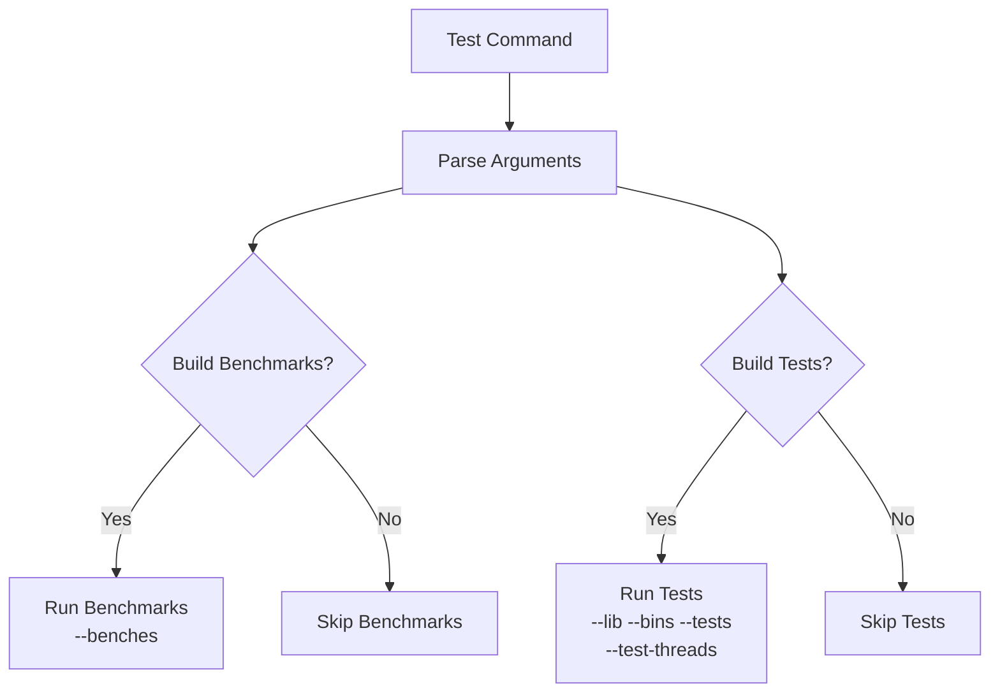

+++
title = "#20346 Side: Fix `ci` tool when running with `--test-threads`"
date = "2025-08-02T00:00:00"
draft = false
template = "pull_request_page.html"
in_search_index = false

[extra]
current_language = "zh-cn"
available_languages = {"en" = { name = "English", url = "/pull_request/bevy/2025-08/pr-20346-en-20250802" }, "zh-cn" = { name = "中文", url = "/pull_request/bevy/2025-08/pr-20346-zh-cn-20250802" }}
labels = ["A-Build-System", "C-Testing", "D-Straightforward"]
+++

# Side: Fix `ci` tool when running with `--test-threads`

## Basic Information
- **Title**: Side: Fix `ci` tool when running with `--test-threads`
- **PR Link**: https://github.com/bevyengine/bevy/pull/20346
- **Author**: hukasu
- **Status**: MERGED
- **Labels**: A-Build-System, S-Ready-For-Final-Review, C-Testing, D-Straightforward
- **Created**: 2025-07-31T00:53:23Z
- **Merged**: 2025-08-02T18:13:17Z
- **Merged By**: mockersf

## Description Translation
**目标**  
当使用 `--test-threads` 参数运行 `ci` 工具时会失败，因为 `cargo test --benches` 不接受 `--test-threads` 参数。

**解决方案**  
将调用 `cargo test` 的命令拆分为两个：一个用于 `--benches`，另一个用于 `--lib --bins --tests`。

**测试**  
运行了 `cargo run -p ci -- --build-jobs 4 --test-threads 4`

**注意**  
这是从 #19011 中提取的一个无关提交的 cherry-pick

## The Story of This Pull Request

### 问题与背景
在 Bevy 的 CI 工具链中，`test` 命令实现存在一个参数兼容性问题。当用户尝试使用 `--test-threads` 参数运行测试时（例如控制测试并发度），命令会失败。根本原因是 `cargo test --benches` 命令不支持 `--test-threads` 参数，而现有的实现将基准测试(benches)和普通测试(lib/bins/tests)合并到单个命令中执行：

```rust
"cargo test --workspace --lib --bins --tests --benches ... -- {test_threads...}"
```
这种实现导致当 `--test-threads` 参数被传递时，整个命令执行失败，因为 `--benches` 不接受该参数。

### 解决方案与实现
解决方案直接而有效：将单条测试命令拆分为两条独立的命令：
1. 普通测试命令（lib/bins/tests）保留 `--test-threads` 参数
2. 基准测试命令（benches）移除此参数

修改后的实现创建了两个 `PreparedCommand` 对象：
```rust
vec![
    PreparedCommand::new::<Self>(
        cmd!(
            sh,
            "cargo test --workspace --lib --bins --tests {no_fail_fast...} {jobs_ref...} -- {test_threads_ref...}"
        ),
        // ...
    ),
    PreparedCommand::new::<Self>(
        cmd!(
            sh,
            "cargo test --workspace --benches {no_fail_fast...} {jobs...}"
        ),
        // ...
    )
]
```
关键修改点：
1. 使用 `jobs_ref` 和 `test_threads_ref` 确保普通测试正确接收线程参数
2. 基准测试命令移除了 `-- {test_threads...}` 后缀
3. 原注释移动到基准测试命令上方，保持上下文关联

### 技术决策与影响
这个修复体现了几个重要的工程原则：
1. **参数兼容性处理**：识别不同子命令的参数约束差异
2. **关注点分离**：将不兼容的操作拆分为独立执行单元
3. **向后兼容**：保留所有原有参数行为（`no_fail_fast`, `jobs` 等）

影响：
- 用户现在可以自由使用 `--test-threads` 参数控制测试并发
- 基准测试验证保持独立执行，不受线程参数影响
- CI 工具链的可靠性提升，减少因参数冲突导致的失败

## Visual Representation



## Key Files Changed

### tools/ci/src/commands/test.rs (+20/-8)
**变更原因**：修复 `--test-threads` 参数与基准测试的兼容性问题  
**关键修改**：将单条测试命令拆分为两条独立命令

**变更前**：
```rust
vec![PreparedCommand::new::<Self>(
    cmd!(
        sh,
        "cargo test --workspace --lib --bins --tests --benches {no_fail_fast...} {jobs...} -- {test_threads...}"
    ),
    "Please fix failing tests in output above.",
)]
```

**变更后**：
```rust
vec![
    PreparedCommand::new::<Self>(
        cmd!(
            sh,
            "cargo test --workspace --lib --bins --tests {no_fail_fast...} {jobs_ref...} -- {test_threads_ref...}"
        ),
        // ...
    ),
    PreparedCommand::new::<Self>(
        cmd!(
            sh,
            "cargo test --workspace --benches {no_fail_fast...} {jobs...}"
        ),
        // ...
    )
]
```

**技术要点**：
1. 引入变量引用(`jobs_ref`, `test_threads_ref`)确保宏扩展正确
2. 基准测试命令移除线程参数后缀(`-- {test_threads...}`)
3. 保持错误消息和处理逻辑不变

## Further Reading
1. Cargo 测试文档: https://doc.rust-lang.org/cargo/commands/cargo-test.html
2. Rust 基准测试指南: https://doc.rust-lang.org/unstable-book/library-features/bench.html
3. Bevy CI 工具架构: https://github.com/bevyengine/bevy/tree/main/tools/ci

## Full Code Diff
```diff
diff --git a/tools/ci/src/commands/test.rs b/tools/ci/src/commands/test.rs
index a904e59c46c99..68fc9ba67c5dd 100644
--- a/tools/ci/src/commands/test.rs
+++ b/tools/ci/src/commands/test.rs
@@ -13,14 +13,26 @@ impl Prepare for TestCommand {
         let jobs = args.build_jobs();
         let test_threads = args.test_threads();
 
-        vec![PreparedCommand::new::<Self>(
-            cmd!(
-                sh,
-                // `--benches` runs each benchmark once in order to verify that they behave
-                // correctly and do not panic.
-                "cargo test --workspace --lib --bins --tests --benches {no_fail_fast...} {jobs...} -- {test_threads...}"
+        let jobs_ref = &jobs;
+        let test_threads_ref = &test_threads;
+
+        vec![
+            PreparedCommand::new::<Self>(
+                cmd!(
+                    sh,
+                    "cargo test --workspace --lib --bins --tests {no_fail_fast...} {jobs_ref...} -- {test_threads_ref...}"
+                ),
+                "Please fix failing tests in output above.",
             ),
-            "Please fix failing tests in output above.",
-        )]
+            PreparedCommand::new::<Self>(
+                cmd!(
+                    sh,
+                    // `--benches` runs each benchmark once in order to verify that they behave
+                    // correctly and do not panic.
+                    "cargo test --workspace --benches {no_fail_fast...} {jobs...}"
+                ),
+                "Please fix failing tests in output above.",
+            )
+        ]
     }
 }
```