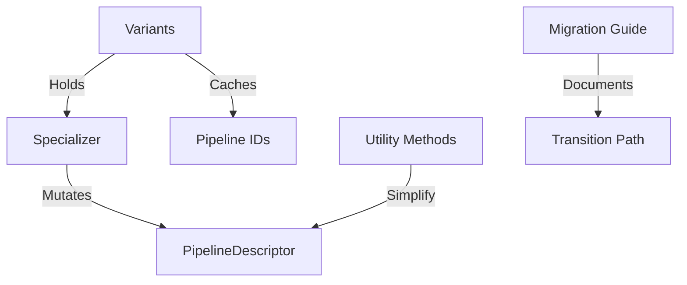

+++
title = "#20348 `spec_v2` style and patterns"
date = "2025-08-06T00:00:00"
draft = false
template = "pull_request_page.html"
in_search_index = true

[taxonomies]
list_display = ["show"]

[extra]
current_language = "en"
available_languages = {"en" = { name = "English", url = "/pull_request/bevy/2025-08/pr-20348-en-20250806" }, "zh-cn" = { name = "中文", url = "/pull_request/bevy/2025-08/pr-20348-zh-cn-20250806" }}
labels = ["A-Rendering", "C-Usability", "D-Modest"]
+++

# Analysis of PR #20348: `spec_v2` style and patterns

## Basic Information
- **Title**: `spec_v2` style and patterns
- **PR Link**: https://github.com/bevyengine/bevy/pull/20348
- **Author**: ecoskey
- **Status**: MERGED
- **Labels**: A-Rendering, C-Usability, S-Ready-For-Final-Review, D-Modest
- **Created**: 2025-07-31T06:49:31Z
- **Merged**: 2025-08-06T17:36:55Z
- **Merged By**: alice-i-cecile

## Description
- Adds some util methods to remove some boilerplate from specializers. More will probably be added later but `set_target` and `set_layout` will be the most used I think.
  - Note: Specializers can't rely on their input descriptor having a certain shape, so instead of just `push`ing to each vec, the methods pad the length of the vec if necessary and set the value directly.
- After migrating a few engine `Specializer`s, `GetBaseDescriptor` & `SpecializedCache: Resource` both seem like anti-patterns, especially with dynamic materials on the horizon
- Also removes `user_specializer`s. If anyone needs that functionality they can easily make a wrapper for it.

## Solution
- Add the things
- Nuke the stuff
- update the migration guide

## The Story of This Pull Request

### The Problem and Context
The existing pipeline specialization system in Bevy had several pain points that complicated specialization logic. Specializers often needed to modify specific indices in vectors within pipeline descriptors, but couldn't assume those vectors had sufficient length. This led to repetitive boilerplate code for bounds-checking and padding. Additionally, the `SpecializedCache` implementation was showing limitations: it required implementing `GetBaseDescriptor` and was automatically registered as a resource, which constrained how specializers could be composed and used. The `user_specializer` mechanism added unnecessary complexity when simpler composition patterns could achieve the same results.

### The Solution Approach
The solution focuses on two main improvements: adding utility methods to simplify common specialization patterns, and refactoring the specialization architecture to remove anti-patterns. For the utilities, new methods were added to directly modify pipeline descriptors at specific indices while handling padding automatically. For the architecture, `SpecializedCache` was replaced with `Variants`, which no longer requires `GetBaseDescriptor` or automatic resource registration. The `user_specializer` mechanism was removed entirely since its functionality can be achieved through simple wrapper patterns.

### The Implementation
The implementation introduces utility methods for pipeline descriptor modification:

```rust
// In RenderPipelineDescriptor
pub fn set_layout(&mut self, index: usize, layout: BindGroupLayout) {
    filling_set_at(&mut self.layout, index, empty_bind_group_layout(), layout);
}

// In FragmentState
pub fn set_target(&mut self, index: usize, target: ColorTargetState) {
    filling_set_at(&mut self.targets, index, None, Some(target));
}
```

These methods use a helper function that handles index validation and padding:

```rust
fn filling_set_at<T: Clone>(vec: &mut Vec<T>, index: usize, filler: T, value: T) {
    let num_to_fill = (index + 1).saturating_sub(vec.len());
    vec.extend(iter::repeat_n(filler, num_to_fill));
    vec[index] = value;
}
```

The architecture changes include replacing `SpecializedCache` with `Variants`:

```rust
pub struct Variants<T: Specializable, S: Specializer<T>> {
    specializer: S,
    base_descriptor: T::Descriptor,
    primary_cache: HashMap<S::Key, T::CachedId>,
    secondary_cache: HashMap<Canonical<S::Key>, T::CachedId>,
}
```

Key differences from the old `SpecializedCache`:
- No longer implements `Resource`
- Doesn't require `GetBaseDescriptor`
- Removes `user_specializer` functionality
- Simplified initialization through direct constructor

The macro system was updated to remove `#[base_descriptor]` attribute and related code generation:

```rust
// Before: FieldInfo contained use_base_descriptor flag
struct FieldInfo {
    ty: Type,
    member: Member,
    key: Key,
    use_base_descriptor: bool,  // Removed
}
```

### Technical Insights
The `filling_set_at` utility abstracts a common pattern where specializers need to modify elements at specific indices in variably-sized vectors. This eliminates repetitive bounds-checking code while ensuring descriptors maintain valid structures. The `empty_bind_group_layout()` singleton serves as a safe filler value for layout vectors.

The transition from `SpecializedCache` to `Variants` reflects a shift from resource-oriented to data-oriented design. By removing the automatic resource registration, specializers gain flexibility in how they're stored and composed. The elimination of `GetBaseDescriptor` simplifies the trait hierarchy and reduces implementation burden.

The migration guide was comprehensively updated to demonstrate how to transition existing code to the new patterns, including full before/after examples of pipeline specialization implementations.

### The Impact
These changes significantly reduce boilerplate in specializer implementations while making the specialization system more flexible and composable. The utility methods eliminate common error-prone vector index operations. The architectural changes remove unnecessary traits and constraints, paving the way for more dynamic material systems. The updated examples and migration guide ensure existing codebases can smoothly transition to the improved patterns.

## Visual Representation



## Key Files Changed

### `crates/bevy_render/src/render_resource/specializer.rs` (+8/-126)
Refactored the specialization cache system. Replaced `SpecializedCache` with `Variants` and removed `GetBaseDescriptor` trait.

```rust
// Before:
pub struct SpecializedCache<T: Specializable, S: Specializer<T>> {
    specializer: S,
    user_specializer: Option<SpecializerFn<T, S>>,
    ...
}

// After:
pub struct Variants<T: Specializable, S: Specializer<T>> {
    specializer: S,
    base_descriptor: T::Descriptor,
    ...
}
```

### `crates/bevy_render/macros/src/specializer.rs` (+13/-109)
Removed `#[base_descriptor]` attribute and related code generation.

```rust
// Before:
enum FieldInfo {
    ...
    use_base_descriptor: bool,
}

// After:
enum FieldInfo {
    ...
    // use_base_descriptor removed
}
```

### `release-content/migration-guides/composable_specialization.md` (+144/-71)
Completely updated migration guide with detailed before/after examples.

```markdown
// Before section showing old SpecializedRenderPipeline
impl SpecializedRenderPipeline for MySpecializer {
    type Key = MyKey;
    fn specialize(&self, key: Self::Key) -> RenderPipelineDescriptor {
        ...
    }
}

// After section showing new Variants approach
impl Specializer<RenderPipeline> for MySpecializer {
    type Key = MyKey;
    fn specialize(
        &self,
        key: Self::Key,
        descriptor: &mut RenderPipelineDescriptor,
    ) -> Result<Canonical<Self::Key>, BevyError> {
        ...
    }
}
```

### `examples/shader_advanced/custom_phase_item.rs` (+42/-42)
Updated example to use new `Variants` pattern.

```rust
// Before:
init_resource::<SpecializedCache<RenderPipeline, CustomPhaseSpecializer>>()

// After:
#[derive(Resource)]
struct CustomPhasePipeline {
    variants: Variants<RenderPipeline, CustomPhaseSpecializer>,
}
```

### `crates/bevy_render/src/render_resource/pipeline.rs` (+31/-1)
Added utility methods for pipeline descriptor modification.

```rust
// New methods:
impl RenderPipelineDescriptor {
    pub fn set_layout(&mut self, index: usize, layout: BindGroupLayout) { ... }
}

impl FragmentState {
    pub fn set_target(&mut self, index: usize, target: ColorTargetState) { ... }
}
```

## Further Reading
1. [Bevy Render Pipeline Documentation](https://docs.rs/bevy_render/latest/bevy_render/render_resource/index.html)
2. [WGSL Shader Language Specification](https://gpuweb.github.io/gpuweb/wgsl/)
3. [Data-Oriented Design Resources](https://github.com/dbartolini/data-oriented-design)
4. [Composition Over Inheritance Patterns](https://en.wikipedia.org/wiki/Composition_over_inheritance)