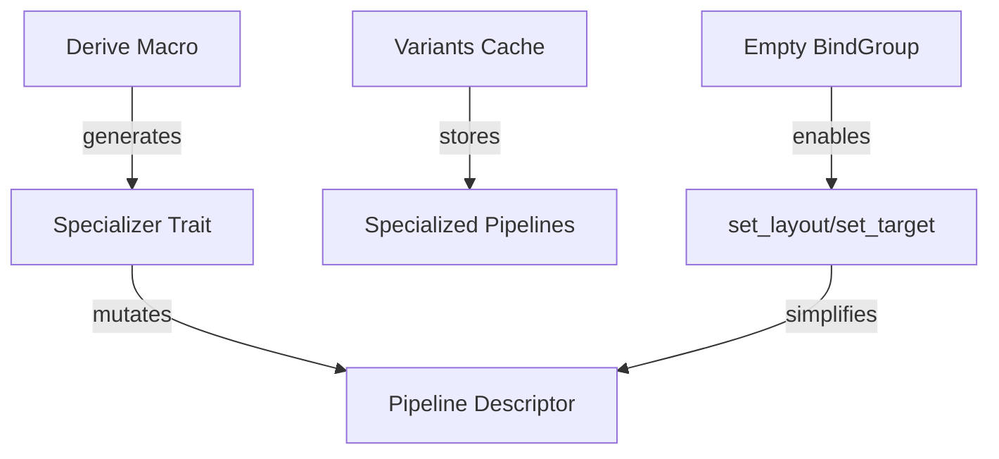

+++
title = "#20348 `spec_v2` style and patterns"
date = "2025-08-06T00:00:00"
draft = false
template = "pull_request_page.html"
in_search_index = false

[extra]
current_language = "zh-cn"
available_languages = {"en" = { name = "English", url = "/pull_request/bevy/2025-08/pr-20348-en-20250806" }, "zh-cn" = { name = "中文", url = "/pull_request/bevy/2025-08/pr-20348-zh-cn-20250806" }}
labels = ["A-Rendering", "C-Usability", "D-Modest"]
+++

# `spec_v2` 风格与模式技术分析报告

## Basic Information
- **Title**: `spec_v2` style and patterns
- **PR Link**: https://github.com/bevyengine/bevy/pull/20348
- **Author**: ecoskey
- **Status**: MERGED
- **Labels**: A-Rendering, C-Usability, S-Ready-For-Final-Review, D-Modest
- **Created**: 2025-07-31T06:49:31Z
- **Merged**: 2025-08-06T17:36:55Z
- **Merged By**: alice-i-cecile

## Description Translation
### 目标
- 添加工具方法减少特殊化器(specializer)的样板代码，预计 `set_target` 和 `set_layout` 将成为最常用的方法。注意：特殊化器不能依赖输入描述符的特定结构，因此这些方法在必要时填充向量长度并直接设置值，而不是简单地向每个向量 `push`。
- 迁移多个引擎 `Specializer` 后，发现 `GetBaseDescriptor` 和 `SpecializedCache: Resource` 都是反模式，特别是在动态材质(dynamic materials)即将到来的背景下。
- 移除 `user_specializer` 功能，需要此功能的用户可轻松创建包装器。

### 解决方案
- 添加新功能
- 移除旧实现
- 更新迁移指南

## The Story of This Pull Request

### 问题背景
Bevy 渲染系统的特殊化(specialization)机制允许根据运行时条件动态调整渲染管线。原有实现存在几个痛点：
1. **特殊化器样板代码过多**：开发者需要手动处理描述符(descriptor)向量填充逻辑，特别是在修改特定索引的布局或渲染目标时
2. **反模式设计**：
   - `GetBaseDescriptor` trait 强制要求特殊化器提供基础描述符，限制了组合灵活性
   - `SpecializedCache` 作为 Resource 的设计不符合所有使用场景
   - `user_specializer` 增加了不必要的复杂性
3. **组合性不足**：现有机制难以优雅组合多个特殊化器，影响代码复用

### 解决方案
PR 采用分阶段方法重构特殊化系统：
1. **添加实用方法**：引入 `set_target` 和 `set_layout` 简化描述符修改
2. **移除反模式**：删除 `GetBaseDescriptor` trait 和 `user_specializer` 功能
3. **重构缓存机制**：将 `SpecializedCache` 重命名为 `Variants` 并移除其 Resource 特性
4. **更新派生宏**：简化 `derive(Specializer)` 宏实现

### 实现细节
核心修改集中在五个关键领域：

**1. 描述符操作方法**
在 `RenderPipelineDescriptor` 和 `FragmentState` 添加安全访问方法：
```rust
// crates/bevy_render/src/render_resource/pipeline.rs
impl RenderPipelineDescriptor {
    pub fn fragment_mut(&mut self) -> Result<&mut FragmentState, NoFragmentStateError> {
        self.fragment.as_mut().ok_or(NoFragmentStateError)
    }

    pub fn set_layout(&mut self, index: usize, layout: BindGroupLayout) {
        filling_set_at(&mut self.layout, index, empty_bind_group_layout(), layout);
    }
}

impl FragmentState {
    pub fn set_target(&mut self, index: usize, target: ColorTargetState) {
        filling_set_at(&mut self.targets, index, None, Some(target));
    }
}
```
`filling_set_at` 辅助函数确保安全索引访问：
```rust
fn filling_set_at<T: Clone>(vec: &mut Vec<T>, index: usize, filler: T, value: T) {
    let num_to_fill = (index + 1).saturating_sub(vec.len());
    vec.extend(iter::repeat_n(filler, num_to_fill));
    vec[index] = value;
}
```

**2. 空绑定组布局**
引入全局空布局单例解决 `set_layout` 的填充需求：
```rust
// crates/bevy_render/src/render_resource/bind_group_layout.rs
static EMPTY_BIND_GROUP_LAYOUT: OnceLock<BindGroupLayout> = OnceLock::new();

pub(crate) fn init_empty_bind_group_layout(render_device: Res<RenderDevice>) {
    let layout = render_device.create_bind_group_layout(Some("empty_bind_group_layout"), &[]);
    EMPTY_BIND_GROUP_LAYOUT.set(layout).expect(...);
}

pub fn empty_bind_group_layout() -> BindGroupLayout {
    EMPTY_BIND_GROUP_LAYOUT.get().expect(...).clone()
}
```

**3. 缓存机制重构**
将 `SpecializedCache` 替换为更通用的 `Variants`：
```rust
// crates/bevy_render/src/render_resource/specializer.rs
pub struct Variants<T: Specializable, S: Specializer<T>> {
    specializer: S,
    base_descriptor: T::Descriptor,
    primary_cache: HashMap<S::Key, T::CachedId>,
    secondary_cache: HashMap<Canonical<S::Key>, T::CachedId>,
}

impl<T: Specializable, S: Specializer<T>> Variants<T, S> {
    pub fn new(specializer: S, base_descriptor: T::Descriptor) -> Self {
        Self { specializer, base_descriptor, ... }
    }
    
    pub fn specialize(...) -> Result<T::CachedId, BevyError> {
        // 两级缓存实现保持不变
    }
}
```

**4. 派生宏简化**
移除 `#[base_descriptor]` 属性和相关代码生成：
```rust
// crates/bevy_render/macros/src/specializer.rs
struct FieldInfo {
    ty: Type,
    member: Member,
    key: Key,
    // 移除 use_base_descriptor 字段
}

// 删除所有 GetBaseDescriptor 相关实现生成
```

**5. 示例更新**
更新 custom_phase_item 示例展示新模式：
```rust
// examples/shader_advanced/custom_phase_item.rs
#[derive(Resource)]
struct CustomPhasePipeline {
    variants: Variants<RenderPipeline, CustomPhaseSpecializer>,
}

// 初始化时创建 Variants
impl FromWorld for CustomPhasePipeline {
    fn from_world(world: &mut World) -> Self {
        let base_descriptor = RenderPipelineDescriptor { ... };
        let variants = Variants::new(CustomPhaseSpecializer, base_descriptor);
        Self { variants }
    }
}

// 使用简化后的特殊化器
impl Specializer<RenderPipeline> for CustomPhaseSpecializer {
    fn specialize(...) -> Result<Canonical<Self::Key>, BevyError> {
        descriptor.multisample.count = key.0.samples();
        Ok(key)
    }
}
```

### 技术洞察
1. **描述符操作安全**：新方法通过自动填充确保索引访问安全，避免手动处理向量边界检查
2. **组合性提升**：移除 `GetBaseDescriptor` 后，特殊化器不再需要提供基础描述符，可通过参数传入
3. **资源解耦**：`Variants` 不再自动实现 `FromWorld`，允许更灵活的使用方式（资源/组件）
4. **派生宏简化**：宏实现减少约 100 行代码，更易维护

### 影响
1. **减少样板代码**：`set_target` 和 `set_layout` 消除常见模式的手动实现
2. **移除技术债务**：删除约 200 行不再需要的代码
3. **迁移指南**：提供详细的迁移路径（+144/-71）
4. **性能保持**：缓存机制保持原有的两级设计，性能特征不变

## Visual Representation



## Key Files Changed

### 1. `crates/bevy_render/src/render_resource/specializer.rs` (+8/-126)
**变更原因**：重构特殊化核心逻辑，移除反模式  
关键修改：
```rust
// 移除 GetBaseDescriptor trait
-pub trait GetBaseDescriptor<T: Specializable>: Specializer<T> {...}

// 重命名 SpecializedCache 为 Variants
-pub struct SpecializedCache<T: Specializable, S: Specializer<T>>{...}
+pub struct Variants<T: Specializable, S: Specializer<T>>{...}

// 移除 Resource 实现和相关 trait bound
-impl<T, S> FromWorld for SpecializedCache<T, S> {...}
```

### 2. `crates/bevy_render/macros/src/specializer.rs` (+13/-109)
**变更原因**：简化派生宏，移除 base_descriptor 支持  
关键修改：
```rust
// 字段信息移除 base_descriptor 相关属性
struct FieldInfo {
    ty: Type,
    member: Member,
    key: Key,
-   use_base_descriptor: bool,
}

// 移除 GetBaseDescriptor 实现生成
-fn impl_get_base_descriptor_specific(...) {...}
-fn impl_get_base_descriptor_all(...) {...}
```

### 3. `examples/shader_advanced/custom_phase_item.rs` (+42/-42)
**变更原因**：更新示例展示新范式  
关键修改：
```rust
// 替换 SpecializedCache 为 Variants
- specializer: ResMut<SpecializedCache<RenderPipeline, CustomPhaseSpecializer>>,
+ mut pipeline: ResMut<CustomPhasePipeline>,

// 新的资源包装模式
#[derive(Resource)]
struct CustomPhasePipeline {
    variants: Variants<RenderPipeline, CustomPhaseSpecializer>,
}
```

### 4. `crates/bevy_render/src/render_resource/pipeline.rs` (+31/-1)
**变更原因**：添加描述符操作方法  
关键修改：
```rust
impl RenderPipelineDescriptor {
+    pub fn set_layout(&mut self, index: usize, layout: BindGroupLayout) {
+        filling_set_at(&mut self.layout, index, empty_bind_group_layout(), layout);
+    }
}

impl FragmentState {
+    pub fn set_target(&mut self, index: usize, target: ColorTargetState) {
+        filling_set_at(&mut self.targets, index, None, Some(target));
+    }
}
```

### 5. `release-content/migration-guides/composable_specialization.md` (+144/-71)
**变更原因**：提供从旧系统迁移的详细指南  
关键内容：
```markdown
// 展示新旧范式对比
## Before:
impl SpecializedRenderPipeline for MyPipeline {
    fn specialize(&self, key: Self::Key) -> RenderPipelineDescriptor {...}
}

## After:
impl Specializer<RenderPipeline> for MySpecializer {
    fn specialize(...) -> Result<Canonical<Self::Key>, BevyError> {
        descriptor.set_layout(0, layout);
        Ok(key)
    }
}
```

## Further Reading
1. [Bevy 渲染管线架构](https://bevyengine.org/learn/book/rendering/pipelines)
2. [WGSL 着色器语言规范](https://www.w3.org/TR/WGSL/)
3. [Rust 派生宏指南](https://doc.rust-lang.org/reference/procedural-macros.html#derive-macros)
4. [ECS 模式在渲染系统的应用](https://bevyengine.org/learn/book/ecs-in-practice/)