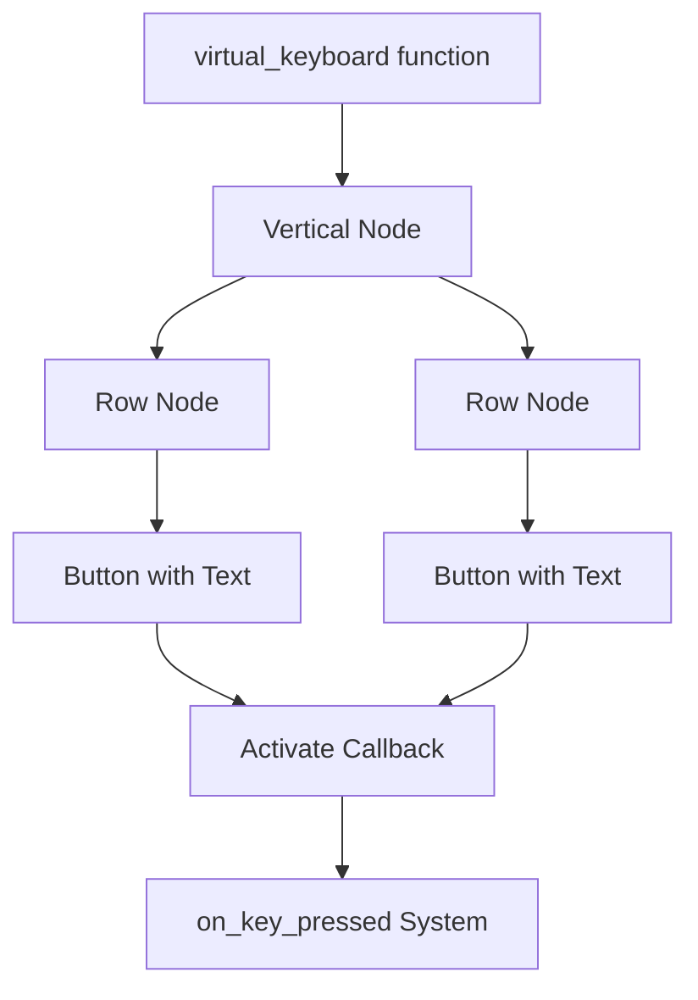

+++
title = "#20350 Virtual keyboard widget"
date = "2025-08-05T00:00:00"
draft = false
template = "pull_request_page.html"
in_search_index = true

[taxonomies]
list_display = ["show"]

[extra]
current_language = "en"
available_languages = {"en" = { name = "English", url = "/pull_request/bevy/2025-08/pr-20350-en-20250805" }, "zh-cn" = { name = "中文", url = "/pull_request/bevy/2025-08/pr-20350-zh-cn-20250805" }}
labels = ["C-Feature", "C-Examples", "A-Input", "A-UI", "D-Modest"]
+++

### Virtual Keyboard Widget Implementation

## Basic Information
- **Title**: Virtual keyboard widget
- **PR Link**: https://github.com/bevyengine/bevy/pull/20350
- **Author**: ickshonpe
- **Status**: MERGED
- **Labels**: C-Feature, C-Examples, A-Input, A-UI, S-Ready-For-Final-Review, M-Needs-Release-Note, D-Modest
- **Created**: 2025-07-31T12:08:33Z
- **Merged**: 2025-08-05T19:59:04Z
- **Merged By**: alice-i-cecile

## Description Translation
# Objective

Minimal virtual keyboard widget implementation.

## Solution

Added a `virtual_keyboard` module to `bevy_feathers::controls` with a single function also called `virtual_keyboard`.
`virtual_keyboard` takes a list of rows of keys and a system ID for the key press handler and returns a bundle of buttons representing the keys arranged into rows.

Lot of limitations:
* No modifier keys.
* No styling for individual keyboard buttons.
* The keyboard buttons can only display text, no image support. 
* The keys don't repeat when held.
* Doesn't have any navigation support for use with a controller.
* Doesn't support tall keys that span multiple rows.

#

I deliberately didn't spend even a moment thinking about the design, this is just meant to be a super basic implementation that I can hook up to the text input widget for testing. Still looks quite neat, even so.

## Testing

```
cargo run --example virtual_keyboard --features="experimental_bevy_feathers"
```

---

## Showcase


## The Story of This Pull Request

#### The Problem and Context
Bevy's UI system lacked a built-in virtual keyboard component, which is essential for applications requiring touch-based text input. Without this, developers would need to implement their own solution from scratch for scenarios like kiosks, mobile interfaces, or gamepad-based text entry. The author needed a minimal implementation specifically for testing text input widgets, with the explicit understanding that this would be a foundational component rather than a fully-featured solution.

#### The Solution Approach
The approach centered on creating a flexible, data-driven keyboard generator that accepts:
1. A list of key rows where each row contains (label, component) pairs
2. A callback system ID for handling key presses

The implementation leverages existing Bevy UI components and Feathers controls, particularly reusing the button widget for individual keys. The keyboard is constructed as a vertical flex container (`FlexDirection::Column`) containing horizontal rows (`FlexDirection::Row`), with each key being a standard button component. This composition approach avoids reinventing basic UI layout mechanics.

#### The Implementation
The core implementation resides in the `virtual_keyboard` function which returns a UI bundle. The function iterates through the provided key rows, spawning a horizontal container for each row. Within each row, it spawns button components for every key:

```rust
pub fn virtual_keyboard<T>(
    keys: impl Iterator<Item = Vec<(String, T)>> + Send + Sync + 'static,
    on_key_press: SystemId<In<Activate>>,
) -> impl Bundle
{
    // ... 
    Children::spawn((SpawnWith(move |parent: &mut RelatedSpawner<ChildOf>| {
        for row in keys {
            parent.spawn((
                Node {
                    flex_direction: FlexDirection::Row,
                    column_gap: Val::Px(4.),
                    // ...
                },
                Children::spawn(SpawnWith(move |parent: &mut RelatedSpawner<ChildOf>| {
                    for (label, key_id) in row.into_iter() {
                        parent.spawn(button(
                            ButtonProps {
                                on_click: Callback::System(on_key_press),
                                // ...
                            },
                            (key_id,),
                            Spawn(Text::new(label)),
                        ));
                    }
                })),
            ));
        }
    }),)),
```

Key technical aspects:
- Uses Bevy's ECS relationship system (`ChildOf`, `RelatedSpawner`) for hierarchical UI construction
- Implements tab navigation support via `TabGroup` component
- Passes key identifiers as components attached to each button
- Uses `Callback::System` to connect button presses to the handler system

#### Technical Insights
The implementation demonstrates several practical Bevy UI patterns:
1. **Component-based key identification**: Each key carries a custom component (`VirtualKey` in the example) containing its label
2. **System callbacks**: Uses `SystemId` for efficient event handling without closures
3. **UI composition**: Builds complex widgets from simpler existing components (buttons within flex containers)
4. **Tab navigation**: Integrates with Bevy's `TabNavigationPlugin` for keyboard navigation

Notable limitations acknowledged by the author:
- No support for key repeat behavior
- No modifier key handling (Shift/Ctrl/Alt)
- Limited to text labels without icons
- No controller navigation support

#### The Impact
This PR adds a foundational virtual keyboard widget to Bevy's Feathers UI toolkit. The immediate impact includes:
1. Enabling text input for touch-based applications
2. Providing a reference implementation for custom keyboard layouts
3. Demonstrating practical composition of Bevy UI components
4. Adding a new example (`virtual_keyboard.rs`) showcasing the implementation

The implementation's simplicity makes it easily extendable for more complex use cases while providing immediate utility for basic text input scenarios. The explicit limitations document the component's current scope and provide clear guidance for future enhancements.

## Visual Representation



## Key Files Changed

### `crates/bevy_feathers/src/controls/virtual_keyboard.rs` (+56/-0)
Added the core implementation of the virtual keyboard widget.

```rust
pub fn virtual_keyboard<T>(
    keys: impl Iterator<Item = Vec<(String, T)>> + Send + Sync + 'static,
    on_key_press: SystemId<In<Activate>>,
) -> impl Bundle
{
    // Implementation as shown above
}
```

### `examples/ui/virtual_keyboard.rs` (+95/-0)
Added a demonstration of the virtual keyboard in use.

```rust
fn setup(mut commands: Commands) {
    let callback = commands.register_system(on_virtual_key_pressed);
    let layout = [ ... ]; // Keyboard layout definition
    
    commands
        .spawn(Node { ... })
        .with_children(|parent| {
            parent.spawn((
                virtual_keyboard(
                    keys_iter, 
                    callback
                )
            ));
        });
}
```

### `crates/bevy_feathers/src/controls/mod.rs` (+2/-0)
Exported the new virtual keyboard module.

```rust
pub use virtual_keyboard::virtual_keyboard;
```

### `Cargo.toml` (+12/-0)
Added the new example to the project manifest.

```toml
[[example]]
name = "virtual_keyboard"
path = "examples/ui/virtual_keyboard.rs"
required-features = ["experimental_bevy_feathers"]
```

### `release-content/release-notes/feathers.md` (+3/-2)
Updated release notes to include the new feature.

```markdown
-authors: ["@viridia", "@Atlas16A"]
-pull_requests: [19730, 19900, 19928, 20237, 20169]
+authors: ["@viridia", "@Atlas16A", "@ickshonpe"]
+pull_requests: [19730, 19900, 19928, 20237, 20169, 20350]
```

## Further Reading
1. [Bevy UI Documentation](https://bevyengine.org/learn/book/getting-started/ui/)
2. [Feathers UI Component System](https://github.com/bevyengine/bevy/tree/main/crates/bevy_feathers)
3. [Bevy Input Handling](https://bevyengine.org/learn/book/getting-started/input/)
4. [Bevy ECS Relationships](https://bevyengine.org/learn/book/ecs/relationships/)