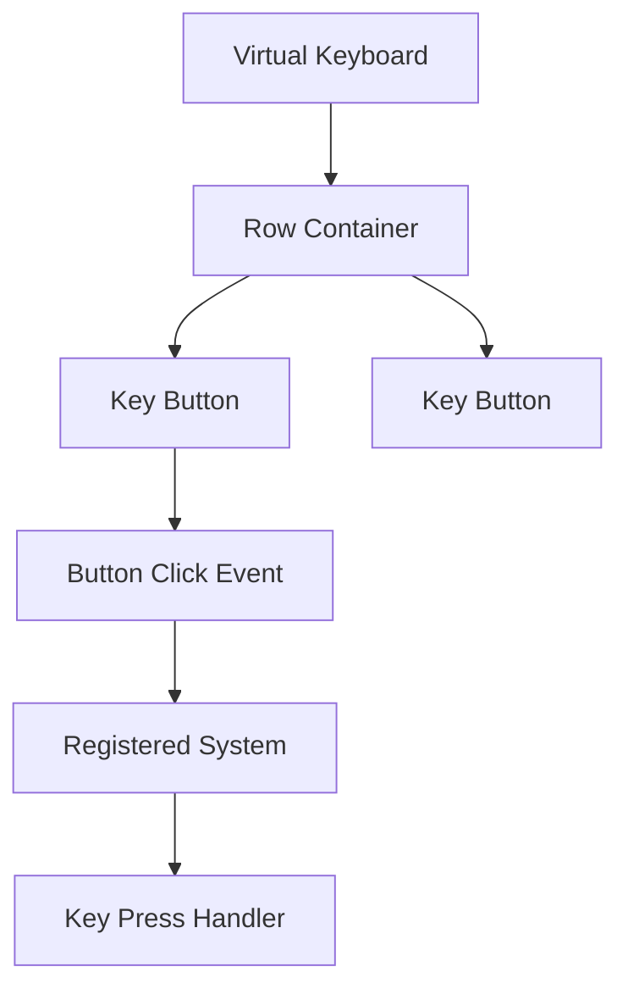

+++
title = "#20350 Virtual keyboard widget"
date = "2025-08-05T00:00:00"
draft = false
template = "pull_request_page.html"
in_search_index = false

[extra]
current_language = "zh-cn"
available_languages = {"en" = { name = "English", url = "/pull_request/bevy/2025-08/pr-20350-en-20250805" }, "zh-cn" = { name = "中文", url = "/pull_request/bevy/2025-08/pr-20350-zh-cn-20250805" }}
+++

# 虚拟键盘控件实现分析报告

## 基本信息
- **标题**: Virtual keyboard widget
- **PR链接**: https://github.com/bevyengine/bevy/pull/20350
- **作者**: ickshonpe
- **状态**: 已合并
- **标签**: C-Feature, C-Examples, A-Input, A-UI, S-Ready-For-Final-Review, M-Needs-Release-Note, D-Modest
- **创建时间**: 2025-07-31T12:08:33Z
- **合并时间**: 2025-08-05T19:59:04Z
- **合并人**: alice-i-cecile

## 描述翻译
### 目标

最小化的虚拟键盘控件实现。

### 解决方案

在`bevy_feathers::controls`中添加了一个`virtual_keyboard`模块，其中包含一个同名的`virtual_keyboard`函数。该函数接收按键行列表和按键处理器的系统ID，返回一个由按键按钮组成的bundle，这些按键按行排列。

存在诸多限制：
* 不支持修饰键
* 不支持单个键盘按钮的样式定制
* 键盘按钮只能显示文本，不支持图片
* 按键长按时不会重复触发
* 不支持使用控制器进行导航
* 不支持跨越多行的长按键

#

我特意没有花任何时间考虑设计，这只是一个非常基础的实现，用于连接文本输入控件进行测试。尽管如此，看起来仍然相当整洁。

### 测试

```
cargo run --example virtual_keyboard --features="experimental_bevy_feathers"
```

---

### 展示


## 本PR的技术实现历程

### 问题背景与需求
在UI开发中，文本输入是常见需求，尤其是在触屏设备上。Bevy的UI系统（Feathers）需要提供虚拟键盘支持，但当时缺少现成实现。作者需要快速构建一个基础版本，主要目标是连接文本输入控件进行功能测试，而不是完整的生产级解决方案。

### 解决方案选择
作者采取了最小化实现策略：
1. 在现有`bevy_feathers`控件系统中添加新组件
2. 复用现有的按钮控件构建键盘按键
3. 使用Flex布局实现行列结构
4. 通过系统回调处理按键事件

这种方法避免了过度工程化，快速交付核心功能，同时明确了当前实现的局限性（如不支持修饰键、按键样式定制等）。

### 具体实现
核心是`virtual_keyboard`函数，它接收按键布局描述和事件处理系统ID：

```rust
pub fn virtual_keyboard<T>(
    keys: impl Iterator<Item = Vec<(String, T)>> + Send + Sync + 'static,
    on_key_press: SystemId<In<Activate>>,
) -> impl Bundle
{
    // 垂直布局容器
    Node {
        flex_direction: FlexDirection::Column,
        row_gap: Val::Px(4.),
        ..Default::default()
    },
    // 遍历行数据
    Children::spawn((SpawnWith(move |parent: &mut RelatedSpawner<ChildOf>| {
        for row in keys {
            // 创建行容器
            parent.spawn((
                Node {
                    flex_direction: FlexDirection::Row,
                    column_gap: Val::Px(4.),
                    ..Default::default()
                },
                // 创建行内按键
                Children::spawn(SpawnWith(move |parent: &mut RelatedSpawner<ChildOf>| {
                    for (label, key_id) in row.into_iter() {
                        // 复用按钮控件
                        parent.spawn(button(
                            ButtonProps {
                                on_click: Callback::System(on_key_press),
                                ..Default::default()
                            },
                            (key_id,),
                            Spawn(Text::new(label)),
                        ));
                    }
                })),
            ));
        }
    }),)),
)
```

关键实现点：
1. **布局结构**：使用嵌套的Flex容器（Column+Row）实现键盘行列
2. **按键生成**：复用现有的`button`控件，避免重复造轮子
3. **事件处理**：通过`Callback::System`绑定到外部定义的处理系统
4. **间距控制**：使用`row_gap`和`column_gap`控制按键间距

### 示例应用
新增的示例展示如何使用虚拟键盘：

```rust
// 定义键盘布局
let layout = [
    vec!["1", "2", "3", "4", "5", "6", "7", "8", "9", "0", ".", ","],
    vec!["Q", "W", "E", "R", "T", "Y", "U", "I", "O", "P"],
    // ...其他行
];

// 转换布局数据
let keys_iter = layout.into_iter().map(|row| {
    row.into_iter()
        .map(|label| {
            (label.to_string(), VirtualKey(label.to_string()))
        })
        .collect()
});

// 注册按键处理系统
let callback = commands.register_system(on_virtual_key_pressed);

// 创建键盘
parent.spawn(virtual_keyboard(keys_iter, callback));
```

按键处理系统实现：

```rust
fn on_virtual_key_pressed(
    In(Activate(virtual_key_entity)): In<Activate>,
    virtual_key_query: Query<&VirtualKey>,
) {
    if let Ok(VirtualKey(label)) = virtual_key_query.get(virtual_key_entity) {
        println!("key pressed: {label}");
    }
}
```

### 技术权衡与局限
作者明确指出了当前实现的限制：
- **功能限制**：不支持修饰键、按键样式定制、图片按键等
- **交互限制**：长按不重复、无控制器导航支持
- **布局限制**：不支持跨行按键

这些是经过考量的设计选择，符合"最小可行实现"的目标。后续可基于此基础扩展功能。

### 影响与价值
1. **填补功能空白**：为Bevy Feathers提供了基础的虚拟键盘支持
2. **实用示例**：展示了如何组合现有控件构建新组件
3. **事件处理范例**：演示了系统回调在UI交互中的应用
4. **扩展基础**：为未来更完善的键盘实现奠定了基础

## 组件关系图


## 关键文件变更

### `crates/bevy_feathers/src/controls/virtual_keyboard.rs` (+56)
**变更描述**：新增虚拟键盘实现  
**核心代码**：
```rust
pub fn virtual_keyboard<T>(
    keys: impl Iterator<Item = Vec<(String, T)>> + Send + Sync + 'static,
    on_key_press: SystemId<In<Activate>>,
) -> impl Bundle
{
    // 垂直布局容器
    // 遍历行数据生成行容器
    // 每行内生成按键按钮
    // 绑定点击事件到指定系统
}
```

### `examples/ui/virtual_keyboard.rs` (+95)
**变更描述**：新增虚拟键盘使用示例  
**核心代码**：
```rust
// 定义键盘布局
let layout = [ ... ];

// 注册按键处理系统
let callback = commands.register_system(on_virtual_key_pressed);

// 创建UI结构
commands.spawn(Node { ... })
    .with_children(|parent| {
        parent.spawn((
            // 键盘面板
            virtual_keyboard(keys_iter, callback)
        ));
    });
```

### `crates/bevy_feathers/src/controls/mod.rs` (+2)
**变更描述**：导出新模块  
**变更代码**：
```rust
// 新增模块导出
pub use virtual_keyboard::virtual_keyboard;
```

### `Cargo.toml` (+12)
**变更描述**：注册新示例  
**变更代码**：
```toml
[[example]]
name = "virtual_keyboard"
path = "examples/ui/virtual_keyboard.rs"
required-features = ["experimental_bevy_feathers"]
```

### `release-content/release-notes/feathers.md` (+3/-2)
**变更描述**：更新发布说明  
**变更代码**：
```markdown
authors: ["@viridia", "@Atlas16A", "@ickshonpe"]
pull_requests: [..., 20350]

- A virtual keyboard suitable for touchscreen text input
```

## 扩展阅读
1. [Bevy UI系统文档](https://docs.rs/bevy_ui/latest/bevy_ui/)
2. [Flex布局教程](https://css-tricks.com/snippets/css/a-guide-to-flexbox/)
3. [Bevy ECS系统使用指南](https://bevy-cheatbook.github.io/programming/systems.html)
4. [UI事件处理最佳实践](https://github.com/bevyengine/bevy/discussions/3972)