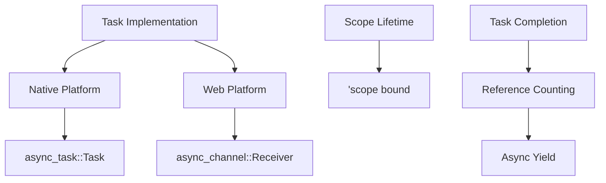

+++
title = "#20352 Fix UB, panic and compiler error in `bevy_tasks`"
date = "2025-08-10T00:00:00"
draft = false
template = "pull_request_page.html"
in_search_index = true

[taxonomies]
list_display = ["show"]

[extra]
current_language = "en"
available_languages = {"en" = { name = "English", url = "/pull_request/bevy/2025-08/pr-20352-en-20250810" }, "zh-cn" = { name = "中文", url = "/pull_request/bevy/2025-08/pr-20352-zh-cn-20250810" }}
labels = ["P-Crash", "A-Tasks", "D-Complex", "P-Unsound", "D-Unsafe", "D-Async"]
+++

## Technical Analysis of PR #20352: Fix UB, panic and compiler error in `bevy_tasks`

### Basic Information
- **Title**: Fix UB, panic and compiler error in `bevy_tasks`
- **PR Link**: https://github.com/bevyengine/bevy/pull/20352
- **Author**: NthTensor
- **Status**: MERGED
- **Labels**: P-Crash, S-Ready-For-Final-Review, A-Tasks, D-Complex, P-Compile-Failure, P-Unsound, D-Unsafe, D-Async
- **Created**: 2025-07-31T15:47:05Z
- **Merged**: 2025-08-10T06:50:27Z
- **Merged By**: james7132

## Description Translation
The original PR description in English is preserved as requested:

# Objective

Fixes several issues with `bevy_tasks` uncovered by @IceSentry and @Ratysz:
+ For web builds, `Task::is_finished` is missing, causing compile failures for cross-platform apps.
+ Scopes running on the single-threaded executor have possible UB due to mistakenly using a `'env` bound instead of a `'scope` lifetime bound on the scope ref.
+ Scopes running on the single-threaded executor fail to poll tasks spawned on them to completion when all tasks go to sleep at the same time (causing panics and potential UB).

## Solution

- Replace `futures_channel::oneshot` with `async_channel::bounded(1)`, and use `Receiver::is_empty` to implement `Task::finished`. The `async_channel` channel crate was chosen because it allows `Task` to be `Send + Sync + Unpin` and because it has a special-case oneshot implementation for bounded size-one channels (inherited from `concurrent-queue`). 
- Switch around the incorrect lifetime bounds.
- Use referencing counting to spin while ticking the executor until all tasks spawned on a scope are complete.

Since these are all fairly small changes I rolled them together into a single PR. I can split any of the three out if they prove controversial. 

## Testing

- Changes are currently untested. I need to check that this fixes the bugs we've been seeing at work, and I'd like to run this through miri.

It's concerning to me that miri failed to catch the bad lifetime bound on the scope impl.

## The Story of This Pull Request

### 1. The Problem and Context
The `bevy_tasks` crate faced three critical issues affecting stability and cross-platform compatibility:

**First issue:** Web builds failed to compile because `Task::is_finished` was missing. This method is essential for determining task completion status in cross-platform applications. Without it, web targets couldn't compile when using this API.

**Second issue:** Scopes running on the single-threaded executor had undefined behavior (UB) due to incorrect lifetime bounds. The original implementation mistakenly used a `'env` bound instead of the required `'scope` lifetime, potentially leading to use-after-free errors:

```rust
// Original incorrect signature:
F: for<'scope> FnOnce(&'env mut Scope<'scope, 'env, T>)
```

**Third issue:** When all tasks in a scope went to sleep simultaneously, the executor would fail to poll them to completion. This caused panics and potential UB because tasks were dropped prematurely without completing their work.

### 2. The Solution Approach
The author addressed each issue with targeted solutions:

1. **Web task implementation:** Replaced `futures_channel::oneshot` with `async_channel::bounded(1)` because:
   - Provides `Send + Sync + Unpin` guarantees for `Task`
   - Implements efficient size-one channels via `concurrent-queue`
   - Enables `is_finished` via `Receiver::is_empty()`

2. **Lifetime correction:** Fixed the scope signature by replacing `'env` with `'scope` to ensure proper lifetime propagation.

3. **Scope completion:** Implemented reference counting for pending tasks instead of relying on busy-waiting. The new approach uses `futures_lite::future::yield_now()` to wait asynchronously until all tasks complete.

### 3. The Implementation
The solution required coordinated changes across multiple files:

**Dependency replacement** (`Cargo.toml`):
```toml
[target.'cfg(target_arch = "wasm32")'.dependencies]
- futures-channel = { version = "0.3", default-features = false }
+ async-channel = "2.3.0"

[target.'cfg(not(all(target_has_atomic = "8", ... ))'.dependencies]
+ async-channel = "2.3.0"
```

**Unified task implementation** (`task.rs`):
- Consolidated web/native task handling using conditional compilation
- Implemented `is_finished` for web using `async_channel::Receiver::is_empty()`
- Added proper panic propagation handling

```rust
pub struct Task<T>(
    cfg::web! {
        if { async_channel::Receiver<Result<T, Panic>> }
        else { async_task::Task<T> }
    },
);

impl<T> Task<T> {
    pub fn is_finished(&self) -> bool {
        cfg::web! {
            if { !self.0.is_empty() }  // Web implementation
            else { self.0.is_finished() }
        }
    }
}
```

**Lifetime correction** (`single_threaded_task_pool.rs`):
```diff
- F: for<'scope> FnOnce(&'env mut Scope<'scope, 'env, T>)
+ F: for<'scope> FnOnce(&'scope mut Scope<'scope, 'env, T>)
```

**Scope completion fix**:
- Added pending task counter with atomic updates
- Replaced busy-loop with async yield

```rust
block_on(executor.run(async {
    while pending_tasks.get() != 0 {
        futures_lite::future::yield_now().await;
    }
}));
```

**Test case** for scope completion:
```rust
#[test]
fn scoped_spawn() {
    let (sender, recever) = async_channel::unbounded();
    let task_pool = TaskPool {};
    let thread = thread::spawn(move || {
        thread::sleep(Duration::from_millis(50));
        let _ = sender.send(0);
    });
    task_pool.scope(|scope| {
        scope.spawn(async { recever.recv().await });
    });
}
```

### 4. Technical Insights
- **Lifetime safety:** The lifetime correction ensures references stay valid throughout their usage. The original `'env` bound was too permissive and could outlive the actual scope.
- **Async synchronization:** The reference counting approach using `Cell<usize>` is more efficient than busy-waiting and properly handles cases where all tasks are waiting.
- **Cross-platform consistency:** The unified `Task` implementation reduces maintenance overhead and ensures consistent behavior across platforms.
- **Panic safety:** Added proper handling for panics in web tasks to prevent silent failures.

### 5. The Impact
- **Fixed UB:** Corrected lifetime bounds prevent potential use-after-free errors
- **Resolved crashes:** Scope completion logic prevents panics when tasks sleep
- **Restored cross-platform support:** Web builds now compile with `is_finished()`
- **Improved code health:** Removed 99 lines of redundant code (`wasm_task.rs`)
- **Enhanced safety:** Added tests to verify scope behavior under concurrent conditions

## Visual Representation



## Key Files Changed

1. `crates/bevy_tasks/src/task.rs` (+167/-15)
   - Unified task implementation for web/native
   - Implemented `is_finished` for web
   - Added panic handling and conformance tests

```rust
// Before (web-specific):
pub struct Task<T>(oneshot::Receiver<Result<T, Panic>>);

// After (unified):
pub struct Task<T>(
    cfg::web! {
        if { async_channel::Receiver<Result<T, Panic>> }
        else { async_task::Task<T> }
    },
);
```

2. `crates/bevy_tasks/src/single_threaded_task_pool.rs` (+89/-47)
   - Fixed lifetime bounds
   - Implemented reference counting for tasks
   - Added test for scope completion

```rust
// Before (busy-wait):
while executor.try_tick() {}

// After (async wait):
block_on(executor.run(async {
    while pending_tasks.get() != 0 {
        futures_lite::future::yield_now().await;
    }
}));
```

3. `crates/bevy_tasks/src/wasm_task.rs` (+0/-99)
   - Entire file removed - functionality merged into `task.rs`

4. `crates/bevy_tasks/src/lib.rs` (+14/-20)
   - Removed conditional module loading
   - Reorganized exports

```diff
- cfg::web! {
-     if { mod wasm_task; }
-     else { mod task; }
- }
+ mod task;
```

5. `crates/bevy_tasks/Cargo.toml` (+3/-2)
   - Replaced `futures-channel` with `async-channel`

```diff
[target.'cfg(target_arch = "wasm32")'.dependencies]
- futures-channel = "0.3"
+ async-channel = "2.3.0"
```

## Further Reading
1. [async_channel documentation](https://docs.rs/async-channel/latest/async_channel/)
2. [Rust Lifetime Elision Rules](https://doc.rust-lang.org/nomicon/lifetime-elision.html)
3. [Bevy Tasks Architecture](https://bevyengine.org/learn/book/next/programming/tasks/)