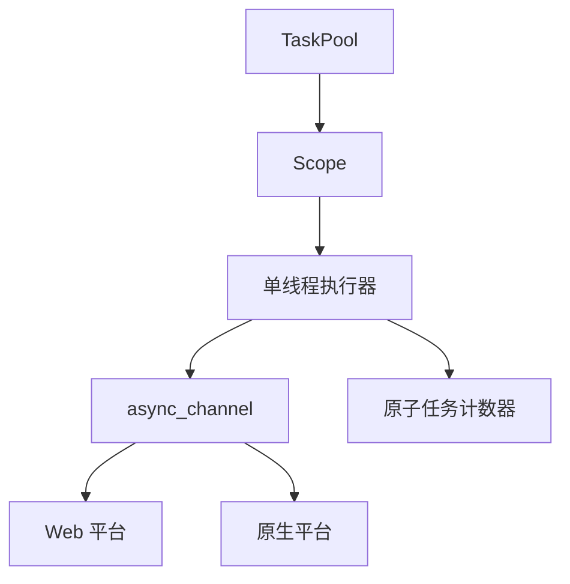

+++
title = "#20352 Fix UB, panic and compiler error in `bevy_tasks"
date = "2025-08-10T00:00:00"
draft = false
template = "pull_request_page.html"
in_search_index = false

[extra]
current_language = "zh-cn"
available_languages = {"en" = { name = "English", url = "/pull_request/bevy/2025-08/pr-20352-en-20250810" }, "zh-cn" = { name = "中文", url = "/pull_request/bevy/2025-08/pr-20352-zh-cn-20250810" }}
+++

### 修复 `bevy_tasks` 中的 UB、恐慌和编译错误

#### 基础信息
- **标题**: Fix UB, panic and compiler error in `bevy_tasks`
- **PR 链接**: https://github.com/bevyengine/bevy/pull/20352
- **作者**: NthTensor
- **状态**: 已合并
- **标签**: P-Crash, S-Ready-For-Final-Review, A-Tasks, D-Complex, P-Compile-Failure, P-Unsound, D-Unsafe, D-Async
- **创建时间**: 2025-07-31T15:47:05Z
- **合并时间**: 2025-08-10T06:50:27Z
- **合并者**: james7132

#### 问题描述
该 PR 解决了 `bevy_tasks` 模块中的三个关键问题：
1. **Web 构建失败**：`Task::is_finished` 在 Web 平台缺失实现，导致跨平台应用编译失败
2. **未定义行为 (UB)**：单线程执行器的 `Scope` 错误使用了 `'env` 生命周期而非 `'scope`
3. **任务饥饿问题**：当单线程执行器上所有任务同时休眠时，作用域无法正确轮询任务完成，导致恐慌和潜在 UB

#### 解决方案
1. **Web 任务重构**：
   - 用 `async_channel::bounded(1)` 替代 `futures_channel::oneshot`
   - 通过 `Receiver::is_empty` 实现 `Task::finished`
   - 选择 `async_channel` 因其支持 `Send + Sync + Unpin` 约束

2. **生命周期修复**：
   - 修正 `Scope` 的生命周期绑定：`&'env mut Scope<'scope, 'env, T>` → `&'scope mut Scope<'scope, 'env, T>`
   - 添加安全注释解释 `transmute` 的必要性

3. **任务饥饿预防**：
   - 引入原子计数器跟踪待处理任务
   - 当作用域内所有任务休眠时，通过 `yield_now().await` 主动让出执行权
   ```rust
   block_on(executor.run(async {
       while pending_tasks.get() != 0 {
           futures_lite::future::yield_now().await;
       }
   }));
   ```

#### 影响分析
1. **跨平台兼容性**：
   - 统一了 Web 和非 Web 平台的 `Task` 实现
   - 删除 `wasm_task.rs` (+0/-99) 消除平台特定代码

2. **内存安全**：
   - 修复错误生命周期绑定防止 UB
   - 任务结果存储改用 `Vec<Option<T>>` 避免同步原语开销

3. **可靠性提升**：
   - 新增测试用例验证任务饥饿场景：
   ```rust
   #[test]
   fn scoped_spawn() {
       // 模拟任务休眠后唤醒的场景
       task_pool.scope(|scope| {
           scope.spawn(async { recever.recv().await });
       });
   }
   ```

#### 关键文件变更
1. **`task.rs` (+167/-15)**：
   - 统一 Web/非 Web 的 `Task` 实现
   - 实现基于 `async_channel` 的 `is_finished()`：
   ```rust
   pub fn is_finished(&self) -> bool {
       cfg::web! {
           if { !self.0.is_empty() }  // Web 实现
           else { self.0.is_finished() } // 原生实现
       }
   }
   ```

2. **`single_threaded_task_pool.rs` (+89/-47)**：
   - 修复 `Scope` 生命周期签名：
   ```diff
   - F: for<'scope> FnOnce(&'env mut Scope<'scope, 'env, T>)
   + F: for<'scope> FnOnce(&'scope mut Scope<'scope, 'env, T>)
   ```
   - 添加原子任务计数器防止饥饿

3. **`wasm_task.rs` (+0/-99)**：
   - 完全移除 Web 特定实现，功能并入 `task.rs`

4. **依赖调整 (`Cargo.toml`)**：
   ```diff
   - futures-channel = "0.3"
   + async-channel = "2.3.0"  # 统一通道实现
   ```

#### 技术启示
1. **通道选择**：
   - `async_channel` 的 `bounded(1)` 在尺寸为 1 时有特殊优化
   - 满足 `Send + Sync + Unpin` 约束，适合异步任务场景

2. **恐慌安全**：
   ```rust
   // 捕获 panic 但不传播
   core::mem::forget(panic); 
   ```
   - 避免任务句柄 drop 时二次触发 panic

3. **无锁同步**：
   - 单线程执行器使用 `Cell<usize>` 而非 `Mutex` 跟踪任务状态
   - 符合单线程环境特性，消除锁开销

#### 图示关系


#### 延伸阅读
1. [async-channel 设计原理](https://docs.rs/async-channel/latest/async_channel/)
2. [Rust 异步执行器实现模式](https://rust-lang.github.io/async-book/02_execution/01_chapter.html)
3. [跨平台 Future 处理最佳实践](https://blog.logrocket.com/asynchronous-programming-in-rust/)