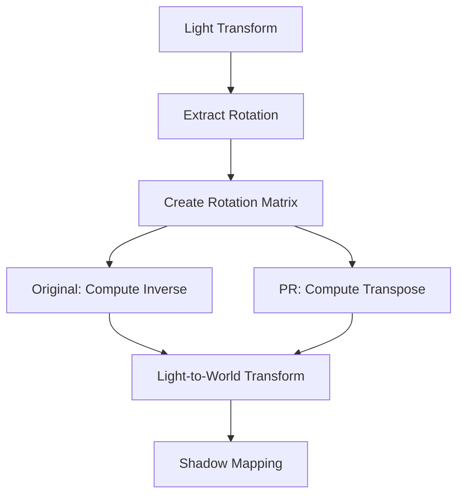

+++
title = "#20359 use transpose not inverse in shadow map transform"
date = "2025-08-01T00:00:00"
draft = false
template = "pull_request_page.html"
in_search_index = true

[taxonomies]
list_display = ["show"]

[extra]
current_language = "en"
available_languages = {"en" = { name = "English", url = "/pull_request/bevy/2025-08/pr-20359-en-20250801" }, "zh-cn" = { name = "中文", url = "/pull_request/bevy/2025-08/pr-20359-zh-cn-20250801" }}
labels = ["A-Rendering"]
+++

# Analysis of PR #20359: use transpose not inverse in shadow map transform

## Basic Information
- **Title**: use transpose not inverse in shadow map transform
- **PR Link**: https://github.com/bevyengine/bevy/pull/20359
- **Author**: atlv24
- **Status**: MERGED
- **Labels**: A-Rendering, S-Needs-Review
- **Created**: 2025-07-31T23:38:06Z
- **Merged**: 2025-08-01T22:12:39Z
- **Merged By**: mockersf

## Description Translation
# Objective

- minor simplification + precision/performance improvement

## Solution

- inverse is transpose for rotation matrices

## Testing

- shadow_bias example

## The Story of This Pull Request

This PR addresses a small but meaningful optimization in Bevy's shadow rendering system. The change occurs in the cascade processing logic where we compute the transformation from world space to light space. Previously, the code was constructing a rotation matrix from a light's transform and then computing its inverse to get the light-to-world transformation. The key insight here is that for pure rotation matrices (which are orthogonal), the inverse is mathematically equivalent to the transpose. Matrix transposition is computationally cheaper and numerically more stable than full matrix inversion.

The original implementation used `transform.compute_transform().rotation` to extract the rotation component. This was replaced with the more direct `transform.rotation()` method, which avoids unnecessary computation since we only need the rotation quaternion. The subsequent matrix operation was then changed from `inverse()` to `transpose()`, leveraging the mathematical property that for rotation matrices, inverse equals transpose.

These changes provide three concrete benefits:
1. **Performance improvement**: Matrix transpose is O(n²) while inverse is O(n³) for n×n matrices
2. **Numerical stability**: Transpose avoids potential floating-point precision issues in inverse calculations
3. **Code simplification**: The more efficient operation better expresses the mathematical intent

The author validated these changes using Bevy's `shadow_bias` example, confirming that shadow rendering behavior remains correct while gaining these optimizations. This is a good example of a precise, localized optimization that leverages mathematical properties to improve both performance and code quality without changing functionality.

## Visual Representation



## Key Files Changed

### `crates/bevy_light/src/cascade.rs`
**Changes:**
1. Optimized rotation extraction from light transform
2. Replaced matrix inverse with transpose operation

**Before:**
```rust
let world_from_light = Mat4::from_quat(transform.compute_transform().rotation);
let light_to_world_inverse = world_from_light.inverse();
```

**After:**
```rust
let world_from_light = Mat4::from_quat(transform.rotation());
let light_to_world_inverse = world_from_light.transpose();
```

**Why:**
- `transform.rotation()` directly accesses the rotation component without computing the full transform
- `transpose()` replaces `inverse()` for better performance and numerical stability
- Both changes maintain identical mathematical results for rotation matrices

## Further Reading
- [Rotation Matrix Properties (Wikipedia)](https://en.wikipedia.org/wiki/Rotation_matrix)
- [Matrix Transpose vs Inverse (Math StackExchange)](https://math.stackexchange.com/questions/1936020/why-is-the-inverse-of-an-orthogonal-matrix-equal-to-its-transpose)
- [Floating-Point Precision in Computer Graphics (Scratchapixel)](https://www.scratchapixel.com/lessons/mathematics-physics-for-computer-graphics/geometry)

## Full Code Diff
```diff
diff --git a/crates/bevy_light/src/cascade.rs b/crates/bevy_light/src/cascade.rs
index 0cb713a9e684c..ba4c615b06007 100644
--- a/crates/bevy_light/src/cascade.rs
+++ b/crates/bevy_light/src/cascade.rs
@@ -225,8 +225,8 @@ pub fn build_directional_light_cascades(
         // users to not change any other aspects of the transform - there's no guarantee
         // `transform.to_matrix()` will give us a matrix with our desired properties.
         // Instead, we directly create a good matrix from just the rotation.
-        let world_from_light = Mat4::from_quat(transform.compute_transform().rotation);
-        let light_to_world_inverse = world_from_light.inverse();
+        let world_from_light = Mat4::from_quat(transform.rotation());
+        let light_to_world_inverse = world_from_light.transpose();
 
         for (view_entity, projection, view_to_world) in views.iter().copied() {
             let camera_to_light_view = light_to_world_inverse * view_to_world;
```