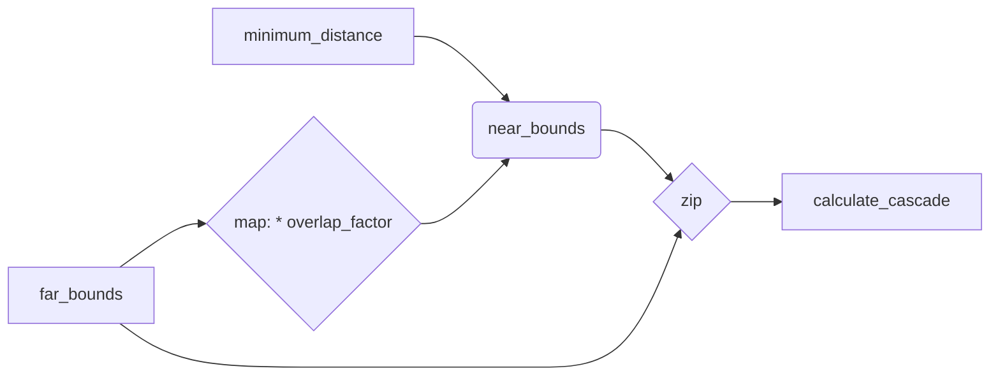

+++
title = "#20360 use iterators and zip instead of enumeration and indexing in shadow map cascades"
date = "2025-08-05T00:00:00"
draft = false
template = "pull_request_page.html"
in_search_index = true

[taxonomies]
list_display = ["show"]

[extra]
current_language = "en"
available_languages = {"en" = { name = "English", url = "/pull_request/bevy/2025-08/pr-20360-en-20250805" }, "zh-cn" = { name = "中文", url = "/pull_request/bevy/2025-08/pr-20360-zh-cn-20250805" }}
labels = ["A-Rendering"]
+++

## Title
Refactoring Shadow Cascade Calculation with Iterator Patterns

## Basic Information
- **Title**: use iterators and zip instead of enumeration and indexing in shadow map cascades
- **PR Link**: https://github.com/bevyengine/bevy/pull/20360
- **Author**: atlv24
- **Status**: MERGED
- **Labels**: A-Rendering, S-Ready-For-Final-Review
- **Created**: 2025-07-31T23:42:36Z
- **Merged**: 2025-08-05T01:51:47Z
- **Merged By**: james7132

## Description Translation
# Objective

- refactor code to be easier to understand

## Solution

- use iterator methods like zip chain map instead of if statements and indexing

## Testing

- shadow_biases example

## The Story of This Pull Request

The PR addresses readability issues in Bevy's shadow cascade generation code. The original implementation used index-based array access and conditional logic to compute near/far planes for cascaded shadow maps. This approach required manual bounds checking and special handling for the first cascade, making the control flow more complex than necessary.

The solution replaces index enumeration with iterator combinators to create a more linear data pipeline. We start by defining an overlap factor derived from the configuration's overlap proportion. Two primary iterators are then created:
1. `far_bounds` - directly iterates through configured cascade bounds
2. `near_bounds` - constructs near plane values by:
   - Starting with the minimum distance
   - Chaining with scaled versions of the far bounds (using `overlap_factor`)
   
These iterators are combined using `zip()` to create coordinated (near, far) pairs. Each pair is then processed through the existing cascade calculation logic. The key advantage is eliminating:
- Index variables and bounds checking
- Conditional branches for first-cascade special casing
- Explicit array indexing operations

The refactoring maintains identical mathematical behavior while improving code clarity. By leveraging Rust's iterator chaining (`chain()`, `map()`, `zip()`), the new implementation expresses the cascade plane relationships more declaratively. The changes were verified using Bevy's `shadow_biases` example to confirm identical rendering output.

This approach demonstrates how iterator patterns can simplify graphics algorithms that process sequential data with offset relationships. The solution avoids intermediate collections by operating entirely through iterator adapters, maintaining zero-cost abstraction benefits.

## Visual Representation



## Key Files Changed

### `crates/bevy_light/src/cascade.rs`
Refactored cascade plane calculation to use iterator combinators instead of indexing and conditionals.

#### Before:
```rust
cascades_config
    .bounds
    .iter()
    .enumerate()
    .map(|(idx, far_bound)| {
        let z_near = if idx > 0 {
            (1.0 - cascades_config.overlap_proportion)
                * -cascades_config.bounds[idx - 1]
        } else {
            -cascades_config.minimum_distance
        };
        let z_far = -far_bound;

        let corners = projection.get_frustum_corners(z_near, z_far);
        // ...
    })
```

#### After:
```rust
let overlap_factor = 1.0 - cascades_config.overlap_proportion;
let far_bounds = cascades_config.bounds.iter();
let near_bounds = [cascades_config.minimum_distance]
    .into_iter()
    .chain(far_bounds.clone().map(|bound| overlap_factor * bound));
let view_cascades = near_bounds
    .zip(far_bounds)
    .map(|(near_bound, far_bound)| {
        let corners = projection.get_frustum_corners(-near_bound, -far_bound);
        // ...
    })
```

## Further Reading
- [Rust Iterator Documentation](https://doc.rust-lang.org/std/iter/trait.Iterator.html)
- [Iterator Combinator Patterns](https://rust-lang.github.io/rust-clippy/master/index.html#/iter_overeager_cloned)
- [Cascaded Shadow Maps](https://learn.microsoft.com/en-us/windows/win32/dxtecharts/cascaded-shadow-maps)