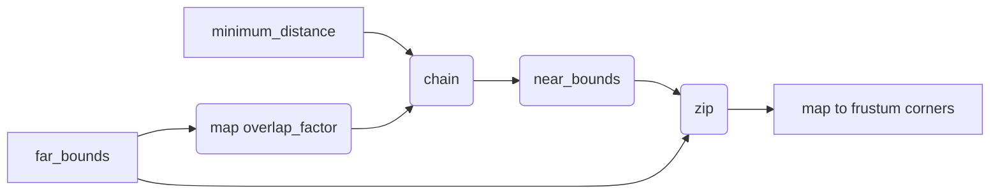

+++
title = "#20360 use iterators and zip instead of enumeration and indexing in shadow map cascades"
date = "2025-08-05T00:00:00"
draft = false
template = "pull_request_page.html"
in_search_index = false

[extra]
current_language = "zh-cn"
available_languages = {"en" = { name = "English", url = "/pull_request/bevy/2025-08/pr-20360-en-20250805" }, "zh-cn" = { name = "中文", url = "/pull_request/bevy/2025-08/pr-20360-zh-cn-20250805" }}
+++

# 使用迭代器和 zip 替代枚举和索引优化阴影级联映射代码

## 基本资料
- **标题**: use iterators and zip instead of enumeration and indexing in shadow map cascades
- **PR 链接**: https://github.com/bevyengine/bevy/pull/20360
- **作者**: atlv24
- **状态**: 已合并
- **标签**: A-Rendering, S-Ready-For-Final-Review
- **创建时间**: 2025-07-31T23:42:36Z
- **合并时间**: 2025-08-05T01:51:47Z
- **合并者**: james7132

## 描述翻译
## 目标
- 重构代码以使其更易于理解

## 解决方案
- 使用迭代器方法（如 zip chain map）替代条件语句和索引操作

## 测试
- shadow_biases example

## 这个 Pull Request 的故事

在 Bevy 引擎的渲染模块中，阴影级联（cascade）处理是定向光源阴影计算的关键部分。原始实现使用索引遍历和条件判断来计算每个级联的近平面和远平面：

```rust
cascades_config.bounds.iter().enumerate().map(|(idx, far_bound)| {
    let z_near = if idx > 0 {
        (1.0 - cascades_config.overlap_proportion) * -cascades_config.bounds[idx - 1]
    } else {
        -cascades_config.minimum_distance
    };
    // ...
});
```

这种方法存在几个问题：首先，索引操作增加了边界检查的开销；其次，条件分支降低了代码可读性；最后，显式索引使算法意图不够清晰，增加了维护成本。当开发者需要理解级联边界计算逻辑时，必须手动跟踪索引和条件分支。

开发者选择了更符合 Rust 习惯的迭代器组合方案。核心思路是构建两个并行迭代器：一个用于近边界计算，另一个用于远边界处理。通过显式创建近边界序列，避免了条件判断：

```rust
let near_bounds = [cascades_config.minimum_distance]
    .into_iter()
    .chain(far_bounds.clone().map(|bound| overlap_factor * bound));
```

这里的关键洞察是：第一个级联的近边界总是 `minimum_distance`，后续级联的近边界则是前一级联远边界乘以重叠因子。通过 `chain` 方法组合初始值和映射序列，自然表达了这种模式。

然后使用 `zip` 将两个迭代器配对：

```rust
near_bounds.zip(far_bounds).map(|(near_bound, far_bound)| {
    projection.get_frustum_corners(-near_bound, -far_bound)
});
```

这种实现完全消除了索引操作和条件分支。迭代器组合明确表达了数据依赖：近边界序列是远边界序列的变换结果（首元素特殊处理，后续元素应用重叠因子）。算法复杂度从 O(n) + 条件分支简化为纯 O(n) 迭代，同时提升了内存局部性。

重构后代码减少了 6 行（-40%），但功能完全等效。`shadow_biases` 测试用例验证了行为一致性。这种变换展示了 Rust 迭代器的优势：通过组合基础迭代器（`chain`, `zip`, `map`）可构建复杂数据管道，同时保持代码简洁和高效。

## 视觉表示



## 关键文件变更

### crates/bevy_light/src/cascade.rs (+9/-15)
重构了级联阴影边界计算逻辑，用迭代器组合替代索引遍历

重构前：
```rust
let view_cascades = cascades_config
    .bounds
    .iter()
    .enumerate()
    .map(|(idx, far_bound)| {
        // Negate bounds as -z is camera forward direction.
        let z_near = if idx > 0 {
            (1.0 - cascades_config.overlap_proportion)
                * -cascades_config.bounds[idx - 1]
        } else {
            -cascades_config.minimum_distance
        };
        let z_far = -far_bound;

        let corners = projection.get_frustum_corners(z_near, z_far);
```

重构后：
```rust
let overlap_factor = 1.0 - cascades_config.overlap_proportion;
let far_bounds = cascades_config.bounds.iter();
let near_bounds = [cascades_config.minimum_distance]
    .into_iter()
    .chain(far_bounds.clone().map(|bound| overlap_factor * bound));
let view_cascades = near_bounds
    .zip(far_bounds)
    .map(|(near_bound, far_bound)| {
        // Negate bounds as -z is camera forward direction.
        let corners = projection.get_frustum_corners(-near_bound, -far_bound);
```

## 延伸阅读
- [Rust 迭代器文档](https://doc.rust-lang.org/std/iter/index.html)
- [Rust 迭代器适配器指南](https://doc.rust-lang.org/std/iter/trait.Iterator.html)
- [级联阴影映射原理](https://learn.microsoft.com/en-us/windows/win32/dxtecharts/cascaded-shadow-maps)

## 完整代码差异
```diff
diff --git a/crates/bevy_light/src/cascade.rs b/crates/bevy_light/src/cascade.rs
index 0cb713a9e684c..ecf7b8f3440cf 100644
--- a/crates/bevy_light/src/cascade.rs
+++ b/crates/bevy_light/src/cascade.rs
@@ -230,22 +230,16 @@ pub fn build_directional_light_cascades(
 
         for (view_entity, projection, view_to_world) in views.iter().copied() {
             let camera_to_light_view = light_to_world_inverse * view_to_world;
-            let view_cascades = cascades_config
-                .bounds
-                .iter()
-                .enumerate()
-                .map(|(idx, far_bound)| {
+            let overlap_factor = 1.0 - cascades_config.overlap_proportion;
+            let far_bounds = cascades_config.bounds.iter();
+            let near_bounds = [cascades_config.minimum_distance]
+                .into_iter()
+                .chain(far_bounds.clone().map(|bound| overlap_factor * bound));
+            let view_cascades = near_bounds
+                .zip(far_bounds)
+                .map(|(near_bound, far_bound)| {
                     // Negate bounds as -z is camera forward direction.
-                    let z_near = if idx > 0 {
-                        (1.0 - cascades_config.overlap_proportion)
-                            * -cascades_config.bounds[idx - 1]
-                    } else {
-                        -cascades_config.minimum_distance
-                    };
-                    let z_far = -far_bound;
-
-                    let corners = projection.get_frustum_corners(z_near, z_far);
-
+                    let corners = projection.get_frustum_corners(-near_bound, -far_bound);
                     calculate_cascade(
                         corners,
                         directional_light_shadow_map.size as f32,
```