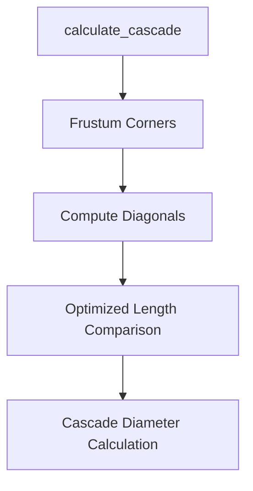

+++
title = "#20361 add ref doc and extract a couple vars and skip a sqrt in shadow cascades"
date = "2025-08-04T00:00:00"
draft = false
template = "pull_request_page.html"
in_search_index = true

[taxonomies]
list_display = ["show"]

[extra]
current_language = "en"
available_languages = {"en" = { name = "English", url = "/pull_request/bevy/2025-08/pr-20361-en-20250804" }, "zh-cn" = { name = "中文", url = "/pull_request/bevy/2025-08/pr-20361-zh-cn-20250804" }}
labels = ["D-Trivial", "A-Rendering", "C-Code-Quality"]
+++

## Pull Request Analysis: add ref doc and extract a couple vars and skip a sqrt in shadow cascades

### Basic Information
- **Title**: add ref doc and extract a couple vars and skip a sqrt in shadow cascades
- **PR Link**: https://github.com/bevyengine/bevy/pull/20361
- **Author**: atlv24
- **Status**: MERGED
- **Labels**: D-Trivial, A-Rendering, C-Code-Quality, S-Ready-For-Final-Review
- **Created**: 2025-07-31T23:51:36Z
- **Merged**: 2025-08-04T21:32:52Z
- **Merged By**: james7132

### Description Translation
# Objective

- ref doc is hard to find
- expression is big
- sqrt is extra

## Solution

- add ref doc
- extract a couple vars
- skip a sqrt

## Testing

- shadow biases example

### The Story of This Pull Request

This PR addresses three related issues in Bevy's cascade shadow mapping implementation. First, the `calculate_cascade` function lacked reference documentation, making it harder for developers to understand the theoretical basis for the shadow cascade calculations. Second, the existing code contained a complex expression for calculating cascade diameter that was difficult to parse at a glance. Third, the implementation performed two unnecessary square root operations when computing frustum diagonals.

The solution approach focused on clarity and performance. For documentation, we added a direct link to NVIDIA's official paper on cascaded shadow maps. This provides developers with essential context about the algorithm's theoretical foundation. The complex expression was refactored by extracting intermediate values (`body_diagonal` and `far_plane_diagonal`) to improve readability. Most significantly, the square root operations were optimized by comparing squared lengths first before performing a single square root operation on the maximum value.

The implementation changes demonstrate good optimization practices. By moving from length comparisons to squared length comparisons, we reduce the number of expensive square root operations from two to one. This is particularly valuable in graphics code that runs every frame. The variable extraction also improves maintainability - the intermediate values clearly represent the two diagonal measurements being compared.

These changes fit well within Bevy's existing rendering architecture. The optimization doesn't alter the shadow mapping behavior, but makes the calculations more efficient. The added documentation helps future contributors understand why certain calculations exist, particularly the note about precision considerations affecting cascade diameter calculations.

The impact is twofold: better developer documentation and a small but measurable performance improvement in shadow cascade calculations. The changes demonstrate a good pattern for optimizing vector comparisons where relative distances matter more than absolute values - a common scenario in graphics programming.

### Visual Representation



### Key Files Changed

**crates/bevy_light/src/cascade.rs** (+5/-4)  
This file contains the core implementation changes for cascade shadow mapping. The modifications improve documentation clarity and optimize the cascade diameter calculation.

Key changes:
```rust
// Before:
let cascade_diameter = (frustum_corners[0] - frustum_corners[6])
    .length()
    .max((frustum_corners[4] - frustum_corners[6]).length())
    .ceil();

// After:
let body_diagonal = (frustum_corners[0] - frustum_corners[6]).length_squared();
let far_plane_diagonal = (frustum_corners[4] - frustum_corners[6]).length_squared();
let cascade_diameter = body_diagonal.max(far_plane_diagonal).sqrt().ceil();
```
The changes:
1. Added reference documentation linking to NVIDIA's cascaded shadow maps paper
2. Extracted two diagonal calculations into separate variables
3. Replaced two `.length()` calls with `.length_squared()` + single `.sqrt()`

### Further Reading
- [Cascaded Shadow Maps (NVIDIA)](https://developer.download.nvidia.com/SDK/10.5/opengl/src/cascaded_shadow_maps/doc/cascaded_shadow_maps.pdf) - Official reference paper added in documentation
- Bevy's [Shadow Biases Example](https://github.com/bevyengine/bevy/blob/main/examples/3d/shadow_biases.rs) - Relevant test case mentioned in PR description
- Mathematics of [Squared Length Optimization](https://developer.nvidia.com/gpugems/gpugems/part-i-natural-effects/chapter-1-effective-water-simulation-physical-models) - General technique for optimizing distance comparisons