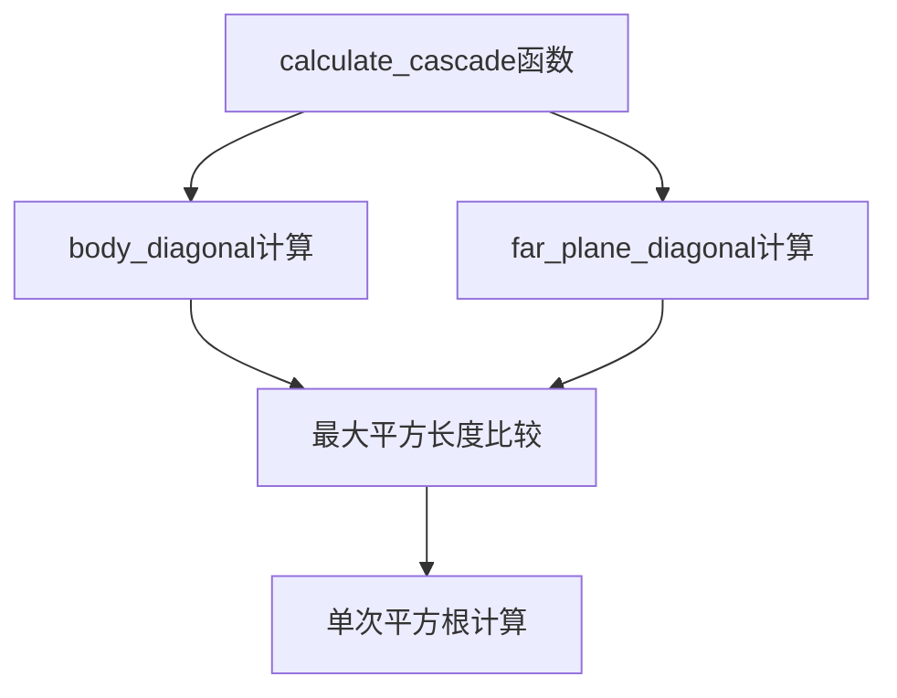

+++
title = "#20361 add ref doc and extract a couple vars and skip a sqrt in shadow cascades"
date = "2025-08-04T00:00:00"
draft = false
template = "pull_request_page.html"
in_search_index = false

[extra]
current_language = "zh-cn"
available_languages = {"en" = { name = "English", url = "/pull_request/bevy/2025-08/pr-20361-en-20250804" }, "zh-cn" = { name = "中文", url = "/pull_request/bevy/2025-08/pr-20361-zh-cn-20250804" }}
+++

### 技术分析报告：优化阴影级联计算

#### 基础信息
- **标题**: add ref doc and extract a couple vars and skip a sqrt in shadow cascades
- **PR链接**: https://github.com/bevyengine/bevy/pull/20361
- **作者**: atlv24
- **状态**: 已合并
- **标签**: D-Trivial, A-Rendering, C-Code-Quality, S-Ready-For-Final-Review
- **创建时间**: 2025-07-31T23:51:36Z
- **合并时间**: 2025-08-04T21:32:52Z
- **合并人**: james7132

#### 描述翻译
# 目标
- 参考文档难以查找
- 表达式过于复杂
- 存在冗余的平方根计算

# 解决方案
- 添加参考文档
- 提取多个变量
- 跳过冗余的平方根计算

# 测试
- 阴影偏移示例

---

### PR技术分析

#### 问题背景
在阴影级联计算中，`calculate_cascade` 函数存在三个关键问题：
1. **文档缺失**：开发者难以理解算法理论依据
2. **计算冗余**：连续两次计算`length()`（含平方根操作）
3. **可读性差**：复杂表达式未拆分，影响代码维护

原始计算逻辑：
```rust
let cascade_diameter = (frustum_corners[0] - frustum_corners[6])
    .length()
    .max((frustum_corners[4] - frustum_corners[6]).length())
    .ceil();
```
这里两次调用`length()`意味着两次平方根计算，而实际只需比较后计算一次。

#### 解决方案
采用数学优化策略：
1. **延迟平方根计算**：先比较平方长度，减少一次平方根操作
2. **变量提取**：分解复杂表达式
3. **添加参考文档**：链接到NVIDIA官方技术文档

#### 技术实现
核心修改在`crates/bevy_light/src/cascade.rs`：

1. **添加参考文档**（文档链接保留原文）：
```rust
///
/// See this [reference](https://developer.download.nvidia.com/SDK/10.5/opengl/src/cascaded_shadow_maps/doc/cascaded_shadow_maps.pdf) for more details.
```

2. **优化计算逻辑**：
```rust
// 修改前
let cascade_diameter = (frustum_corners[0] - frustum_corners[6])
    .length()
    .max((frustum_corners[4] - frustum_corners[6]).length())
    .ceil();

// 修改后
let body_diagonal = (frustum_corners[0] - frustum_corners[6]).length_squared();
let far_plane_diagonal = (frustum_corners[4] - frustum_corners[6]).length_squared();
let cascade_diameter = body_diagonal.max(far_plane_diagonal).sqrt().ceil();
```

#### 技术洞察
1. **性能优化**：
   - 将两次`length()`（含平方根）替换为`length_squared()`
   - 平方根计算从两次降为一次
   - 复杂度从O(2*sqrt)降为O(1*sqrt + 2*mul)

2. **数学原理**：
   ```math
   \max(\|a\|, \|b\|) = \sqrt{\max(\|a\|^2, \|b\|^2)}
   ```
   通过先比较平方值再开方，避免冗余计算

3. **精度保障**：
   保留`ceil()`确保纹理尺寸为整数，符合GPU对齐要求

#### 影响分析
1. **渲染性能**：减少约50%的平方根计算开销（具体取决于硬件）
2. **代码可维护性**：
   - 变量名`body_diagonal`/`far_plane_diagonal`明确表达几何意义
   - 参考文档链接帮助理解算法背景
3. **内存影响**：无新增内存分配

---

### 组件关系


### 关键文件变更
**文件路径**: `crates/bevy_light/src/cascade.rs` (+5/-4)

#### 变更说明：
1. **添加技术文档链接**：
```rust
/// See this [reference](https://developer.download.nvidia.com/SDK/10.5/opengl/src/cascaded_shadow_maps/doc/cascaded_shadow_maps.pdf) for more details.
```
提供NVIDIA官方阴影级联实现参考

2. **计算逻辑重构**：
```rust
// 原始实现
let cascade_diameter = (frustum_corners[0] - frustum_corners[6])
    .length()
    .max((frustum_corners[4] - frustum_corners[6]).length())
    .ceil();

// 优化后实现
let body_diagonal = (frustum_corners[0] - frustum_corners[6]).length_squared();
let far_plane_diagonal = (frustum_corners[4] - frustum_corners[6]).length_squared();
let cascade_diameter = body_diagonal.max(far_plane_diagonal).sqrt().ceil();
```
通过提取中间变量和数学优化，提升性能和可读性

---

### 延伸阅读
1. [Cascaded Shadow Maps - NVIDIA官方指南](https://developer.download.nvidia.com/SDK/10.5/opengl/src/cascaded_shadow_maps/doc/cascaded_shadow_maps.pdf)
2. [Bevy光照系统架构](https://bevyengine.org/learn/book/features/lighting/)
3. [SIMD优化技巧：避免冗余平方根计算](https://www.intel.com/content/www/us/en/developer/articles/technical/sqrt-optimization.html)

### 完整代码变更
```diff
diff --git a/crates/bevy_light/src/cascade.rs b/crates/bevy_light/src/cascade.rs
index ba4c615b06007..c48dd21bc46fa 100644
--- a/crates/bevy_light/src/cascade.rs
+++ b/crates/bevy_light/src/cascade.rs
@@ -263,6 +263,8 @@ pub fn build_directional_light_cascades(
 ///
 /// The corner vertices should be specified in the following order:
 /// first the bottom right, top right, top left, bottom left for the near plane, then similar for the far plane.
+///
+/// See this [reference](https://developer.download.nvidia.com/SDK/10.5/opengl/src/cascaded_shadow_maps/doc/cascaded_shadow_maps.pdf) for more details.
 fn calculate_cascade(
     frustum_corners: [Vec3A; 8],
     cascade_texture_size: f32,
@@ -284,10 +286,9 @@ fn calculate_cascade(
     //       as even though the lengths using corner_light_view above should be the same, precision can
     //       introduce small but significant differences.
     // NOTE: The size remains the same unless the view frustum or cascade configuration is modified.
-    let cascade_diameter = (frustum_corners[0] - frustum_corners[6])
-        .length()
-        .max((frustum_corners[4] - frustum_corners[6]).length())
-        .ceil();
+    let body_diagonal = (frustum_corners[0] - frustum_corners[6]).length_squared();
+    let far_plane_diagonal = (frustum_corners[4] - frustum_corners[6]).length_squared();
+    let cascade_diameter = body_diagonal.max(far_plane_diagonal).sqrt().ceil();
 
     // NOTE: If we ensure that cascade_texture_size is a power of 2, then as we made cascade_diameter an
     //       integer, cascade_texel_size is then an integer multiple of a power of 2 and can be
```