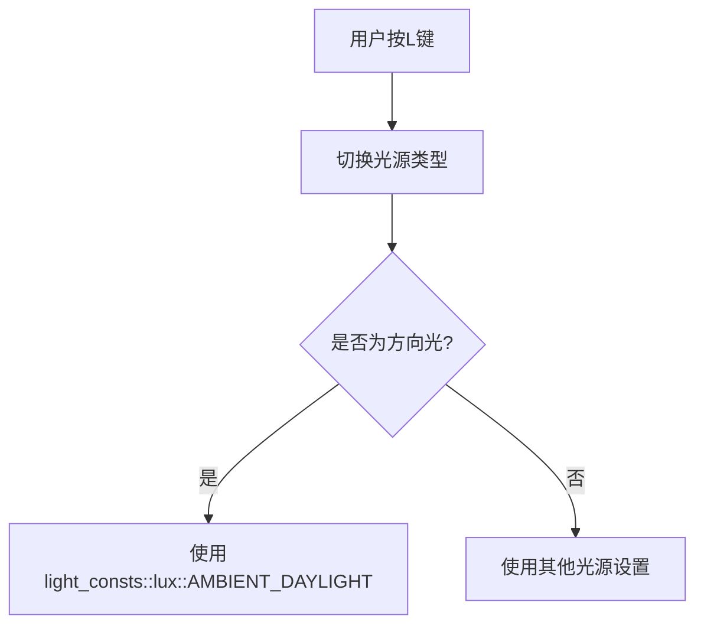

+++
title = "#20362 Use the default directional light intensity constant"
date = "2025-08-05T00:00:00"
draft = false
template = "pull_request_page.html"
in_search_index = false

[extra]
current_language = "zh-cn"
available_languages = {"en" = { name = "English", url = "/pull_request/bevy/2025-08/pr-20362-en-20250805" }, "zh-cn" = { name = "中文", url = "/pull_request/bevy/2025-08/pr-20362-zh-cn-20250805" }}
+++

# Use the default directional light intensity constant

## 基本信息
- **标题**: Use the default directional light intensity constant
- **PR链接**: https://github.com/bevyengine/bevy/pull/20362
- **作者**: atlv24
- **状态**: 已合并 (MERGED)
- **标签**: A-Rendering, S-Ready-For-Final-Review
- **创建时间**: 2025-08-01T01:12:44Z
- **合并时间**: 2025-08-05T19:40:28Z
- **合并者**: alice-i-cecile

## 描述翻译

# 目标 (Objective)

- 在 shadow_biases 示例中按两次 L 键循环切换光源类型会导致光源亮度不一致

## 解决方案 (Solution)

- 使用正确的默认值使亮度匹配

## 测试 (Testing)

- 运行 shadow_biases 示例

## 这个 Pull Request 的故事

### 问题背景
在 Bevy 的 shadow_biases 示例中，用户可以通过按 L 键循环切换不同的光源类型（点光源、聚光灯、方向光）。开发者发现一个具体问题：当用户按两次 L 键切换回方向光时，光源亮度与初始状态不一致。具体表现为：
- 首次加载方向光时使用默认常量值 `light_consts::lux::AMBIENT_DAYLIGHT` (≈100,000 lux)
- 但切换回方向光时使用硬编码值 100000.0
虽然数值相同，但存在两个问题：
1. 代码重复定义相同的亮度值
2. 如果引擎默认值改变，硬编码值不会同步更新

### 解决方案
解决方案直接明了：统一使用 Bevy 预定义的光源常量 `light_consts::lux::AMBIENT_DAYLIGHT` 替代硬编码值。这个修改：
1. 确保亮度值始终与引擎默认值一致
2. 消除代码重复
3. 提高可维护性（未来默认值变更自动生效）

### 实现细节
修改集中在光源切换逻辑中。当检测到方向光激活时，现在正确使用引擎常量而非硬编码值：

```rust
light.illuminance = if light.illuminance == 0.0 {
    *writer.text(*example_text, 4) = "DirectionalLight".to_string();
    light_consts::lux::AMBIENT_DAYLIGHT // 使用常量替代硬编码
} else {
    0.0
};
```

### 技术见解
这个修改体现了重要的工程原则：
1. **避免硬编码**：使用预定义常量保证全系统一致性
2. **单一事实源**：亮度值只在一个地方定义（引擎常量）
3. **API 一致性**：正确使用 Bevy 提供的公共常量接口

虽然修改很小，但解决了实际用户体验问题：确保光源切换后亮度保持一致，提升示例的演示质量。

### 影响
- 用户现在可以在 shadow_biases 示例中无缝切换光源而不会出现亮度差异
- 代码更健壮，避免未来因默认值变更导致的潜在不一致
- 为其他开发者示范了正确使用引擎常量的方式

## 视觉表示



## 关键文件更改

### `examples/3d/shadow_biases.rs`
**修改原因**：修复方向光切换时的亮度不一致问题  
**关键修改**：将方向光亮度的硬编码值替换为引擎常量

```rust
// 修改前:
for mut light in &mut directional_lights {
    light.illuminance = if light.illuminance == 0.0 {
        *writer.text(*example_text, 4) = "DirectionalLight".to_string();
        100000.0 // 硬编码值
    } else {
        0.0
    };
}

// 修改后:
for mut light in &mut directional_lights {
    light.illuminance = if light.illuminance == 0.0 {
        *writer.text(*example_text, 4) = "DirectionalLight".to_string();
        light_consts::lux::AMBIENT_DAYLIGHT // 使用引擎常量
    } else {
        0.0
    };
}
```

## 扩展阅读
- [Bevy 光照系统文档](https://docs.rs/bevy/latest/bevy/pbr/struct.DirectionalLight.html)
- [Rust 常量使用最佳实践](https://doc.rust-lang.org/stable/std/keyword.const.html)
- [Bevy 示例代码指南](https://github.com/bevyengine/bevy/blob/main/examples/README.md)

## 完整代码差异

```diff
diff --git a/examples/3d/shadow_biases.rs b/examples/3d/shadow_biases.rs
index afd469affff54..0f0ff5d295a79 100644
--- a/examples/3d/shadow_biases.rs
+++ b/examples/3d/shadow_biases.rs
@@ -160,7 +160,7 @@ fn toggle_light(
         for mut light in &mut directional_lights {
             light.illuminance = if light.illuminance == 0.0 {
                 *writer.text(*example_text, 4) = "DirectionalLight".to_string();
-                100000.0
+                light_consts::lux::AMBIENT_DAYLIGHT
             } else {
                 0.0
             };
```