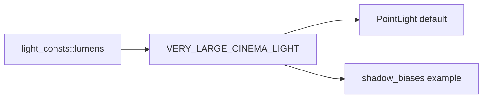

+++
title = "#20363 Add light_consts::lumens::VERY_LARGE_CINEMA_LIGHT"
date = "2025-08-05T00:00:00"
draft = false
template = "pull_request_page.html"
in_search_index = true

[taxonomies]
list_display = ["show"]

[extra]
current_language = "en"
available_languages = {"en" = { name = "English", url = "/pull_request/bevy/2025-08/pr-20363-en-20250805" }, "zh-cn" = { name = "中文", url = "/pull_request/bevy/2025-08/pr-20363-zh-cn-20250805" }}
labels = ["A-Rendering"]
+++

# Technical Analysis of PR #20363: Add light_consts::lumens::VERY_LARGE_CINEMA_LIGHT

## Basic Information
- **Title**: Add light_consts::lumens::VERY_LARGE_CINEMA_LIGHT
- **PR Link**: https://github.com/bevyengine/bevy/pull/20363
- **Author**: atlv24
- **Status**: MERGED
- **Labels**: A-Rendering, S-Ready-For-Final-Review
- **Created**: 2025-08-01T01:17:44Z
- **Merged**: 2025-08-05T19:40:28Z
- **Merged By**: alice-i-cecile

## Description Translation
# Objective

- Point light default has no constant
- shadow_biases example uses some arbitrary weird lumen value

## Solution

- Add a constant inspired by the doc comment on point light default

## Testing

- run shadow_biases example and press L

## The Story of This Pull Request

The PR addresses two related issues in Bevy's lighting system. First, the default point light implementation used a hard-coded intensity value without a named constant. Second, the shadow_biases example used an arbitrary large lumen value that didn't match the established lighting conventions in the engine.

In the original implementation, the PointLight struct's default intensity was set to 1,000,000 lumens with an explanatory comment about its suitability for Bevy's default "very overcast day" exposure level. However, this value was duplicated in the shadow_biases example as 100,000,000 lumens - a significantly different value that appeared arbitrary and inconsistent.

The solution centralizes the standard large light value by creating a named constant VERY_LARGE_CINEMA_LIGHT in the light_consts::lumens module. This constant is then used in both the PointLight default implementation and the shadow_biases example, replacing the hard-coded values. The approach follows standard software engineering practices for eliminating magic numbers and establishing single sources of truth.

The implementation required three key changes:
1. Defining the new constant with appropriate documentation
2. Updating the PointLight default to reference this constant
3. Modifying the example to use the same constant

By using a named constant, the code becomes more maintainable and self-documenting. Future changes to lighting behavior only require modification in one location, and developers can understand the purpose of the value through its descriptive name and accompanying documentation.

## Visual Representation



## Key Files Changed

### `crates/bevy_light/src/lib.rs`
Added the constant definition with documentation:

```rust
pub mod light_consts {
    pub mod lumens {
        // ... existing constants ...
        /// 1,000,000 lumens is a very large "cinema light" capable of registering brightly at Bevy's
        /// default "very overcast day" exposure level. For "indoor lighting" with a lower exposure,
        /// this would be way too bright.
        pub const VERY_LARGE_CINEMA_LIGHT: f32 = 1_000_000.0;
    }
}
```

### `crates/bevy_light/src/point_light.rs`
Updated the default implementation to use the new constant:

```rust
// Before:
impl Default for PointLight {
    fn default() -> Self {
        PointLight {
            color: Color::WHITE,
            // 1,000,000 lumens is a very large "cinema light"...
            intensity: 1_000_000.0,
            // ... other fields ...
        }
    }
}

// After:
impl Default for PointLight {
    fn default() -> Self {
        PointLight {
            color: Color::WHITE,
            intensity: light_consts::lumens::VERY_LARGE_CINEMA_LIGHT,
            // ... other fields ...
        }
    }
}
```

### `examples/3d/shadow_biases.rs`
Updated the example to use the constant:

```rust
// Before:
light.intensity = if light.intensity == 0.0 {
    *writer.text(*example_text, 4) = "PointLight".to_string();
    100000000.0
} else {
    0.0
};

// After:
light.intensity = if light.intensity == 0.0 {
    *writer.text(*example_text, 4) = "PointLight".to_string();
    light_consts::lumens::VERY_LARGE_CINEMA_LIGHT
} else {
    0.0
};
```

## Further Reading
1. [Bevy Lighting Documentation](https://docs.rs/bevy/latest/bevy/light/index.html)
2. [Rust Constants Best Practices](https://doc.rust-lang.org/book/ch03-01-variables-and-mutability.html#constants)
3. [Magic Numbers Anti-pattern](https://refactoring.guru/replace-magic-number-with-symbolic-constant)