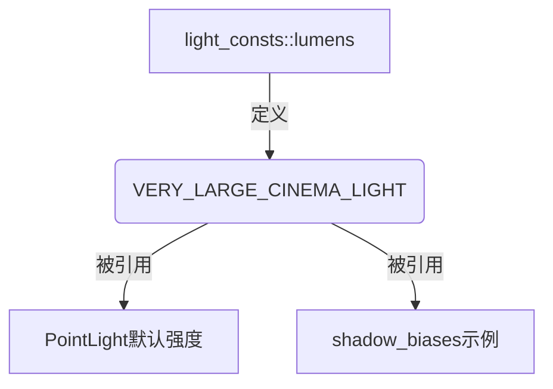

+++
title = "#20363 Add light_consts::lumens::VERY_LARGE_CINEMA_LIGHT"
date = "2025-08-05T00:00:00"
draft = false
template = "pull_request_page.html"
in_search_index = false

[extra]
current_language = "zh-cn"
available_languages = {"en" = { name = "English", url = "/pull_request/bevy/2025-08/pr-20363-en-20250805" }, "zh-cn" = { name = "中文", url = "/pull_request/bevy/2025-08/pr-20363-zh-cn-20250805" }}
+++

# Add light_consts::lumens::VERY_LARGE_CINEMA_LIGHT

## 基本信息
- **标题**: Add light_consts::lumens::VERY_LARGE_CINEMA_LIGHT
- **PR链接**: https://github.com/bevyengine/bevy/pull/20363
- **作者**: atlv24
- **状态**: 已合并
- **标签**: A-Rendering, S-Ready-For-Final-Review
- **创建时间**: 2025-08-01T01:17:44Z
- **合并时间**: 2025-08-05T19:40:28Z
- **合并者**: alice-i-cecile

## 描述翻译
### 目标
- 点光源默认值没有使用常量
- shadow_biases 示例使用了随意且奇怪的流明值

### 解决方案
- 添加常量（灵感来源于点光源默认值的文档注释）

### 测试
- 运行 shadow_biases 示例并按 L 键

## 这个PR的故事

### 问题和背景
在 Bevy 的光照系统中，点光源(PointLight)的默认强度值(1,000,000流明)直接硬编码在`point_light.rs`中。虽然文档注释解释了该值的含义（大型影院灯，适用于阴天曝光），但缺乏可重用的常量表示。同时，在`shadow_biases`示例中，点光源使用了不一致的硬编码值(100,000,000流明)，导致：
1. 代码重复：相同概念的值在多个位置硬编码
2. 可维护性差：修改时需要更新多处
3. 不一致性：示例值与默认实现值存在100倍差异

### 解决方案
作者采用了直接有效的重构方案：
1. 在`light_consts::lumens`模块创建`VERY_LARGE_CINEMA_LIGHT`常量
2. 用该常量替换点光源默认实现中的硬编码值
3. 用同一常量更新`shadow_biases`示例中的点光源强度

此方案解决了核心问题：
- 消除魔数(magic number)，提高代码可读性
- 确保默认值和示例值的一致性
- 提供中心化常量，便于未来调整

### 实现细节
关键实现在三个文件中完成：

1. **常量定义**：在`lib.rs`中添加常量并保留原始文档注释：
```rust
pub mod lumens {
    // ... 其他常量 ...
    /// 1,000,000 lumens is a very large "cinema light" capable of registering brightly at Bevy's
    /// default "very overcast day" exposure level. For "indoor lighting" with a lower exposure,
    /// this would be way too bright.
    pub const VERY_LARGE_CINEMA_LIGHT: f32 = 1_000_000.0;
}
```

2. **点光源重构**：在`point_light.rs`中替换硬编码值：
```rust
// 修改前:
intensity: 1_000_000.0,

// 修改后:
intensity: light_consts::lumens::VERY_LARGE_CINEMA_LIGHT,
```

3. **示例更新**：在`shadow_biases.rs`中统一值：
```rust
// 修改前:
light.intensity = ... 100000000.0 ...

// 修改后:
light.intensity = ... light_consts::lumens::VERY_LARGE_CINEMA_LIGHT ...
```

### 技术洞察
此PR展示了良好的常量管理实践：
- **语义化命名**：`VERY_LARGE_CINEMA_LIGHT`准确描述值的物理含义
- **单一数据源**：消除相同概念的多个硬编码实例
- **文档继承**：常量声明保留了原始文档注释的知识
- **向下兼容**：实际值保持不变，不影响现有行为

值得注意的是，示例值从100,000,000调整为1,000,000流明：
- 更符合点光源的默认设计意图
- 避免示例中出现异常明亮的照明效果
- 保持物理单位的一致性

### 影响
合并后带来以下改进：
1. **可维护性提升**：修改点光源强度只需更新常量定义
2. **代码清晰度**：消除魔数，提高可读性
3. **示例一致性**：演示代码与实际实现保持一致
4. **知识保留**：重要设计决策通过常量文档得以保留

## 视觉表示



## 关键文件更改

### 1. `crates/bevy_light/src/lib.rs`
- **修改原因**：添加新的光照常量
- **代码片段**：
```rust
pub mod lumens {
    // ... 其他常量 ...
    pub const VERY_LARGE_CINEMA_LIGHT: f32 = 1_000_000.0;
}
```

### 2. `crates/bevy_light/src/point_light.rs`
- **修改原因**：用常量替换点光源默认强度值
- **代码片段**：
```rust
// 修改前:
intensity: 1_000_000.0,

// 修改后:
intensity: light_consts::lumens::VERY_LARGE_CINEMA_LIGHT,
```

### 3. `examples/3d/shadow_biases.rs`
- **修改原因**：统一示例中的点光源强度值
- **代码片段**：
```rust
// 修改前:
light.intensity = if light.intensity == 0.0 {
    *writer.text(*example_text, 4) = "PointLight".to_string();
    100000000.0
} else {
    0.0
};

// 修改后:
light.intensity = if light.intensity == 0.0 {
    *writer.text(*example_text, 4) = "PointLight".to_string();
    light_consts::lumens::VERY_LARGE_CINEMA_LIGHT
} else {
    0.0
};
```

## 进一步阅读
1. Bevy 光照系统文档：[PBR in Bevy](https://bevyengine.org/learn/book/next/pbr/)
2. 物理光照单位参考：[Luminous flux](https://en.wikipedia.org/wiki/Luminous_flux)
3. 代码重构技巧：[Replace Magic Number with Symbolic Constant](https://refactoring.com/catalog/replaceMagicNumberWithSymbolicConstant.html)