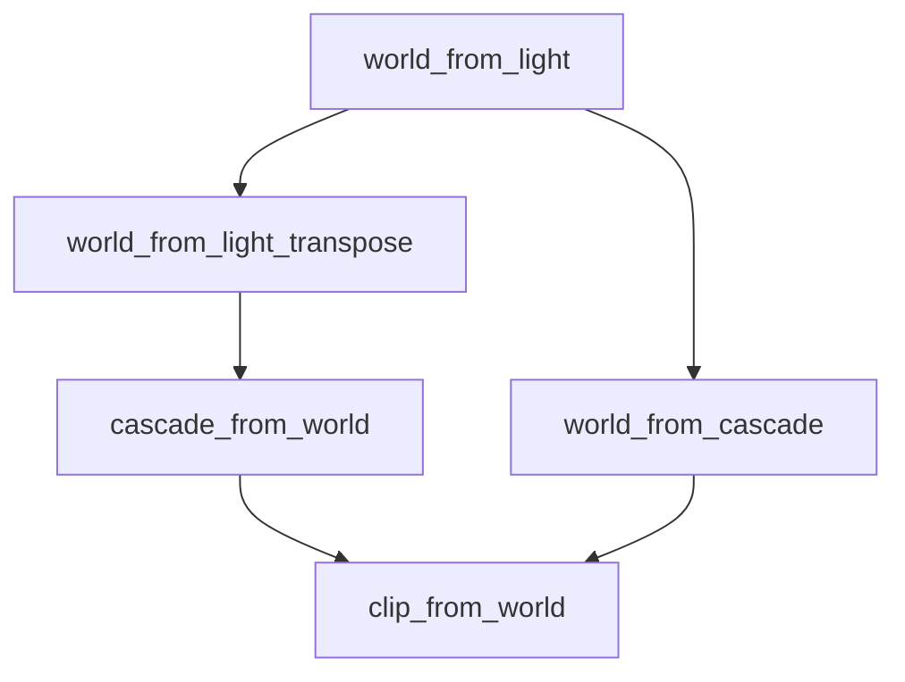

+++
title = "#20364 Precision Improvement in Cascade Transformation Calculation"
date = "2025-08-05T00:00:00"
draft = false
template = "pull_request_page.html"
in_search_index = true

[taxonomies]
list_display = ["show"]

[extra]
current_language = "en"
available_languages = {"en" = { name = "English", url = "/pull_request/bevy/2025-08/pr-20364-en-20250805" }, "zh-cn" = { name = "中文", url = "/pull_request/bevy/2025-08/pr-20364-zh-cn-20250805" }}
labels = ["A-Rendering"]
+++

## Title: Precision Improvement in Cascade Transformation Calculation

## Basic Information
- **Title**: compute world_from_cascade analytically
- **PR Link**: https://github.com/bevyengine/bevy/pull/20364
- **Author**: atlv24
- **Status**: MERGED
- **Labels**: A-Rendering, S-Ready-For-Final-Review
- **Created**: 2025-08-01T02:10:10Z
- **Merged**: 2025-08-05T18:04:34Z
- **Merged By**: alice-i-cecile

## Description Translation
# Objective

- doc comment says numeric inverse is avoided because of precision issues, but its still used in two places anyways (the other being fixed by #20359)
- dont do that lmao

## Solution

- calculate it manually instead of using a numeric inverse
- also rename some variables to match new x_from_y style while im at it

## Testing

- shadow biases example

## The Story of This Pull Request

### The Problem and Context
The cascade transformation calculation contained a contradiction. The documentation explicitly stated that numeric matrix inversion was avoided due to precision concerns, but the implementation still used `.inverse()` in two critical locations. One instance had been addressed in PR #20359, but the second remained in the cascade transformation calculation. This inconsistency created a risk of precision-related artifacts in shadow rendering, particularly for directional lights using cascaded shadow maps.

### The Solution Approach
The solution was straightforward: replace the numeric inverse with an analytical calculation. By constructing the `world_from_cascade` matrix directly using the light's transformation components, we avoid precision issues inherent in numerical inversion methods. Additionally, variable names were updated to follow the consistent `x_from_y` naming convention used elsewhere in the codebase.

### The Implementation
The key changes occurred in the cascade matrix calculation:
1. Renamed `light_to_world_transpose` to `world_from_light_transpose` for naming consistency
2. Constructed `world_from_cascade` analytically using:
   - The original light's basis vectors (x_axis, y_axis, z_axis)
   - The light-space transformation of the near plane center
3. Replaced `cascade_from_world.inverse()` with the precomputed `world_from_cascade`

This approach maintains the same mathematical result but achieves it through direct computation rather than numerical inversion.

### Technical Insights
The precision concern stems from how matrix inversion works with floating-point numbers. When cascades cover large view distances, small floating-point errors in the inverse calculation can cause visible artifacts ("shadow acne" or "peter panning"). The analytical solution avoids this by:
1. Preserving the orthogonal nature of the rotation matrix
2. Directly computing the translation component
3. Maintaining consistent coordinate system transformations

The change also improves consistency with the established `x_from_y` naming convention, where:
- `a_from_b` represents transformation from B-space to A-space
- This makes matrix multiplication order more intuitive: `a_from_c = a_from_b * b_from_c`

### The Impact
These changes provide concrete benefits:
1. **Precision Improvement**: Eliminates floating-point inaccuracies in cascade transformations
2. **Performance**: Avoids expensive matrix inversion operations
3. **Code Clarity**: 
   - More explicit matrix construction
   - Consistent naming convention
   - Removal of contradictory documentation
4. **Maintainability**: Reduces cognitive load by aligning with established patterns

The solution was verified using the shadow biases example, confirming artifact-free rendering after the changes.

## Visual Representation



## Key Files Changed

### `crates/bevy_light/src/cascade.rs` (+13/-7)
This file handles cascade calculations for directional light shadows. The changes replace numeric matrix inversion with direct analytical computation and improve naming consistency.

**Key changes:**
```rust
// Before:
// It is critical for `world_to_cascade` to be stable...
let light_to_world_transpose = world_from_light.transpose();
let cascade_from_world = Mat4::from_cols(
    light_to_world_transpose.x_axis,
    light_to_world_transpose.y_axis,
    light_to_world_transpose.z_axis,
    (-near_plane_center).extend(1.0),
);

// ... later in Cascade struct initialization
world_from_cascade: cascade_from_world.inverse(),

// After:
// It is critical for `cascade_from_world` to be stable...
let world_from_light_transpose = world_from_light.transpose();
let cascade_from_world = Mat4::from_cols(
    world_from_light_transpose.x_axis,
    world_from_light_transpose.y_axis,
    world_from_light_transpose.z_axis,
    (-near_plane_center).extend(1.0),
);
let world_from_cascade = Mat4::from_cols(
    world_from_light.x_axis,
    world_from_light.y_axis,
    world_from_light.z_axis,
    world_from_light * near_plane_center.extend(1.0),
);

// ... later in Cascade struct initialization
world_from_cascade,
```

**Relationship to PR purpose:**
- Directly computes `world_from_cascade` instead of using numeric inverse
- Renames variables to match `x_from_y` convention
- Maintains identical mathematical result with better precision

## Further Reading
1. [Matrix inversion precision considerations](https://en.wikipedia.org/wiki/Condition_number)
2. [Cascaded Shadow Maps overview](https://learnopengl.com/Guest-Articles/2021/CSM)
3. [Bevy rendering architecture](https://bevyengine.org/learn/book/getting-started/rendering/)