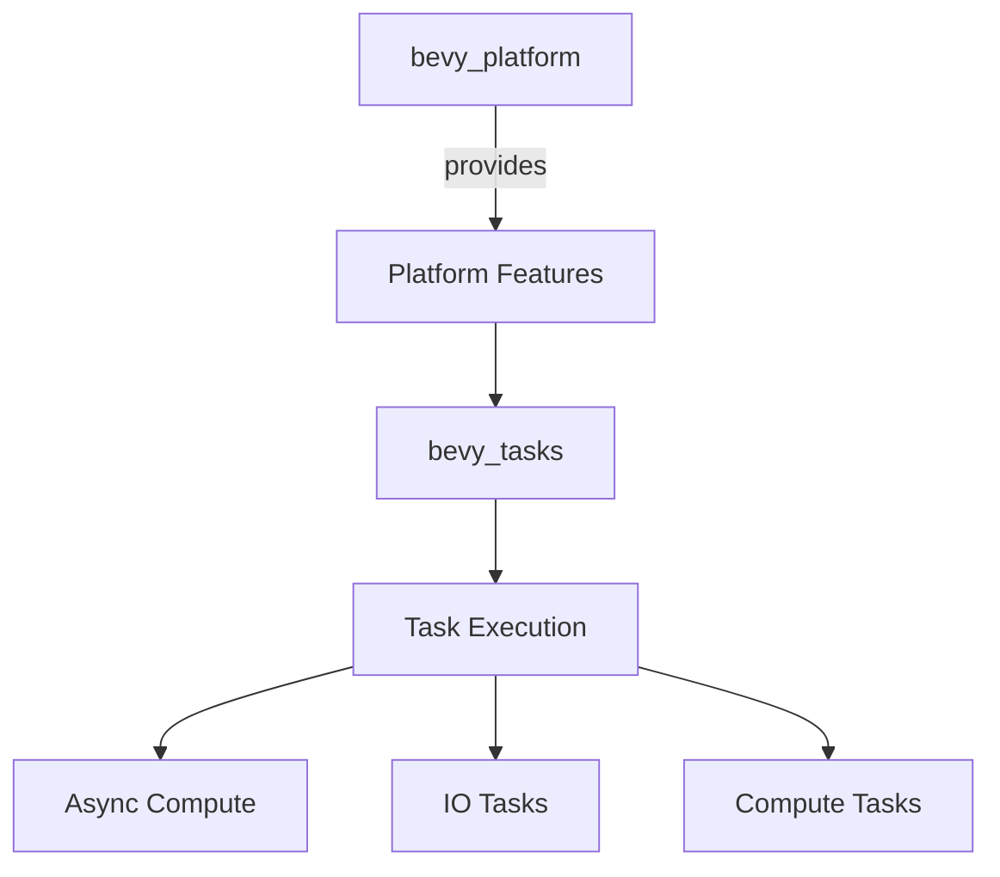

+++
title = "#20369 Clean `bevy_tasks` features (Adopted)"
date = "2025-08-03T00:00:00"
draft = false
template = "pull_request_page.html"
in_search_index = true

[taxonomies]
list_display = ["show"]

[extra]
current_language = "en"
available_languages = {"en" = { name = "English", url = "/pull_request/bevy/2025-08/pr-20369-en-20250803" }, "zh-cn" = { name = "中文", url = "/pull_request/bevy/2025-08/pr-20369-zh-cn-20250803" }}
labels = ["C-Code-Quality", "A-Tasks", "D-Straightforward"]
+++

### Clean `bevy_tasks` features (Adopted)

#### Basic Information
- **Title**: Clean `bevy_tasks` features (Adopted)
- **PR Link**: https://github.com/bevyengine/bevy/pull/20369
- **Author**: NthTensor
- **Status**: MERGED
- **Labels**: C-Code-Quality, S-Ready-For-Final-Review, A-Tasks, D-Straightforward
- **Created**: 2025-08-01T15:22:16Z
- **Merged**: 2025-08-03T19:46:49Z
- **Merged By**: alice-i-cecile

#### Description Translation
adopts https://github.com/bevyengine/bevy/pull/19091.  
Work in progress.

#### The Story of This Pull Request
The PR addresses feature entanglement in `bevy_tasks`, where multiple crates depended on its feature flags unnecessarily. This caused two main issues:  
1. Unclear feature boundaries made it difficult to reason about dependencies  
2. Conditional compilation logic was scattered and complex  

The solution centralizes platform-specific logic in `bevy_platform` and simplifies feature gating. Key changes include:  
- Migrating Wasm-specific dependencies (`wasm-bindgen-futures`, `js-sys`) to `bevy_platform`  
- Removing redundant `bevy_tasks` feature dependencies from 10+ crates  
- Introducing a structured `cfg` system for conditional compilation  

The implementation refactors `bevy_tasks` to use `bevy_platform`'s features as its foundation. For example, the `web` feature now relies entirely on `bevy_platform/web`:  

```rust
// crates/bevy_platform/Cargo.toml
[features]
web = [
  "std",
  "dep:web-time",
  "dep:getrandom",
  "dep:wasm-bindgen-futures",
  "dep:wasm-bindgen",
  "dep:js-sys",
]
```

This change cascaded through the task execution system. The `block_on` implementation now cleanly selects backends using feature flags:  

```rust
// crates/bevy_tasks/src/lib.rs
cfg::switch! {
    cfg::async_io => {
        pub use async_io::block_on;
    }
    cfg::futures_lite => {
        pub use futures_lite::future::block_on;
    }
    _ => {
        pub fn block_on<T>(future: impl Future<Output = T>) -> T {
            // Busy-wait fallback implementation
        }
    }
}
```

For Wasm support, the PR moves browser API handling to `bevy_platform::exports`, eliminating duplicate bindings. The `wasm_task` module now uses these centralized exports:  

```rust
// crates/bevy_tasks/src/wasm_task.rs
use bevy_platform::exports::wasm_bindgen_futures;
```

The impact is significant:  
- Removed 31 lines from `bevy_tasks/Cargo.toml`  
- Simplified feature requirements for dependent crates  
- Created clear boundaries between platform abstraction and task logic  
- Reduced Wasm-specific conditional checks in core task code  

A key insight was that task execution shouldn't dictate platform abstraction. By inverting this relationship, the PR achieves better separation of concerns. Future improvements could extend this pattern to other cross-cutting concerns like threading primitives.

#### Visual Representation


#### Key Files Changed
1. **`crates/bevy_tasks/Cargo.toml`** (+19/-31)  
   Simplified feature definitions and dependencies:  
   ```toml
   # Before:
   std = ["futures-lite/std", "async-task/std", ...]
   web = ["bevy_platform/web", "dep:wasm-bindgen-futures", ...]
   
   # After:
   async_executor = ["bevy_platform/std", "dep:async-executor"]
   web = [] # Now handled by bevy_platform
   ```
   Removed redundant dependencies and aligned features with `bevy_platform`.

2. **`crates/bevy_tasks/src/lib.rs`** (+105/-53)  
   Introduced new `cfg` module for conditional compilation:  
   ```rust
   pub mod cfg {
       pub use bevy_platform::cfg::*;
       // Feature-specific conditionals
   }
   ```
   Unified `available_parallelism()` using cfg switches:  
   ```rust
   pub fn available_parallelism() -> usize {
       cfg::switch! {{
           cfg::std => { /* std implementation */ }
           _ => 1
       }}
   }
   ```

3. **`crates/bevy_tasks/src/wasm_task.rs`** (+19/-13)  
   Simplified Wasm bindings using centralized exports:  
   ```rust
   // Before:
   #[cfg(all(target_arch = "wasm32", feature = "web"))]
   use wasm_bindgen_futures;
   
   // After:
   use bevy_platform::exports::wasm_bindgen_futures;
   ```

4. **`crates/bevy_platform/src/lib.rs`**  
   Added exports module for platform-specific bindings:  
   ```rust
   pub mod exports {
       cfg::web! {
           pub use js_sys;
           pub use wasm_bindgen;
       }
   }
   ```

5. **`crates/bevy_tasks/src/usages.rs`** (+25/-22)  
   Conditionally compiled task pool ticking:  
   ```rust
   cfg::web! {
       if {} else {
           pub fn tick_global_task_pools_on_main_thread() {
               // Core ticking logic
           }
       }
   }
   ```

#### Further Reading
1. [Bevy Engine Tasks Documentation](https://docs.rs/bevy_tasks/latest/bevy_tasks/)  
2. [Rust Conditional Compilation](https://doc.rust-lang.org/reference/conditional-compilation.html)  
3. [Async Executor Design Patterns](https://rust-lang.github.io/async-book/02_execution/04_executor.html)