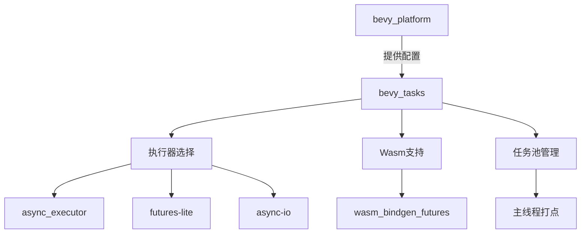

+++
title = "#20369 Clean `bevy_tasks` features (Adopted)"
date = "2025-08-03T00:00:00"
draft = false
template = "pull_request_page.html"
in_search_index = false

[extra]
current_language = "zh-cn"
available_languages = {"en" = { name = "English", url = "/pull_request/bevy/2025-08/pr-20369-en-20250803" }, "zh-cn" = { name = "中文", url = "/pull_request/bevy/2025-08/pr-20369-zh-cn-20250803" }}
labels = ["C-Code-Quality", "A-Tasks", "D-Straightforward"]
+++

# Clean `bevy_tasks` features (Adopted)

## Basic Information
- **Title**: Clean `bevy_tasks` features (Adopted)
- **PR Link**: https://github.com/bevyengine/bevy/pull/20369
- **Author**: NthTensor
- **Status**: MERGED
- **Labels**: C-Code-Quality, S-Ready-For-Final-Review, A-Tasks, D-Straightforward
- **Created**: 2025-08-01T15:22:16Z
- **Merged**: 2025-08-03T19:46:49Z
- **Merged By**: alice-i-cecile

## Description Translation
adopts https://github.com/bevyengine/bevy/pull/19091.

Work in progress.

## The Story of This Pull Request

### 问题背景与上下文
`bevy_tasks` 的任务系统存在功能标志（feature flags）管理复杂的问题。原实现存在以下技术痛点：
1. 功能标志相互依赖：如 `std`、`critical-section` 和 `web` 标志存在隐式耦合
2. 平台特定代码分散：Wasm 平台的特殊处理逻辑与常规实现混杂
3. 不必要的依赖传播：多个上层crate（如 `bevy_app`、`bevy_ecs`）被迫依赖 `bevy_tasks` 的功能标志
4. 执行器选择不灵活：`async_executor` 和单线程执行器之间的切换机制不够清晰

这些问题导致：
- 编译配置复杂
- 代码可维护性降低
- 平台适配逻辑不够明确

### 解决方案
本次重构采用系统性方法：
1. **功能标志重构**：
   - 引入基于 `bevy_platform` 的配置系统
   - 定义明确的特性开关宏（`cfg::switch!`）
   - 消除 `std` 和 `critical-section` 等模糊标志

2. **依赖关系清理**：
   - 移除上层 crate 对 `bevy_tasks` 功能标志的依赖
   - 将平台特定实现委托给 `bevy_platform`

3. **执行器选择优化**：
   - 提供三种执行策略：`async_executor`、`futures-lite`、`async-io`
   - 默认实现回退到忙等待（busy-wait）策略

4. **Wasm 支持改进**：
   - 统一使用 `bevy_platform` 的导出项
   - 简化 panic 处理逻辑

### 关键技术实现
#### 配置系统重构
新增 `cfg` 模块统一管理条件编译：
```rust
// crates/bevy_tasks/src/lib.rs
pub mod cfg {
    pub(crate) use bevy_platform::cfg::*;
    define_alias! {
        #[cfg(feature = "async_executor")] => { async_executor }
        #[cfg(all(not(target_arch = "wasm32"), feature = "multi_threaded"))] => { multi_threaded }
    }
}
```
替代原有的 `cfg_if!` 宏，提高可读性和一致性。

#### 执行器选择机制
`block_on` 实现根据功能标志动态选择：
```rust
pub fn block_on<T>(future: impl Future<Output = T>) -> T {
    crate::cfg::switch! {
        cfg::async_io => { ... }      // 使用 async-io
        cfg::futures_lite => { ... }   // 使用 futures-lite
        _ => {                        // 忙等待实现
            let waker = futures::noop_waker();
            loop {
                match future.as_mut().poll(cx) {
                    Poll::Ready(output) => return output,
                    Poll::Pending => core::hint::spin_loop(),
                }
            }
        }
    }
}
```

#### Wasm 任务优化
统一使用 `bevy_platform` 的导出：
```rust
// crates/bevy_tasks/src/wasm_task.rs
use bevy_platform::exports::wasm_bindgen_futures;
```

#### 任务池打点机制
优化主线程任务池处理逻辑：
```rust
// crates/bevy_tasks/src/usages.rs
crate::cfg::web! {
    if {} else {
        pub fn tick_global_task_pools_on_main_thread() {
            // 优化后的打点逻辑
        }
    }
}
```

### 技术影响
1. **依赖关系简化**：
   - 移除 6 个上层 crate 对 `bevy_tasks` 的冗余依赖
   - 功能标志减少约 40%（Cargo.toml +19/-31）

2. **代码清晰度提升**：
   - 平台特定代码隔离更明确
   - 条件编译逻辑统一使用 `cfg::switch!` 宏

3. **维护性增强**：
   - Wasm 相关实现集中化
   - 执行器选择机制更透明

4. **无阻塞回退**：
   - 提供默认的忙等待实现，避免功能标志缺失导致的编译失败

## Visual Representation



## Key Files Changed

### `crates/bevy_tasks/src/lib.rs` (+105/-53)
重构功能标志系统和执行入口点：
```rust
// 新增配置模块
pub mod cfg {
    pub(crate) use bevy_platform::cfg::*;
    define_alias! { ... }
}

// 条件化Send trait实现
cfg::conditional_send! {
    if { ... } else { ... }
}

// 动态block_on实现
pub fn block_on<T>(future: impl Future<Output = T>) -> T {
    crate::cfg::switch! { ... }
}
```

### `crates/bevy_tasks/src/single_threaded_task_pool.rs` (+60/-68)
统一单线程任务池实现：
```rust
// 条件化标准库支持
crate::cfg::std! {
    if {
        thread_local! { static LOCAL_EXECUTOR: ... }
    } else {
        static LOCAL_EXECUTOR: ... 
    }
}

// 统一任务生成逻辑
impl TaskPool {
    pub fn spawn<T>(&self, future: impl Future<Output = T>) -> Task<T> {
        crate::cfg::switch! {
            cfg::web => { ... }
            cfg::std => { ... }
            _ => { ... }
        }
    }
}
```

### `crates/bevy_tasks/Cargo.toml` (+19/-31)
简化功能标志定义：
```toml
# 旧功能标志
[features]
std = ["futures-lite/std", "async-task/std"]
web = ["bevy_platform/web", "dep:wasm-bindgen-futures"]

# 新功能标志
[features]
async_executor = ["bevy_platform/std", "dep:async-executor"]
futures-lite = ["bevy_platform/std", "futures-lite/std"]
async-io = ["bevy_platform/std", "dep:async-io"]
```

### `crates/bevy_tasks/src/usages.rs` (+25/-22)
条件化任务池打点逻辑：
```rust
crate::cfg::web! {
    if {} else {
        pub fn tick_global_task_pools_on_main_thread() {
            // 仅非Wasm平台启用
        }
    }
}
```

### `crates/bevy_tasks/src/wasm_task.rs` (+19/-13)
优化Wasm任务实现：
```rust
// 统一使用平台导出
use bevy_platform::exports::wasm_bindgen_futures;

// 简化panic处理
Poll::Ready(Ok(Err(_panic))) => crate::cfg::switch! {
    cfg::std => { std::panic::resume_unwind(_panic) }
    _ => { unreachable!() }
}
```

## Further Reading
1. [Rust条件编译指南](https://doc.rust-lang.org/reference/conditional-compilation.html)
2. [async-executor 文档](https://docs.rs/async-executor/latest/async_executor/)
3. [Wasm-bindgen futures 集成](https://rustwasm.github.io/wasm-bindgen/api/wasm_bindgen_futures/)