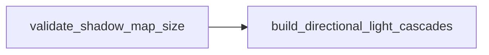

+++
title = "#20375 Validate directional light shadow map size is power of two"
date = "2025-08-05T00:00:00"
draft = false
template = "pull_request_page.html"
in_search_index = true

[taxonomies]
list_display = ["show"]

[extra]
current_language = "en"
available_languages = {"en" = { name = "English", url = "/pull_request/bevy/2025-08/pr-20375-en-20250805" }, "zh-cn" = { name = "中文", url = "/pull_request/bevy/2025-08/pr-20375-zh-cn-20250805" }}
labels = ["A-Rendering"]
+++

# Validate directional light shadow map size is power of two

## Basic Information
- **Title**: Validate directional light shadow map size is power of two
- **PR Link**: https://github.com/bevyengine/bevy/pull/20375
- **Author**: atlv24
- **Status**: MERGED
- **Labels**: A-Rendering, S-Ready-For-Final-Review
- **Created**: 2025-08-02T02:31:58Z
- **Merged**: 2025-08-05T19:29:49Z
- **Merged By**: alice-i-cecile

## Description Translation
# Objective

- cascade construction code assumes shadowmap sizes are power of two
- this invariant is not enforced anywhere

## Solution

- automatically correct and warn when its not POT
- document

## Testing

- tried setting it to non-pot in shadow_biases example:
```
2025-08-02T02:30:44.379967Z  WARN bevy_light::directional_light: Non-power-of-two DirectionalLightShadowMap sizes are not supported, correcting 2442 to 4096
```

## The Story of This Pull Request

The cascade shadow mapping implementation for directional lights in Bevy relies on shadow map sizes being powers of two. This requirement comes from how cascade positioning calculations work - they assume that texture dimensions follow power-of-two constraints to maintain stable positioning and avoid rendering artifacts. However, this invariant wasn't enforced anywhere in the codebase, meaning users could configure non-power-of-two sizes that would lead to undefined behavior in the cascade construction logic.

To address this, the PR introduces an explicit validation step. When a `DirectionalLightShadowMap` resource is modified, a new system `validate_shadow_map_size` checks if its `size` property is a power of two. If not, it automatically corrects the value to the next highest power of two and logs a warning. This ensures the invariant holds before the cascade building system runs, preventing potential rendering issues.

The solution was implemented with minimal overhead. The validation system runs only when the shadow map size changes (`is_changed()`), and uses Rust's built-in `is_power_of_two()` and `next_power_of_two()` methods for efficient computation. The warning message clearly indicates both the invalid value and the corrected value, helping users understand why their configuration was modified.

Additionally, the PR documents this requirement in the `DirectionalLightShadowMap` struct's doc comment. This helps users understand the constraint without needing to dig into implementation details, improving the API's usability.

For testing, the author verified the solution by setting a non-power-of-two value (2442) in the shadow_biases example. As expected, the system detected the invalid size, corrected it to 4096 (the next power of two), and logged the warning shown in the PR description.

This change improves the rendering system's robustness by enforcing a critical invariant that was previously implicit. It prevents subtle rendering artifacts that could occur with non-power-of-two shadow map sizes while maintaining backward compatibility through automatic correction.

## Visual Representation



## Key Files Changed

1. `crates/bevy_light/src/directional_light.rs` (+11/-0)
   - Added validation function and documented size requirement
   - Key changes:
```rust
pub struct DirectionalLightShadowMap {
    // The width and height of each cascade.
    ///
    /// Must be a power of two to avoid unstable cascade positioning.
    ///
    /// Defaults to `2048`.
    pub size: usize,
}

pub fn validate_shadow_map_size(mut shadow_map: ResMut<DirectionalLightShadowMap>) {
    if shadow_map.is_changed() && !shadow_map.size.is_power_of_two() {
        let new_size = shadow_map.size.next_power_of_two();
        warn!("Non-power-of-two DirectionalLightShadowMap sizes are not supported, correcting {} to {new_size}", shadow_map.size);
        shadow_map.size = new_size;
    }
}
```

2. `crates/bevy_light/src/lib.rs` (+3/-0)
   - Integrated validation into system schedule
   - Key change:
```rust
use crate::directional_light::validate_shadow_map_size;

impl Plugin for LightPlugin {
    fn build(&self, app: &mut App) {
        app.add_systems(
            PostUpdate,
            (
                validate_shadow_map_size.before(build_directional_light_cascades),
                // ... other systems
            ),
        );
    }
}
```

## Further Reading
1. [Power of Two Textures in Graphics Programming](https://www.khronos.org/opengl/wiki/Common_Mistakes#Texture_Power_of_Two)
2. [Bevy's Lighting Documentation](https://bevyengine.org/learn/book/features/rendering/lighting/)
3. [Rust's integer power methods](https://doc.rust-lang.org/std/primitive.u32.html#method.is_power_of_two)