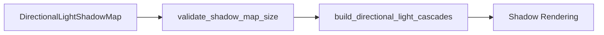

+++
title = "#20375 Validate directional light shadow map size is power of two"
date = "2025-08-05T00:00:00"
draft = false
template = "pull_request_page.html"
in_search_index = false

[extra]
current_language = "zh-cn"
available_languages = {"en" = { name = "English", url = "/pull_request/bevy/2025-08/pr-20375-en-20250805" }, "zh-cn" = { name = "中文", url = "/pull_request/bevy/2025-08/pr-20375-zh-cn-20250805" }}
+++

## 技术报告：验证定向光源阴影贴图尺寸为2的幂次

### 基础信息
- **标题**: Validate directional light shadow map size is power of two
- **PR链接**: https://github.com/bevyengine/bevy/pull/20375
- **作者**: atlv24
- **状态**: 已合并
- **标签**: A-Rendering, S-Ready-For-Final-Review
- **创建时间**: 2025-08-02T02:31:58Z
- **合并时间**: 2025-08-05T19:29:49Z
- **合并者**: alice-i-cecile

### 描述翻译
#### 目标
- 级联(cascade)构建代码假设阴影贴图(shadowmap)尺寸是2的幂次(power of two)
- 此约束条件未在任何地方强制实施

#### 解决方案
- 当尺寸非2的幂次时自动校正并发出警告
- 添加文档说明

#### 测试
- 在shadow_biases示例中尝试设置为非2的幂次值：
```
2025-08-02T02:30:44.379967Z  WARN bevy_light::directional_light: Non-power-of-two DirectionalLightShadowMap sizes are not supported, correcting 2442 to 4096
```

### PR技术分析

#### 问题背景
在Bevy渲染系统中，定向光源(directional light)的阴影贴图使用级联阴影映射(CSM)技术。级联构建逻辑隐式依赖阴影贴图尺寸为2的幂次(power of two/POT)的特性，但代码中未强制此约束。当开发者设置非POT尺寸时，会导致级联位置计算不稳定，产生不可预测的渲染问题。

#### 解决方案实现
PR通过添加运行时验证和自动校正机制解决该问题：
1. 在`DirectionalLightShadowMap`结构体的文档中明确POT要求
2. 创建验证函数`validate_shadow_map_size`检查尺寸
3. 当检测到非POT尺寸时：
   - 自动校正为最接近的POT值
   - 输出警告日志提示修正
4. 将验证函数集成到光照系统管线中

关键验证逻辑：
```rust
pub fn validate_shadow_map_size(mut shadow_map: ResMut<DirectionalLightShadowMap>) {
    if shadow_map.is_changed() && !shadow_map.size.is_power_of_two() {
        let new_size = shadow_map.size.next_power_of_two();
        warn!("Non-power-of-two DirectionalLightShadowMap sizes are not supported, correcting {} to {new_size}", shadow_map.size);
        shadow_map.size = new_size;
    }
}
```

#### 技术决策考量
1. **自动校正而非报错**：选择自动升级到下一个POT值而非直接报错，避免应用崩溃
2. **变更时检查**：通过`is_changed()`确保仅在配置修改时触发验证
3. **日志级别**：使用`warn!`而非`error!`，允许非POT值但提示潜在问题
4. **执行顺序**：在级联构建系统前执行验证(`before(build_directional_light_cascades)`)

#### 影响与改进
1. **稳定性提升**：消除级联位置计算对非POT尺寸的敏感依赖
2. **开发者体验**：
   - 文档明确API约束
   - 运行时提示避免静默失败
3. **性能影响**：验证开销可忽略，仅在校改时触发
4. **防御性编程**：通过系统顺序约束保证级联构建前完成验证

### 组件关系图



### 关键文件变更

#### crates/bevy_light/src/directional_light.rs
**变更目的**：添加阴影贴图尺寸验证逻辑和文档说明

```rust
// 新增文档说明POT要求
pub struct DirectionalLightShadowMap {
    /// The width and height of each cascade.
    ///
    /// Must be a power of two to avoid unstable cascade positioning.
    ///
    /// Defaults to `2048`.
    pub size: usize,
}

// 新增验证函数
pub fn validate_shadow_map_size(mut shadow_map: ResMut<DirectionalLightShadowMap>) {
    if shadow_map.is_changed() && !shadow_map.size.is_power_of_two() {
        let new_size = shadow_map.size.next_power_of_two();
        warn!("Non-power-of-two DirectionalLightShadowMap sizes are not supported, correcting {} to {new_size}", shadow_map.size);
        shadow_map.size = new_size;
    }
}
```

#### crates/bevy_light/src/lib.rs
**变更目的**：将验证系统集成到光照处理管线

```rust
// 引入验证函数
use crate::directional_light::validate_shadow_map_size;

impl Plugin for LightPlugin {
    fn build(&self, app: &mut App) {
        app.add_systems(
            PostUpdate,
            (
                // 在级联构建前插入验证
                validate_shadow_map_size.before(build_directional_light_cascades),
                // ...原有系统...
            ),
        );
    }
}
```

### 延伸阅读
1. **级联阴影映射原理**：
   - [MSDN：级联阴影贴图](https://learn.microsoft.com/en-us/windows/win32/dxtecharts/cascaded-shadow-maps)
2. **Power-of-Two纹理优势**：
   - [OpenGL Wiki：纹理最佳实践](https://www.khronos.org/opengl/wiki/Texture)
3. **Bevy光照系统**：
   - [Bevy光照文档](https://github.com/bevyengine/bevy/blob/main/crates/bevy_light/README.md)