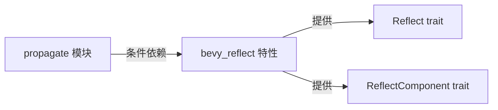

+++
title = "#20382 fix reflect import in bevy_app propagate"
date = "2025-08-02T00:00:00"
draft = false
template = "pull_request_page.html"
in_search_index = false

[extra]
current_language = "zh-cn"
available_languages = {"en" = { name = "English", url = "/pull_request/bevy/2025-08/pr-20382-en-20250802" }, "zh-cn" = { name = "中文", url = "/pull_request/bevy/2025-08/pr-20382-zh-cn-20250802" }}
+++

# 修复 bevy_app propagate 模块中的反射导入问题

## 基础信息
- **标题**: fix reflect import in bevy_app propagate
- **PR链接**: https://github.com/bevyengine/bevy/pull/20382
- **作者**: mockersf
- **状态**: 已合并
- **标签**: C-Code-Quality, A-App
- **创建时间**: 2025-08-02T09:30:28Z
- **合并时间**: 2025-08-02T17:58:55Z
- **合并人**: james7132

## 问题描述翻译
### 目标
修复在禁用默认功能时构建 bevy_app 的问题

### 解决方案
自 https://github.com/bevyengine/bevy/pull/20197 后，部分反射导入未正确进行功能开关控制

### 测试方法
```
cargo build --package bevy_app --no-default-features
```

## 问题解决过程

### 问题背景
在 #20197 PR 合并后，`bevy_app` crate 的 `propagate` 模块引入了一个构建问题：当用户使用 `--no-default-features` 标志禁用默认功能集时，构建会失败。具体原因是该模块无条件导入了 `bevy_reflect` 相关组件，而 `bevy_reflect` 属于默认功能集的一部分，在禁用默认功能时不可用。

这个问题影响了用户定制化构建的能力，特别是那些需要最小化依赖或针对特定平台优化的场景。在禁用默认功能时，构建会因缺少 `ReflectComponent` 和 `Reflect` 的导入而失败。

### 解决方案
解决方案的核心是添加条件编译属性(`#[cfg(feature = "bevy_reflect")]`)，确保反射相关的导入只在启用 `bevy_reflect` 功能时才被包含。具体修改包括：

1. 将 `ReflectComponent` 的导入移出 `bevy_ecs` 的批量导入语句
2. 为 `ReflectComponent` 和 `bevy_reflect::Reflect` 分别添加条件编译属性
3. 确保反射相关的导入语句只在 `bevy_reflect` 功能启用时生效

### 实现细节
关键修改集中在 `propagate.rs` 文件的导入部分。原实现中反射组件的导入是无条件的：

```rust
use bevy_ecs::{
    // ...
    reflect::ReflectComponent,  // 无条件导入
    // ...
};
```

修改后，反射相关的导入被提取出来并添加了条件编译控制：

```rust
#[cfg(feature = "bevy_reflect")]
use bevy_ecs::reflect::ReflectComponent;

use bevy_ecs::{
    // ...
    // 移除了 reflect::ReflectComponent
    // ...
};

#[cfg(feature = "bevy_reflect")]
use bevy_reflect::Reflect;
```

这种处理方式确保了：
- 当 `bevy_reflect` 功能启用时，所有反射组件正常导入
- 当禁用默认功能（即不启用 `bevy_reflect`）时，相关导入被完全排除
- 不影响模块内其他功能的正常编译

### 技术考量
这个修复涉及几个重要的工程决策：
1. **精准的条件编译**：仅对反射相关的导入添加 `#[cfg]` 属性，不影响其他功能
2. **最小改动原则**：不改变现有逻辑，只调整导入方式
3. **后向兼容**：确保在启用默认功能时行为不变
4. **编译时安全**：通过条件编译完全消除未使用功能的编译错误

这种处理方式遵循了 Rust 的条件编译最佳实践，特别是在处理可选依赖时。通过将可选组件的导入隔离到独立的语句中，代码保持了清晰性和可维护性。

### 验证方法
作者通过以下命令验证修复效果：
```bash
cargo build --package bevy_app --no-default-features
```
这个命令直接模拟了用户禁用默认功能时的构建场景，是最直接的验证方式。成功构建确认了反射导入已被正确隔离。

### 影响与意义
这个修复：
1. 恢复了 `bevy_app` 在禁用默认功能时的构建能力
2. 确保了功能开关的严格边界
3. 维护了框架的模块化设计原则
4. 减少了用户定制化构建的障碍

对于需要精简依赖或特定功能组合的用户，这个修复至关重要。它体现了良好维护的功能开关对库的可用性的重要性。

## 组件关系图



## 关键文件变更

### `crates/bevy_app/src/propagate.rs`
**变更原因**：修复在禁用默认功能时由反射导入导致的构建失败问题

**关键修改**：
```diff
// 变更前
use alloc::vec::Vec;
use core::marker::PhantomData;

use crate::{App, Plugin, Update};
use bevy_ecs::{
    component::Component,
    entity::Entity,
    hierarchy::ChildOf,
    lifecycle::RemovedComponents,
    query::{Changed, Or, QueryFilter, With, Without},
    reflect::ReflectComponent,  // 无条件导入
    relationship::{Relationship, RelationshipTarget},
    schedule::{IntoScheduleConfigs, SystemSet},
    system::{Commands, Local, Query},
};

// 变更后
use alloc::vec::Vec;
use core::marker::PhantomData;

use crate::{App, Plugin, Update};
+#[cfg(feature = "bevy_reflect")]
+use bevy_ecs::reflect::ReflectComponent;
use bevy_ecs::{
    component::Component,
    entity::Entity,
    hierarchy::ChildOf,
    lifecycle::RemovedComponents,
    query::{Changed, Or, QueryFilter, With, Without},
-    reflect::ReflectComponent,  // 已移除
    relationship::{Relationship, RelationshipTarget},
    schedule::{IntoScheduleConfigs, SystemSet},
    system::{Commands, Local, Query},
};
+#[cfg(feature = "bevy_reflect")]
+use bevy_reflect::Reflect;
```

**关联说明**：
- 将 `ReflectComponent` 导入移出批量导入语句并添加条件编译
- 新增条件化的 `bevy_reflect::Reflect` 导入
- 这些修改共同确保反射组件只在启用相关功能时导入

## 延伸阅读
1. [Rust 条件编译文档](https://doc.rust-lang.org/reference/conditional-compilation.html) - 了解 `#[cfg]` 属性的使用
2. [Cargo 特性指南](https://doc.rust-lang.org/cargo/reference/features.html) - 掌握 Cargo 功能管理机制
3. [Bevy 插件系统](https://bevyengine.org/learn/book/getting-started/plugins/) - 理解 Bevy 的模块化架构
4. [原始问题 PR #20197](https://github.com/bevyengine/bevy/pull/20197) - 导致本问题的先前修改

## 完整代码变更
```diff
diff --git a/crates/bevy_app/src/propagate.rs b/crates/bevy_app/src/propagate.rs
index 4c130df21a882..d851f0dd38402 100644
--- a/crates/bevy_app/src/propagate.rs
+++ b/crates/bevy_app/src/propagate.rs
@@ -2,17 +2,19 @@ use alloc::vec::Vec;
 use core::marker::PhantomData;
 
 use crate::{App, Plugin, Update};
+#[cfg(feature = "bevy_reflect")]
+use bevy_ecs::reflect::ReflectComponent;
 use bevy_ecs::{
     component::Component,
     entity::Entity,
     hierarchy::ChildOf,
     lifecycle::RemovedComponents,
     query::{Changed, Or, QueryFilter, With, Without},
-    reflect::ReflectComponent,
     relationship::{Relationship, RelationshipTarget},
     schedule::{IntoScheduleConfigs, SystemSet},
     system::{Commands, Local, Query},
 };
+#[cfg(feature = "bevy_reflect")]
 use bevy_reflect::Reflect;
 
 /// Plugin to automatically propagate a component value to all direct and transient relationship
```