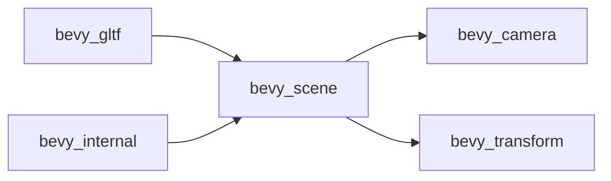

+++
title = "#20388 dont depend on bevy_render in bevy_scene"
date = "2025-08-03T00:00:00"
draft = false
template = "pull_request_page.html"
in_search_index = true

[taxonomies]
list_display = ["show"]

[extra]
current_language = "en"
available_languages = {"en" = { name = "English", url = "/pull_request/bevy/2025-08/pr-20388-en-20250803" }, "zh-cn" = { name = "中文", url = "/pull_request/bevy/2025-08/pr-20388-zh-cn-20250803" }}
labels = ["D-Trivial", "A-Rendering", "C-Dependencies", "A-Scenes"]
+++

### Title  
**Dependency Refactoring: Decoupling `bevy_scene` from `bevy_render`**

---

### Basic Information  
- **Title**: dont depend on bevy_render in bevy_scene  
- **PR Link**: https://github.com/bevyengine/bevy/pull/20388  
- **Author**: atlv24  
- **Status**: MERGED  
- **Labels**: D-Trivial, A-Rendering, C-Dependencies, S-Ready-For-Final-Review, A-Scenes  
- **Created**: 2025-08-02T23:53:39Z  
- **Merged**: 2025-08-03T01:12:45Z  
- **Merged By**: alice-i-cecile  

---

### Description Translation  
**Objective**  
- Remove `bevy_render` dependency from `bevy_scene`  

**Solution**  
- Remove `bevy_render` dependency from `bevy_scene`  

**Testing**  
- `cargo check --examples`  

---

### The Story of This Pull Request  
#### Problem and Context  
`bevy_scene` unnecessarily depended on `bevy_render` solely to access the `Visibility` component. This created two issues:  
1. **Dependency bloat**: Projects using `bevy_scene` without rendering (e.g., headless servers) pulled in rendering infrastructure.  
2. **Feature entanglement**: Conditional compilation (`#[cfg(feature = "bevy_render")]`) complicated component requirements.  

The `Visibility` component is actually defined in `bevy_camera` – a lighter, more appropriate dependency for scene management.  

#### Solution Approach  
1. Replace `bevy_render` with `bevy_camera` in `bevy_scene`'s dependencies.  
2. Unconditionally require `Visibility` for scene roots, simplifying component logic.  
3. Propagate dependency cleanup to downstream crates (`bevy_gltf`, `bevy_internal`).  

#### Implementation  
The changes focus on dependency declarations and component requirements:  

**Dependency Cleanup**  
- Removed `bevy_render` from `bevy_scene`'s `[dependencies]` and `[features]`.  
- Added `bevy_camera` as a direct dependency.  
- Updated downstream crates to reflect the simplified dependency chain.  

**Component Simplification**  
- Replaced conditional `bevy_render` imports with unconditional `bevy_camera::visibility::Visibility`.  
- Removed `#[cfg_attr(feature = "bevy_render", ...)]` guards from `SceneRoot` and `DynamicSceneRoot`.  
- Enforced `Visibility` requirement unconditionally using `#[require(Visibility)]`.  

#### Technical Insights  
- **Architectural decoupling**: Moves `bevy_scene` toward renderer-agnosticism.  
- **Compilation impact**: Reduces binary size and compile times for non-rendering use cases.  
- **Future-proofing**: Unconditional `Visibility` requirement aligns with Bevy's "explicit components" philosophy.  

#### Impact  
- **Reduced dependencies**: `bevy_scene` now has zero rendering dependencies.  
- **Simpler component contracts**: Clearer requirements for `SceneRoot`/`DynamicSceneRoot`.  
- **Downstream simplification**: `bevy_gltf` and `bevy_internal` inherit cleaner dependencies.  

---

### Visual Representation  


---

### Key Files Changed  
#### 1. `crates/bevy_scene/Cargo.toml`  
**Changes**:  
- Replaced `bevy_render` with `bevy_camera`  
- Removed `bevy_render` feature flag  

```toml
# Before:
[dependencies]
bevy_render = { path = "../bevy_render", optional = true }

[features]
serialize = [ "bevy_render?/serialize" ]

# After:
[dependencies]
bevy_camera = { path = "../bevy_camera" }  # Added

[features]
serialize = []  # Removed bevy_render reference
```

#### 2. `crates/bevy_scene/src/components.rs`  
**Changes**:  
- Switched to `bevy_camera`'s `Visibility`  
- Removed conditional compilation  

```rust
// Before:
#[cfg(feature = "bevy_render")]
use bevy_render::view::visibility::Visibility;

#[cfg_attr(feature = "bevy_render", require(Visibility))]

// After:
use bevy_camera::visibility::Visibility;  // Unconditional import

#[require(Visibility)]  // Unconditional requirement
```

#### 3. `crates/bevy_gltf/Cargo.toml`  
**Changes**:  
- Removed forced `bevy_render` feature in `bevy_scene` dependency  

```toml
# Before:
bevy_scene = { features = ["bevy_render"] }

# After:
bevy_scene = {}  # No special features
```

#### 4. `crates/bevy_internal/Cargo.toml`  
**Changes**:  
- Removed obsolete feature coupling  

```toml
# Before:
bevy_render = [ "bevy_scene?/bevy_render" ]

# After:
bevy_render = []  # Removed conditional
```

---

### Further Reading  
1. [Bevy's ECS Architecture](https://bevyengine.org/learn/book/getting-started/ecs/)  
2. [Cargo Feature Flags Guide](https://doc.rust-lang.org/cargo/reference/features.html)  
3. [Component Inheritance in Bevy](https://bevyengine.org/examples/ECS/component-inheritance/)