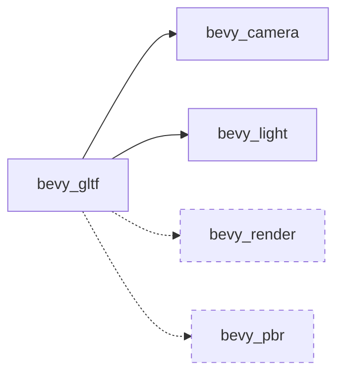

+++
title = "#20390 reduce bevy_gltf dependency on render and pbr"
date = "2025-08-03T00:00:00"
draft = false
template = "pull_request_page.html"
in_search_index = true

[taxonomies]
list_display = ["show"]

[extra]
current_language = "en"
available_languages = {"en" = { name = "English", url = "/pull_request/bevy/2025-08/pr-20390-en-20250803" }, "zh-cn" = { name = "中文", url = "/pull_request/bevy/2025-08/pr-20390-zh-cn-20250803" }}
labels = ["A-Rendering", "C-Code-Quality", "A-Scenes", "D-Straightforward"]
+++

## PR Analysis: reduce bevy_gltf dependency on render and pbr

### Basic Information
- **Title**: reduce bevy_gltf dependency on render and pbr
- **PR Link**: https://github.com/bevyengine/bevy/pull/20390
- **Author**: atlv24
- **Status**: MERGED
- **Labels**: A-Rendering, C-Code-Quality, S-Ready-For-Final-Review, A-Scenes, X-Uncontroversial, D-Straightforward
- **Created**: 2025-08-03T00:40:42Z
- **Merged**: 2025-08-03T06:51:02Z
- **Merged By**: james7132

### Description Translation
# Objective
- make bevy_gltf not depend on bevy_render/bevy_pbr

## Solution
- use bevy_light and bevy_camera

## Testing
- cargo check --examples

### The Story of This Pull Request

The GLTF loader in Bevy (`bevy_gltf`) historically depended on both `bevy_render` and `bevy_pbr` for camera and lighting components. This created unnecessary coupling - the GLTF format describes scene data (cameras, lights, meshes) independently of rendering implementation details. 

The problem became apparent during maintenance and potential future extensions. For example:
1. `bevy_gltf` shouldn't require knowledge of PBR-specific lighting implementations
2. Camera components belong in a dedicated camera module
3. Unnecessary dependencies increase compile times and binary size

The solution was straightforward: relocate component imports to more appropriate crates. Instead of pulling camera components from `bevy_render`, we now import them from `bevy_camera`. Similarly, lighting components moved from `bevy_pbr` to `bevy_light`. This maintains functionality while better aligning with Bevy's modular architecture.

The implementation required two key changes:
1. Adding new crate dependencies in `Cargo.toml`
2. Updating import paths in the GLTF loader module

These changes make `bevy_gltf` more focused - it now handles scene description without being tied to specific rendering implementations. The loader still processes all the same data (cameras, directional lights, spotlights, etc.), but through more appropriate abstractions.

Testing confirmed the approach works without breaking existing functionality. A simple `cargo check --examples` verified that all GLTF examples still compile correctly with the updated dependencies.

### Visual Representation

*Solid lines show new dependencies, dashed lines show reduced dependencies*

### Key Files Changed

1. **crates/bevy_gltf/Cargo.toml**  
   Added two new dependencies while maintaining existing functionality:
```toml
# Before:
# ... existing dependencies ...
bevy_pbr = { path = "../bevy_pbr", version = "0.17.0-dev" }
bevy_render = { path = "../bevy_render", version = "0.17.0-dev" }

# After:
bevy_light = { path = "../bevy_light", version = "0.17.0-dev" }
bevy_camera = { path = "../bevy_camera", version = "0.17.0-dev" }
```

2. **crates/bevy_gltf/src/loader/mod.rs**  
   Updated import paths for camera, lighting, and rendering components:
```rust
// Before:
use bevy_pbr::{DirectionalLight, PointLight, SpotLight, ...};
use bevy_render::{
    camera::{Camera, OrthographicProjection, ...},
    primitives::Aabb,
    view::Visibility
};

// After:
use bevy_camera::{
    primitives::Aabb, 
    visibility::Visibility,
    Camera, OrthographicProjection, PerspectiveProjection, Projection, ScalingMode
};
use bevy_light::{DirectionalLight, PointLight, SpotLight};
use bevy_render::render_resource::Face;  // Only remaining render import
```

### Further Reading
- [Bevy ECS Guide](https://bevyengine.org/learn/book/getting-started/ecs/)
- [GLTF 2.0 Specification](https://registry.khronos.org/glTF/specs/2.0/glTF-2.0.html)
- [Rust Module System](https://doc.rust-lang.org/book/ch07-02-defining-modules-to-control-scope-and-privacy.html)

### Full Code Diff
```diff
diff --git a/crates/bevy_gltf/Cargo.toml b/crates/bevy_gltf/Cargo.toml
index 7c4216d8897f2..15149139ae396 100644
--- a/crates/bevy_gltf/Cargo.toml
+++ b/crates/bevy_gltf/Cargo.toml
@@ -26,6 +26,8 @@ bevy_color = { path = "../bevy_color", version = "0.17.0-dev" }
 bevy_core_pipeline = { path = "../bevy_core_pipeline", version = "0.17.0-dev" }
 bevy_ecs = { path = "../bevy_ecs", version = "0.17.0-dev" }
 bevy_image = { path = "../bevy_image", version = "0.17.0-dev" }
+bevy_light = { path = "../bevy_light", version = "0.17.0-dev" }
+bevy_camera = { path = "../bevy_camera", version = "0.17.0-dev" }
 bevy_math = { path = "../bevy_math", version = "0.17.0-dev" }
 bevy_mesh = { path = "../bevy_mesh", version = "0.17.0-dev" }
 bevy_pbr = { path = "../bevy_pbr", version = "0.17.0-dev" }
diff --git a/crates/bevy_gltf/src/loader/mod.rs b/crates/bevy_gltf/src/loader/mod.rs
index 9597f8699bb84..15047cf41062e 100644
--- a/crates/bevy_gltf/src/loader/mod.rs
+++ b/crates/bevy_gltf/src/loader/mod.rs
@@ -15,6 +15,10 @@ use bevy_asset::{
     io::Reader, AssetLoadError, AssetLoader, Handle, LoadContext, ReadAssetBytesError,
     RenderAssetUsages,
 };
+use bevy_camera::{
+    primitives::Aabb, visibility::Visibility, Camera, OrthographicProjection,
+    PerspectiveProjection, Projection, ScalingMode,
+};
 use bevy_color::{Color, LinearRgba};
 use bevy_core_pipeline::prelude::Camera3d;
 use bevy_ecs::{
@@ -27,25 +31,18 @@ use bevy_image::{
     CompressedImageFormats, Image, ImageLoaderSettings, ImageSampler, ImageSamplerDescriptor,
     ImageType, TextureError,
 };
+use bevy_light::{DirectionalLight, PointLight, SpotLight};
 use bevy_math::{Mat4, Vec3};
 use bevy_mesh::{
     morph::{MeshMorphWeights, MorphAttributes, MorphTargetImage, MorphWeights},
     skinning::{SkinnedMesh, SkinnedMeshInverseBindposes},
-    Indices, Mesh, MeshVertexAttribute, PrimitiveTopology, VertexAttributeValues,
+    Indices, Mesh, Mesh3d, MeshVertexAttribute, PrimitiveTopology, VertexAttributeValues,
 };
 #[cfg(feature = "pbr_transmission_textures")]
 use bevy_pbr::UvChannel;
-use bevy_pbr::{
-    DirectionalLight, MeshMaterial3d, PointLight, SpotLight, StandardMaterial, MAX_JOINTS,
-};
+use bevy_pbr::{MeshMaterial3d, StandardMaterial, MAX_JOINTS};
 use bevy_platform::collections::{HashMap, HashSet};
-use bevy_render::{
-    camera::{Camera, OrthographicProjection, PerspectiveProjection, Projection, ScalingMode},
-    mesh::Mesh3d,
-    primitives::Aabb,
-    view::Visibility,
-};
+use bevy_render::render_resource::Face;
 use bevy_scene::Scene;
 #[cfg(not(target_arch = "wasm32"))]
 use bevy_tasks::IoTaskPool;
```