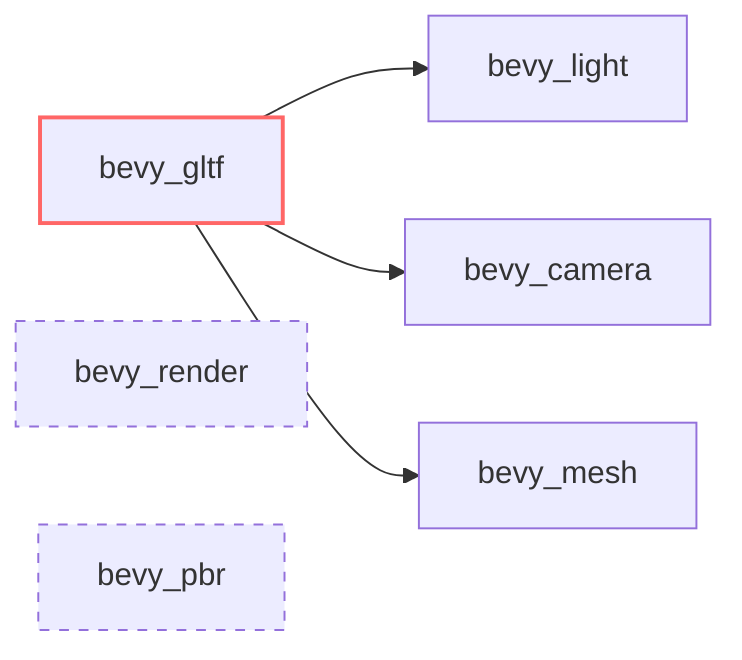

+++
title = "#20390 reduce bevy_gltf dependency on render and pbr"
date = "2025-08-03T00:00:00"
draft = false
template = "pull_request_page.html"
in_search_index = false

[extra]
current_language = "zh-cn"
available_languages = {"en" = { name = "English", url = "/pull_request/bevy/2025-08/pr-20390-en-20250803" }, "zh-cn" = { name = "中文", url = "/pull_request/bevy/2025-08/pr-20390-zh-cn-20250803" }}
labels = ["A-Rendering", "C-Code-Quality", "A-Scenes", "D-Straightforward"]
+++

# reduce bevy_gltf dependency on render and pbr

## Basic Information
- **Title**: reduce bevy_gltf dependency on render and pbr
- **PR Link**: https://github.com/bevyengine/bevy/pull/20390
- **Author**: atlv24
- **Status**: MERGED
- **Labels**: A-Rendering, C-Code-Quality, S-Ready-For-Final-Review, A-Scenes, X-Uncontroversial, D-Straightforward
- **Created**: 2025-08-03T00:40:42Z
- **Merged**: 2025-08-03T06:51:02Z
- **Merged By**: james7132

## Description Translation
### 目标
- 使 bevy_gltf 不再依赖 bevy_render/bevy_pbr

### 解决方案
- 使用 bevy_light 和 bevy_camera

### 测试
- cargo check --examples

## The Story of This Pull Request

### 问题背景
在 Bevy 引擎中，`bevy_gltf` 模块负责 GLTF 资源加载功能。在原始实现中，该模块直接依赖 `bevy_render` 和 `bevy_pbr` 来获取光照(lights)、相机(camera)和网格(mesh)等组件。这种依赖关系存在两个主要问题：

1. **不必要的编译负担**：GLTF 加载器并不需要完整的渲染管线功能，依赖整个渲染模块增加了编译时间和二进制体积
2. **架构耦合**：使 GLTF 加载器与渲染实现细节紧密耦合，降低了模块的独立性和可维护性

这种依赖关系在代码中体现为直接从 `bevy_render` 和 `bevy_pbr` 导入组件类型：
```rust
// 原始实现中的典型导入
use bevy_pbr::{DirectionalLight, PointLight, SpotLight};
use bevy_render::{
    camera::{Camera, OrthographicProjection, PerspectiveProjection, Projection, ScalingMode},
    primitives::Aabb,
    view::Visibility
};
```

### 解决方案
PR 的核心思路是将依赖转移到更细粒度的模块：
1. 光照组件改从 `bevy_light` 导入
2. 相机组件改从 `bevy_camera` 导入
3. 网格组件改从 `bevy_mesh` 导入

这种调整符合 Bevy 的模块化架构设计原则。`bevy_light` 和 `bevy_camera` 是更基础的组件模块，只包含相关组件的定义而不包含渲染逻辑。这种依赖关系更精确地反映了 GLTF 加载器实际需要的功能。

### 实现细节
关键修改涉及导入路径的调整。例如处理光源类型时：
```rust
// 修改前
use bevy_pbr::{DirectionalLight, PointLight, SpotLight};

// 修改后
use bevy_light::{DirectionalLight, PointLight, SpotLight};
```

相机组件的处理也类似：
```rust
// 修改前
use bevy_render::camera::{/* 各种相机类型 */};

// 修改后
use bevy_camera::{
    primitives::Aabb, 
    visibility::Visibility, 
    Camera, 
    OrthographicProjection,
    PerspectiveProjection, 
    Projection, 
    ScalingMode
};
```

值得注意的是 `Mesh3d` 组件的来源变化：
```rust
// 修改前
use bevy_render::mesh::Mesh3d;

// 修改后
use bevy_mesh::Mesh3d;
```

这种改动保持了类型一致性，因为所有相关组件在各自模块中都有明确定义，不会影响运行时行为。

### 依赖管理
在 `Cargo.toml` 中显式添加了新依赖：
```toml
bevy_light = { path = "../bevy_light", version = "0.17.0-dev" }
bevy_camera = { path = "../bevy_camera", version = "0.17.0-dev" }
```
这些依赖原本是通过 `bevy_render` 和 `bevy_pbr` 间接引入的，现在改为直接声明，使依赖关系更清晰。

### 影响与验证
改动后的主要收益：
1. **编译效率**：减少了不必要的编译单元，加快开发迭代速度
2. **架构清晰度**：解耦了资源加载与渲染实现
3. **可维护性**：模块边界更清晰，减少意外耦合

验证方式保持了简洁高效：
```bash
cargo check --examples
```
这确保所有公开接口保持兼容，没有引入编译错误。由于只是导入路径调整而不涉及逻辑变更，不需要额外的运行时测试。

## Visual Representation



## Key Files Changed

### crates/bevy_gltf/Cargo.toml
**修改目的**：添加必要的直接依赖项  
**代码变更**：
```toml
# Before: 无 bevy_light/bevy_camera 依赖

# After:
bevy_light = { path = "../bevy_light", version = "0.17.0-dev" }
bevy_camera = { path = "../bevy_camera", version = "0.17.0-dev" }
```

### crates/bevy_gltf/src/loader/mod.rs
**修改目的**：调整组件导入路径  
**关键变更**：
```rust
// Before:
use bevy_pbr::{DirectionalLight, PointLight, SpotLight};
use bevy_render::{
    camera::{Camera, OrthographicProjection, PerspectiveProjection, Projection, ScalingMode},
    primitives::Aabb,
    view::Visibility
};
use bevy_render::mesh::Mesh3d;

// After:
use bevy_light::{DirectionalLight, PointLight, SpotLight};
use bevy_camera::{
    primitives::Aabb,
    visibility::Visibility,
    Camera,
    OrthographicProjection,
    PerspectiveProjection,
    Projection,
    ScalingMode
};
use bevy_mesh::Mesh3d;
```

**其他调整**：  
移除了不必要的渲染模块导入：
```rust
// 删除的导入
use bevy_render::render_resource::Face;  // 保留在 bevy_render 中
```

## Further Reading
1. [Bevy Modules Documentation](https://docs.rs/bevy/latest/bevy/)
2. [Rust Module System](https://doc.rust-lang.org/book/ch07-02-defining-modules-to-control-scope-and-privacy.html)
3. [GLTF Specification](https://registry.khronos.org/glTF/specs/2.0/glTF-2.0.html)
4. [Bevy ECS Architecture](https://bevyengine.org/learn/book/getting-started/ecs/)