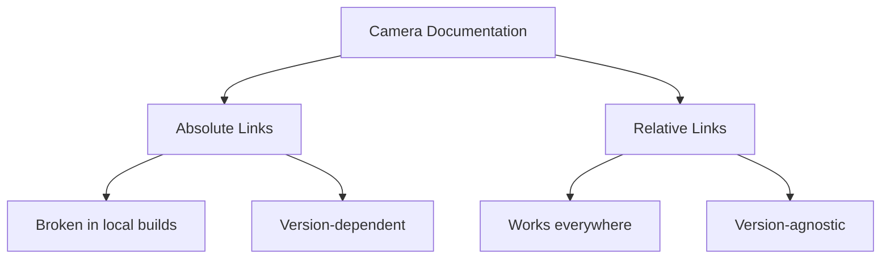

+++
title = "#20392 fix some camera component links"
date = "2025-08-03T00:00:00"
draft = false
template = "pull_request_page.html"
in_search_index = true

[taxonomies]
list_display = ["show"]

[extra]
current_language = "en"
available_languages = {"en" = { name = "English", url = "/pull_request/bevy/2025-08/pr-20392-en-20250803" }, "zh-cn" = { name = "中文", url = "/pull_request/bevy/2025-08/pr-20392-zh-cn-20250803" }}
labels = ["A-Rendering"]
+++

## Technical Analysis: PR #20392 - Fixing Camera Component Links

### Basic Information
- **Title**: fix some camera component links
- **PR Link**: https://github.com/bevyengine/bevy/pull/20392
- **Author**: atlv24
- **Status**: MERGED
- **Labels**: A-Rendering, S-Needs-Review
- **Created**: 2025-08-03T03:31:35Z
- **Merged**: 2025-08-03T23:04:20Z
- **Merged By**: mockersf

### Description
The PR addresses broken links in camera component documentation. It replaces absolute URLs pointing to docs.rs with intra-crate relative links, ensuring documentation remains valid across different build environments and Bevy versions. The changes are limited to doc comments with no functional modifications to the camera systems.

### The Story of This Pull Request

#### The Documentation Link Problem
The Bevy engine's camera components contained documentation links that referenced absolute paths to docs.rs (Rust's documentation hosting service). While functional for published versions, these links break in several scenarios:
1. During local development with `cargo doc`
2. In documentation generated for non-published versions
3. When offline development is required

The original links used version-specific paths like `https://docs.rs/bevy/latest/bevy/core_pipeline/core_3d/struct.Camera3d.html`. This approach is brittle because:
- The `/latest/` path segment becomes outdated immediately after new releases
- Local documentation builds can't resolve external URLs
- Navigation between related components is less efficient

#### The Solution Approach
The fix replaces absolute URLs with intra-crate relative links using Rust's path syntax. This approach:
1. Uses `[`Type`]` syntax for in-text references
2. Defines link targets with `[`Type`]: crate::path::to::Type`
3. Maintains compatibility with all documentation generation contexts

The implementation required identifying all broken links in camera-related documentation and replacing them with relative paths. No functional code changes were needed since the modifications only affect doc comments.

#### Implementation Details
The changes occur in two files within the camera module. Each modification follows the same pattern: replacing absolute URLs with relative paths within the crate.

For `Exposure` component docs:
```rust
// Before:
/// How much energy a `Camera3d` absorbs from incoming light.

// After:
/// How much energy a [`Camera3d`](crate::Camera3d) absorbs from incoming light.
```
This change links `Camera3d` to its definition within the current crate.

For the main `Camera` component docs:
```rust
// Before:
/// [`Camera2d`]: https://docs.rs/bevy/latest/bevy/core_pipeline/core_2d/struct.Camera2d.html
/// [`Camera3d`]: https://docs.rs/bevy/latest/bevy/core_pipeline/core_3d/struct.Camera3d.html

// After:
/// [`Camera2d`]: crate::Camera2d
/// [`Camera3d`]: crate::Camera3d
```
This converts external links to intra-crate references.

For the `Frustum` component:
```rust
// Before:
/// The frustum component is typically added automatically for cameras, either `Camera2d` or `Camera3d`.

// After:
/// The frustum component is typically added automatically for cameras, either [`Camera2d`] or [`Camera3d`].
```
Additionally, link definitions were added:
```rust
/// [`Camera2d`]: crate::Camera2d
/// [`Camera3d`]: crate::Camera3d
```

#### Technical Insights
These changes leverage Rust's intra-doc linking system:
1. `[`Type`]` creates clickable links in generated HTML
2. `crate::path` references are resolved relative to current crate root
3. Link definitions (`[`Type`]: target`) associate references with targets

The approach maintains several advantages:
- **Version independence**: Links work across Bevy versions
- **Offline compatibility**: Local `cargo doc` works without internet
- **Navigation efficiency**: Developers can jump between related components
- **Maintenance reduction**: No need to update version numbers in URLs

#### Impact
The changes improve developer experience by:
1. Ensuring documentation links work consistently in all environments
2. Reducing confusion when links break after new releases
3. Making camera component relationships more discoverable
4. Setting a pattern for other documentation links in the codebase

The minimal changeset (6 lines modified) demonstrates how small documentation fixes can significantly improve code maintainability without risking regressions.

### Visual Representation



### Key Files Changed

1. **crates/bevy_camera/src/camera.rs** (+3/-3)
   - Updates links in `Exposure` and `Camera` component docs
   - Before:
     ```rust
     /// How much energy a `Camera3d` absorbs from incoming light.
     /// [`Camera2d`]: https://docs.rs/bevy/latest/bevy/core_pipeline/core_2d/struct.Camera2d.html
     /// [`Camera3d`]: https://docs.rs/bevy/latest/bevy/core_pipeline/core_3d/struct.Camera3d.html
     ```
   - After:
     ```rust
     /// How much energy a [`Camera3d`](crate::Camera3d) absorbs from incoming light.
     /// [`Camera2d`]: crate::Camera2d
     /// [`Camera3d`]: crate::Camera3d
     ```

2. **crates/bevy_camera/src/primitives.rs** (+3/-1)
   - Updates `Frustum` component docs and adds link definitions
   - Before:
     ```rust
     /// The frustum component is typically added automatically for cameras, either `Camera2d` or `Camera3d`.
     ```
   - After:
     ```rust
     /// The frustum component is typically added automatically for cameras, either [`Camera2d`] or [`Camera3d`].
     /// [`Camera2d`]: crate::Camera2d
     /// [`Camera3d`]: crate::Camera3d
     ```

### Further Reading
1. [Rust Documentation Guide](https://doc.rust-lang.org/rustdoc/how-to-write-documentation.html)
2. [Intra-doc Links RFC](https://github.com/rust-lang/rfcs/blob/master/text/1946-intra-rustdoc-links.md)
3. [Bevy Camera Documentation](https://docs.rs/bevy/latest/bevy/camera/index.html)

### Full Code Diff
```diff
diff --git a/crates/bevy_camera/src/camera.rs b/crates/bevy_camera/src/camera.rs
index 1eea96307732e..3c1dbde72bee3 100644
--- a/crates/bevy_camera/src/camera.rs
+++ b/crates/bevy_camera/src/camera.rs
@@ -176,7 +176,7 @@ pub struct ComputedCameraValues {
     pub old_sub_camera_view: Option<SubCameraView>,
 }
 
-/// How much energy a `Camera3d` absorbs from incoming light.
+/// How much energy a [`Camera3d`](crate::Camera3d) absorbs from incoming light.
 ///
 /// <https://en.wikipedia.org/wiki/Exposure_(photography)>
 #[derive(Component, Clone, Copy, Reflect)]
@@ -322,8 +322,8 @@ pub enum ViewportConversionError {
 /// but custom render graphs can also be defined. Inserting a [`Camera`] with no render
 /// graph will emit an error at runtime.
 ///
-/// [`Camera2d`]: https://docs.rs/bevy/latest/bevy/core_pipeline/core_2d/struct.Camera2d.html
-/// [`Camera3d`]: https://docs.rs/bevy/latest/bevy/core_pipeline/core_3d/struct.Camera3d.html
+/// [`Camera2d`]: crate::Camera2d
+/// [`Camera3d`]: crate::Camera3d
 #[derive(Component, Debug, Reflect, Clone)]
 #[reflect(Component, Default, Debug, Clone)]
 #[require(
diff --git a/crates/bevy_camera/src/primitives.rs b/crates/bevy_camera/src/primitives.rs
index 32bb557b93774..eb6246d25990c 100644
--- a/crates/bevy_camera/src/primitives.rs
+++ b/crates/bevy_camera/src/primitives.rs
@@ -235,7 +235,7 @@ impl HalfSpace {
 /// This process is called frustum culling, and entities can opt out of it using
 /// the [`NoFrustumCulling`] component.
 ///
-/// The frustum component is typically added automatically for cameras, either `Camera2d` or `Camera3d`.
+/// The frustum component is typically added automatically for cameras, either [`Camera2d`] or [`Camera3d`].
 /// It is usually updated automatically by [`update_frusta`] from the
 /// [`CameraProjection`] component and [`GlobalTransform`] of the camera entity.
 ///
@@ -244,6 +244,8 @@ impl HalfSpace {
 /// [`update_frusta`]: crate::visibility::update_frusta
 /// [`CameraProjection`]: crate::CameraProjection
 /// [`GlobalTransform`]: bevy_transform::components::GlobalTransform
+/// [`Camera2d`]: crate::Camera2d
+/// [`Camera3d`]: crate::Camera3d
 #[derive(Component, Clone, Copy, Debug, Default, Reflect)]
 #[reflect(Component, Default, Debug, Clone)]
 pub struct Frustum {
```