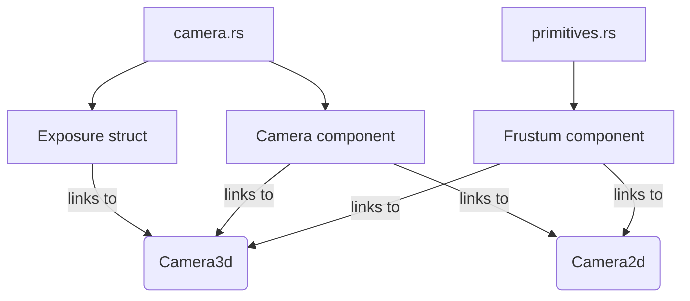

+++
title = "#20392 fix some camera component links"
date = "2025-08-03T00:00:00"
draft = false
template = "pull_request_page.html"
in_search_index = false

[extra]
current_language = "zh-cn"
available_languages = {"en" = { name = "English", url = "/pull_request/bevy/2025-08/pr-20392-en-20250803" }, "zh-cn" = { name = "中文", url = "/pull_request/bevy/2025-08/pr-20392-zh-cn-20250803" }}
labels = ["A-Rendering"]
+++

# fix some camera component links

## Basic Information
- **Title**: fix some camera component links
- **PR Link**: https://github.com/bevyengine/bevy/pull/20392
- **Author**: atlv24
- **Status**: MERGED
- **Labels**: A-Rendering, S-Needs-Review
- **Created**: 2025-08-03T03:31:35Z
- **Merged**: 2025-08-03T23:04:20Z
- **Merged By**: mockersf

## Description Translation
# Objective

- 修复部分相机组件的链接问题

## Solution

- 修复部分相机组件的链接问题

## Testing

- CI 测试

## The Story of This Pull Request

这个 PR 解决的是 Bevy 引擎相机组件文档中的链接一致性问题。在 Bevy 的文档系统中，使用相对路径引用本地类型 (`crate::Type`) 比使用 docs.rs 的绝对链接更可靠，因为相对链接在离线文档和本地开发环境中都能正常工作，而绝对链接可能在非标准构建环境下失效。

开发者发现 camera.rs 文件中多个文档注释存在两种问题：
1. `Exposure` 结构体的文档链接使用了绝对路径 `Camera3d`
2. `Camera` 组件的文档示例链接使用了 docs.rs 的绝对路径

在 primitives.rs 文件中：
1. `Frustum` 组件的文档提到 `Camera2d` 和 `Camera3d` 时缺少链接

解决方案是统一改为使用相对路径链接：
1. 将 `Camera3d` 的引用改为 `[`Camera3d`](crate::Camera3d)`
2. 将 docs.rs 链接替换为 `crate::Camera2d` 和 `crate::Camera3d`
3. 为 primitives.rs 中缺失的相机类型添加相同格式的链接

这些修改不影响实际代码逻辑，纯粹是文档改进。但保持文档链接的准确性很重要，因为：
- 开发者依赖文档理解相机系统的工作原理
- 正确的链接允许在文档中直接跳转到类型定义
- 统一格式提高代码可维护性

修改后，所有相机组件文档都使用一致的相对链接格式，确保在各种环境下链接都能正常工作。

## Visual Representation



## Key Files Changed

### 1. `crates/bevy_camera/src/camera.rs`
**修改原因**：修复文档链接格式不一致问题  
**关键变更**：
```rust
// Before:
/// How much energy a `Camera3d` absorbs from incoming light.
///
/// [`Camera2d`]: https://docs.rs/bevy/latest/bevy/core_pipeline/core_2d/struct.Camera2d.html
/// [`Camera3d`]: https://docs.rs/bevy/latest/bevy/core_pipeline/core_3d/struct.Camera3d.html

// After:
/// How much energy a [`Camera3d`](crate::Camera3d) absorbs from incoming light.
///
/// [`Camera2d`]: crate::Camera2d
/// [`Camera3d`]: crate::Camera3d
```

### 2. `crates/bevy_camera/src/primitives.rs`
**修改原因**：为缺失的相机组件添加文档链接  
**关键变更**：
```rust
// Before:
/// The frustum component is typically added automatically for cameras, either `Camera2d` or `Camera3d`.

// After:
/// The frustum component is typically added automatically for cameras, either [`Camera2d`] or [`Camera3d`].
///
/// [`Camera2d`]: crate::Camera2d
/// [`Camera3d`]: crate::Camera3d
```

## Further Reading
1. [Rust Documentation Guidelines](https://rust-lang.github.io/rfcs/1574-more-api-documentation-conventions.html)
2. [Bevy Camera System Overview](https://bevyengine.org/learn/book/getting-started/camera/)
3. [Rustdoc Link Syntax](https://doc.rust-lang.org/rustdoc/linking-to-items-by-name.html)

## Full Code Diff
```diff
diff --git a/crates/bevy_camera/src/camera.rs b/crates/bevy_camera/src/camera.rs
index 1eea96307732e..3c1dbde72bee3 100644
--- a/crates/bevy_camera/src/camera.rs
+++ b/crates/bevy_camera/src/camera.rs
@@ -176,7 +176,7 @@ pub struct ComputedCameraValues {
     pub old_sub_camera_view: Option<SubCameraView>,
 }
 
-/// How much energy a `Camera3d` absorbs from incoming light.
+/// How much energy a [`Camera3d`](crate::Camera3d) absorbs from incoming light.
 ///
 /// <https://en.wikipedia.org/wiki/Exposure_(photography)>
 #[derive(Component, Clone, Copy, Reflect)]
@@ -322,8 +322,8 @@ pub enum ViewportConversionError {
 /// but custom render graphs can also be defined. Inserting a [`Camera`] with no render
 /// graph will emit an error at runtime.
 ///
-/// [`Camera2d`]: https://docs.rs/bevy/latest/bevy/core_pipeline/core_2d/struct.Camera2d.html
-/// [`Camera3d`]: https://docs.rs/bevy/latest/bevy/core_pipeline/core_3d/struct.Camera3d.html
+/// [`Camera2d`]: crate::Camera2d
+/// [`Camera3d`]: crate::Camera3d
 #[derive(Component, Debug, Reflect, Clone)]
 #[reflect(Component, Default, Debug, Clone)]
 #[require(
diff --git a/crates/bevy_camera/src/primitives.rs b/crates/bevy_camera/src/primitives.rs
index 32bb557b93774..eb6246d25990c 100644
--- a/crates/bevy_camera/src/primitives.rs
+++ b/crates/bevy_camera/src/primitives.rs
@@ -235,7 +235,7 @@ impl HalfSpace {
 /// This process is called frustum culling, and entities can opt out of it using
 /// the [`NoFrustumCulling`] component.
 ///
-/// The frustum component is typically added automatically for cameras, either `Camera2d` or `Camera3d`.
+/// The frustum component is typically added automatically for cameras, either [`Camera2d`] or [`Camera3d`].
 /// It is usually updated automatically by [`update_frusta`] from the
 /// [`CameraProjection`] component and [`GlobalTransform`] of the camera entity.
 ///
@@ -244,6 +244,8 @@ impl HalfSpace {
 /// [`update_frusta`]: crate::visibility::update_frusta
 /// [`CameraProjection`]: crate::CameraProjection
 /// [`GlobalTransform`]: bevy_transform::components::GlobalTransform
+/// [`Camera2d`]: crate::Camera2d
+/// [`Camera3d`]: crate::Camera3d
 #[derive(Component, Clone, Copy, Debug, Default, Reflect)]
 #[reflect(Component, Default, Debug, Clone)]
 pub struct Frustum {
```